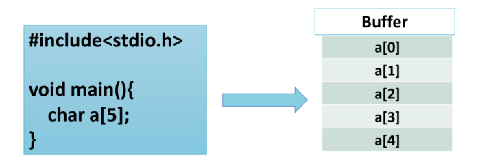
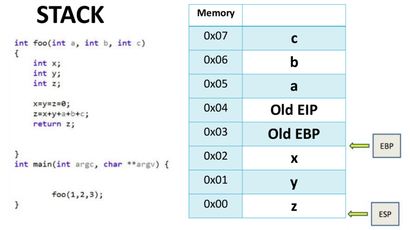

# Introduction to Buffer Overflow

## Definition

- Program memory
- CPU Registers: A register is a small storage space available as part of the CPU.
- Buffer: A region of a physical memory storage used to temporarily store data while it is being moved from one place to another.
- Buffer overflow:


Taken from [Here](https://medium.com/better-programming/an-introduction-to-buffer-overflow-vulnerability-760f23c21ebb#:~:text=%20An%20Introduction%20to%20Buffer%20Overflow%20Vulnerability%20,Techno%20Trick.%20This%20is%20what%20the...%20More%20)

## Basics of Assembly

### Registers

A processor register is a quickly accessible location available to a computer's processor.

|Extended Register|Lower 16 bits|Higher 8 bits|Lower 8 bits|
|-|-|-|-|
|EAX|AX|AH|AL|
|EBX|BX|BH|BL|
|ECX|CX|CH|CL|
|EDX|DX|DH|DL|
|ESI|SI|N/A|N/A|
|EDI|DI|N/A|N/A|
|EBP|BP|N/A|N/A|
|ESP|SP|N/A|N/A|
|EIP|IP|N/A|N/A|

#### General purpose registers

- **EAX** - *Accumulator*:
  - Accumulator: Stores intermediate arithmetic and logic results
  - Used for most arithmetic instructions.
- **EBX** - *Base*: Base pointer for Memory Addresses.
- **ECX** - *Counter*: Stores the loop count in iterative operations.
- **EDX** - *Data*: Perform Input/Output operations as well as multiplication and division
- **ESI** - *Source Index*:
- **EDI** - *Destination Index*:

#### Pointer Registers

- **ESP**: Stack pointer that points to the top of the stack, which is the end of the stack
- **EBP**: Stack pointer that points to the base of the stack.
- **EIP**: Stores the offset address of the next instruction to be executed.

**ESP** and **EBP** together keep track of the stack frame of the currently executing function

#### EFLAGS

EFLAGS is the status register in Intel x86 microprocessors that contains the current state of the processor.
They are used for comparisons and memory segmentations.

### Memory Area

#### Code Segment

This is where the assembled machine language instructions of the program are located.

- Write permission is disabled in the text segment, as it is not used to store variables, only code.
- Can be shared among different copies of the program.
- Has a fixed size.

#### Data & BSS

The data and bss segments are used to store global and static program variables.

The data segment contains the initialized global and static variables

```c
int val = 3;
char string[] = "Hello World";
```

The bss segment contains uninitialized variables.

```c
static int i;
```

Both have a fixed size.

the bss segment is located below the data segment

#### Heap

The heap area commonly begins at the end of the .bss and .data segments and grows to larger addresses from there.

The heap area is managed by:

- **malloc**: Allocates a block of size bytes of memory, returning a pointer to the beginning of the block.
- **calloc**: Allocates a block of memory for an array of num elements, each of them size bytes long, and initializes all its bits to zero.
- **realloc**: Changes the size of the memory block pointed to by ptr.
- **free**: A block of memory previously allocated by a call to malloc, calloc or realloc is deallocated, making it available again for further allocations.

The heap area is **shared by all threads, shared libraries, and dynamically loaded modules** in a process.

#### Stack

The call stack is a data structure that controls the execution flow of a computer program.

In order to interact with the stack, in x86 architecture, we use the following CPU instructions:

- **PUSH**: Add data to the stack
- **POP**: Remove data from the stack

In a program, every function has its own stack



When we add to the stack, it goes from "High" to "Low"

### Instructions

#### Data Movement Instructions

- **MOV**: Move a value from the source to the destination
- **SUB**: Subtract
- **INC**:
- **PUSH**:
- **POP**:
- **LEA**: Load effective address. LEA accepts a standard memory addressing operand, but does nothing more than store the calculated memory offset in the specified register.

#### control the flow of execution

- **CMP**:
- **J\***: Jump to a different part of the code
  - **JLE**:  Jump if less than or equal to. (uses the EFLAGS register)

https://www.cs.virginia.edu/~evans/cs216/guides/x86.html

## C Language

### Sidenote: Variables

By default, numerical values in C are *signed*, which means they can be both negative and positive.
In C, variables can be declared as unsigned by simply prepending the keyword *unsigned* to the declaration.

### Sidenote: Printf

The **printf()** function can be used to print more than just fixed strings. 

- **%d - Value**: Decimal
- **%u - Value**: Unsigned decimal
- **%x - Value**: Hexadecimal
- **%s - Pointer**: String
- **%n - Pointer**: Number of bytes written so far

In order to see the actual data stored in the pointer variable, you must use the *address-of* operator **&**

```c
#include <stdio.h>

int main() {
 char string[10];
 int A = -73;
 unsigned int B = 31337;

 strcpy(string, "sample");

 // Example of printing with different format string
 printf("[A] Dec: %d, Hex: %x, Unsigned: %u\n", A, A, A);
 printf("[B] Dec: %d, Hex: %x, Unsigned: %u\n", B, B, B);
 printf("[field width on B] 3: '%3u', 10: '%10u', '%08u'\n", B, B, B);
 printf("[string] %s Address %08x\n", string, string);
 
 // Example of unary address operator (dereferencing) and a %x format string
 printf("variable A is at address: %08x\n", &A);
}
```

Will output

```
[A] Dec: -73, Hex: ffffffb7, Unsigned: 4294967223
[B] Dec: 31337, Hex: 7a69, Unsigned: 31337
[field width on B] 3: '31337', 10: ' 31337', '00031337'
[string] sample Address bffff870
variable A is at address: bffff86c
```

### Sidenote: Typecasting

Typecasting is simply a way to temporarily change a variable’s data type, despite how it was originally defined

```c
int a, b; float c, d;  a = 13; b = 5;
c = a / b;
d = (float) a / (float) b; // Divide integers typecast as floats.

printf("[integers]\t a = %d\t b = %d\n", a, b);
printf("[floats]\t c = %f\t d = %f\n", c, d);
```

```gdb
[integers]    a = 13 b = 5
[floats]      c = 2.000000 d = 2.600000
```

Even though a pointer is just a memory address, the C compiler still demands a data type for every pointer.
An integer pointer should only point to integer data, while a character pointer should only point to character data.

## GDB

### Introduction

With a debugger like GDB, every aspect of a program's execution can be deterministically examined, paused, stepped through, and repeated as often as needed.

set disassembly intel
 echo "set disassembly intel" > ~/.gdbinit

The GDB debugger provides a direct method to examine memory, using the command x, which is short for examine.
Examining memory is a critical skill for any hacker.

```gdb
(gdb) disassemble main   # Display the disassembly of the main()
(gdb) break main         # Set a breakpoint is set at the start of main()
(gdb) run                # Tell the program to run
(gdb) info register eip  # 
(gdb) next instruction   # Execute the current instruction
```

### Display format

- **o**: Display in octal.
- **x**: Display in hexadecimal.
- **u**: Display in unsigned, standard base-10 decimal.
- **t**: Display in binary.

```gdb
(gdb) info register rip
rip            0x555555555139      0x555555555139 <main+4>
(gdb) x/o 0x555555555139
0x555555555139 <main+4>:        02073101510
(gdb) x/x $rip
0x555555555139 <main+4>:        0x10ec8348
(gdb) x/u $rip
0x555555555139 <main+4>:        283935560
(gdb) x/t $rip
0x555555555139 <main+4>:        00010000111011001000001101001000


(gdb) x/3i $rip
=> 0x555555555146 <main+17>:    lea    rdi,[rip+0xeb7]        # 0x555555556004
   0x55555555514d <main+24>:    call   0x555555555030 <puts@plt>
   0x555555555152 <main+29>:    add    DWORD PTR [rbp-0x4],0x1
(gdb) x/s 0x555555556004
0x555555556004: "Hello, world!\n"
```

*Side note: The GDB debugger is smart enough to know how values are stored, so when a word or halfword is examined, the bytes must be reversed to display the correct values in hexadecimal*

### Sidenote: nm

[nm](https://linux.die.net/man/1/nm) list symbols from object files.
This can be used to find the address of functions

- **t/T**: The symbol is in the text (code) section.


## Buffer Overflow

Some language like C assumes that the programmer is responsible for data integrity. This means that it increase the programmer's control and the efficiency of a program, but it can also lead to buffer overflows and memory leaks

### Causes

#### Off-by-One error

An **off-by-one error** or **off-by-one bug** is a logic error involving the discrete equivalent of a boundary condition. It often occurs in computer programming when an iterative loop iterates one time too many or too few.

#### Unicode conversion oversight

Some programs are made in ASCII and then, due to differents factor, they may be in Unicode. One example is to be able to support other language, another can be newer version of the programming himself.

If you hardcoded some character such as a backlash in ASCII within your code, it will be **%5c**. However, with Unicode you have also the following:

- U+FE68: ﹨
- U+FF3C: ＼

### Types

#### Stack Buffer Overflow

a stack buffer overflow or stack buffer overrun occurs when a program writes to a memory address on the program's call stack outside of the intended data structure, which is usually a fixed-length buffer.

In order to leverage that type of overflow, we need to overwrite the **function return address** with a pointer to **attacker-controlled data** (usually on the stack itself).

#### Heap Overflow

Heap overflows are exploitable in a different manner to that of stack buffer overflows, this is because memory on the heap is dynamically allocated at runtime and typically contains program data.

#### Function based Overflow

## Format String Exploits

Sometimes programmers use printf(string) instead of printf("%s", string) to print strings.

If we pass %d as an input, it will display a piece of memory in a preceding stack frame.

The %s format parameter can be used to read from arbitrary memory addresses.

reader@hacking:~/booksrc $ env | grep PATH
PATH=/usr/local/sbin:/usr/local/bin:/usr/sbin:/usr/bin:/sbin:/bin:/usr/games
reader@hacking:~/booksrc $ ./getenvaddr PATH ./fmt_vuln
PATH will be at 0xbffffdd7
reader@hacking:~/booksrc $ ./fmt_vuln $(printf "\xd7\xfd\xff\xbf")%08x.%08x.%08x.%s
The right way to print user-controlled input:
????%08x.%08x.%08x.%s
The wrong way to print user-controlled input:
????bffff3d0.b7fe75fc.00000000./usr/local/sbin:/usr/local/bin:/usr/sbin:/usr/bin:/sbin:/bin:/
usr/games
[*] test_val @ 0x08049794 = -72 0xffffffb8
reader@hacking:~/booksrc $

If the %s format parameter can be used to read an arbitrary memory address,
you should be able to use the same technique with %n to write to an arbitrary
memory address. Now things are getting interesting.


In binary programs compiled with the GNU C compiler, special table sections
called .dtors and .ctors are made for destructors and constructors, respectively. 

nm

080495a8 d __CTOR_END__
080495a4 d __CTOR_LIST__
080495b4 d __DTOR_END__
080495ac d __DTOR_LIST

objdump -h

 nm ./fmt_vuln | grep DTOR
08049694 d __DTOR_END__
08049690 d __DTOR_LIST__

is only four bytes this time, which means there are no addresses between them. 
