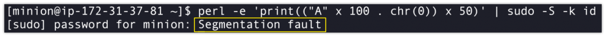

#### CVE-2019-14287

- **Description**: A flaw was found in the way sudo implemented running commands with arbitrary user ID. If a sudoers entry is written to allow the attacker to run a command as any user except root, this flaw can be used by the attacker to bypass that restriction.
- **Affected Version**: Sudo versions 1.7.1 to 1.8.30 inclusive on Red Hat/CentOS
- **Example**: Sudo versions before 1.8.28

- **Command**: sudo -u#-1 bash

#### CVE-2019-18634

- **Description**: A stack-based buffer overflow vulnerability was discovered in sudo, a program designed to provide limited super user privileges to specific users, triggerable when configured with the “pwfeedback” option enabled. An unprivileged user can take advantage of this flaw to obtain full root privileges. If enabled, users can trigger a stack-based buffer overflow in the privileged sudo process.
- **Affected Version**: Sudo versions 1.7.1 to 1.8.30 inclusive on Red Hat/CentOS
- **Example**:

- **Command**: perl -e 'print(("A" x 100 . chr(0)) x 50)' | sudo -S -k id

Sources: 

https://resources.whitesourcesoftware.com/blog-whitesource/new-vulnerability-in-sudo-cve-2019-14287
https://www.linuxminion.com/sudo-stack-based-buffer-overflow-vulnerability-pwfeedback/