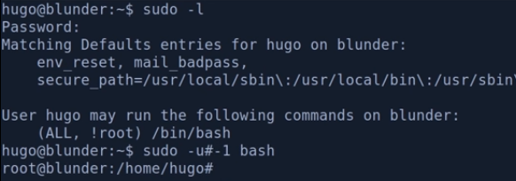

#### CVE-2019-14287

- Description: A flaw was found in the way sudo implemented running commands with arbitrary user ID. If a sudoers entry is written to allow the attacker to run a command as any user except root, this flaw can be used by the attacker to bypass that restriction.
- Example:

- Command: sudo -u#-1 bash

Sources: 

https://resources.whitesourcesoftware.com/blog-whitesource/new-vulnerability-in-sudo-cve-2019-14287